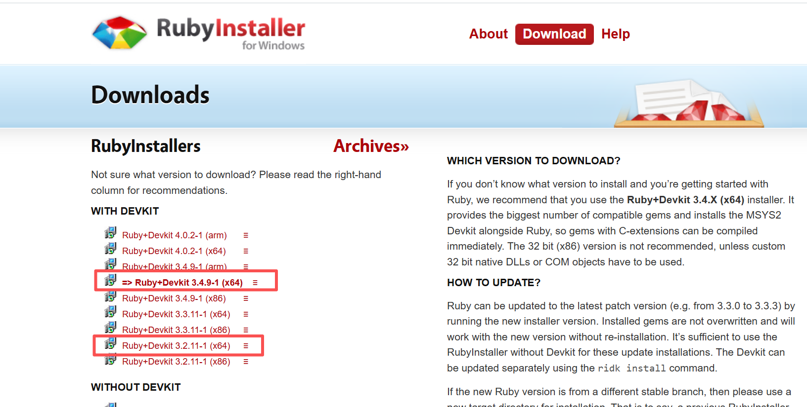
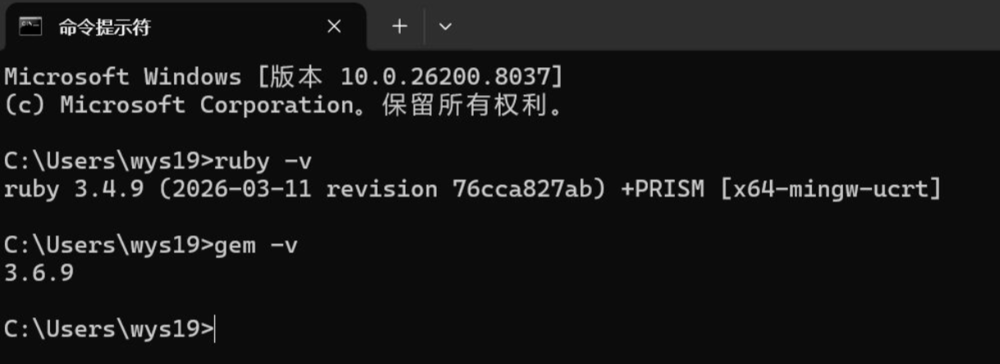
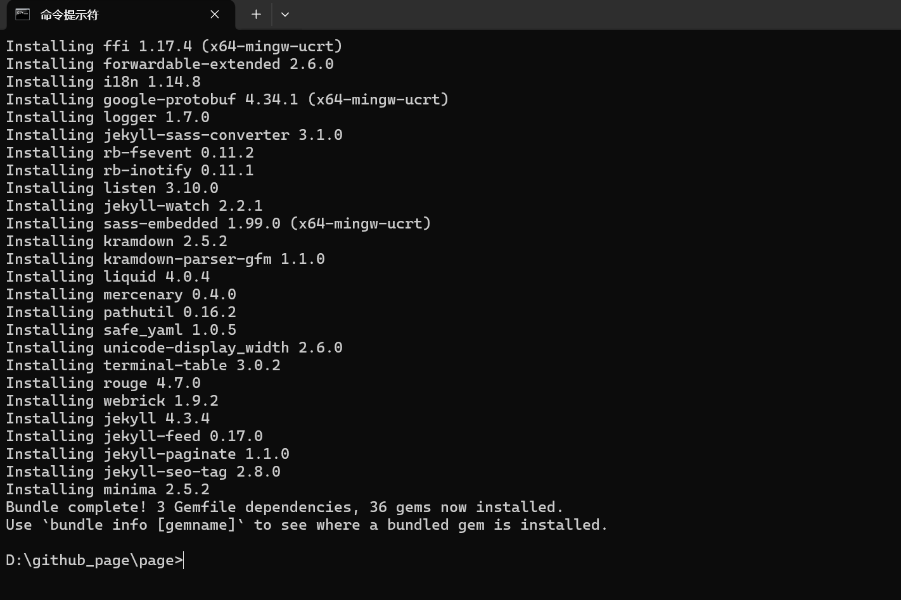
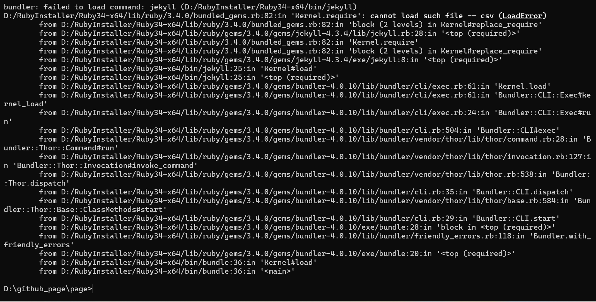
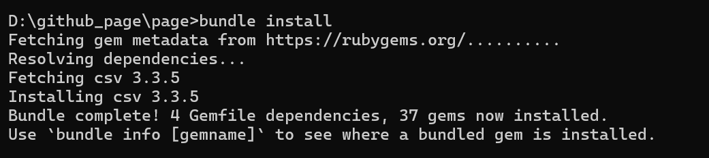
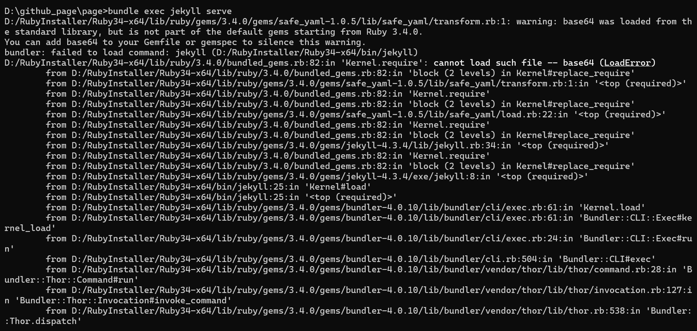
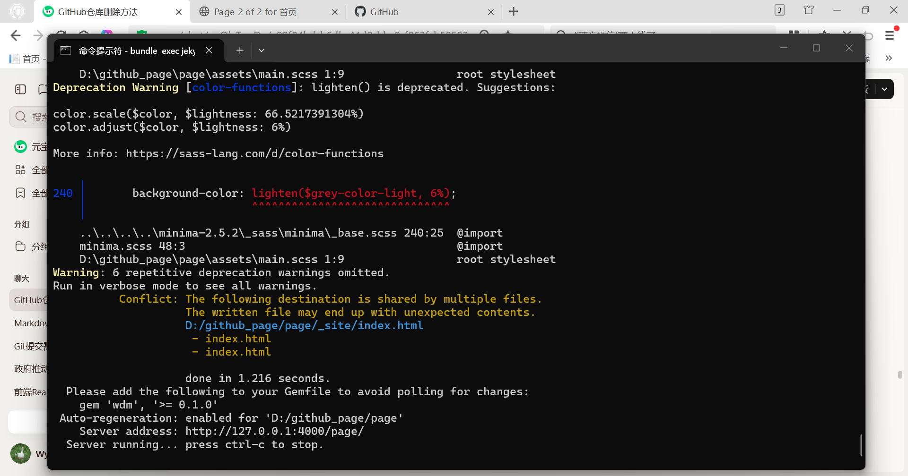

### 一、引言

最近想用github pages搭建一个自己的博客主页，但是每次修改之后都要重新发布才能看到网页版效果，所以还是把jekyll本地环境部署一下，这样每次可以先在本地调试好再发布到网页。

### 二、操作步骤

#### 1.安装Ruby环境：

windows用户下载安装[RubyInstaller](https://rubyinstaller.org/),安装时务必勾选 “Add Ruby executables to your PATH”。推荐安装3.2.11(x64)，博主一开始安装的是3.4.9(x64)，但是实际过程中会报错(下面有介绍）。



验证 Ruby 安装是否成功，CMD输入：

```bash
ruby -v
gem -v
#如果能看到版本号（比如 `ruby 3.4.9p-1`、`gem 3.5.x`），说明安装成功。
```



#### 2.安装 Bundler 和 GitHub Pages Gem：

打开cmd运行命令框，输入以下命令：

```bash
gem install bundler
gem install jekyll
#验证bundle是否安装成功
bundle -v
```

#### 3.初始化 Bundler，进入你的博客项目根目录（比如 `D:\github_page\page`），执行以下命令：

```bash
bundle init
```

这会在项目中生成一个 `Gemfile`文件，用于管理依赖。

#### 4.编辑Gemfile文件：

用文本编辑器打开 `Gemfile`，添加 Jekyll 和分页插件的依赖：

```
   source "https://rubygems.org"
   gem "jekyll", "~> 4.3.3"
   gem "minima", "~> 2.5.1"
   gem "jekyll-paginate", "~> 1.1.0"
```

#### 5.**安装项目依赖**：

在项目根目录执行：bundle install, 这会下载并安装 `Gemfile`中指定的所有插件（包括 Jekyll、Minima、jekyll-paginate）。 

```bash
bundle install
```




#### 6.启动 Jekyll 服务:

在cmd中执行以下命令后报错：

```bash
bundle exec jekyll serve
```



从报错日志来看，核心问题是 **Ruby 3.4.0 之后 `csv`库不再是默认 gem**，而 Jekyll 依赖了它，但我的环境里没有显式安装 `csv`gem。

解决步骤：

打开 `Gemfile`，添加 `gem "csv"`（放在其他 gem 下方）：

```
   source "https://rubygems.org"
   gem "jekyll", "~> 4.3.3"
   gem "minima", "~> 2.5.1"
   gem "jekyll-paginate", "~> 1.1.0"
   gem "csv"  # 新增
```

再次安装依赖并启动服务：

```bash
bundle install
bundle exec jekyll serve
```



发现还是报错：



网上说Ruby 3.4.0 的这个变化导致了许多 gem 兼容性问题。建议降级到 Ruby 3.3.x 以获得更好的兼容性，所以我直接重新下载了3.2.11(x64)，并把环境变量设置为新版本路径。

用新版本执行上面的安装依赖和运行命令后运行正常：



#### 7.服务验证：

在浏览器中输入http://127.0.0.1:4000/并访问：


### 三、总结

本地运行成功之后，就不用每次都推送发布后验证了，github网络经常不稳定，有空再写一篇关于访问github可以做的操作。

* * *

**作者**：吴银双

**日期**：2026年4月14日

**平台**：GitHub Pages / 技术博客
