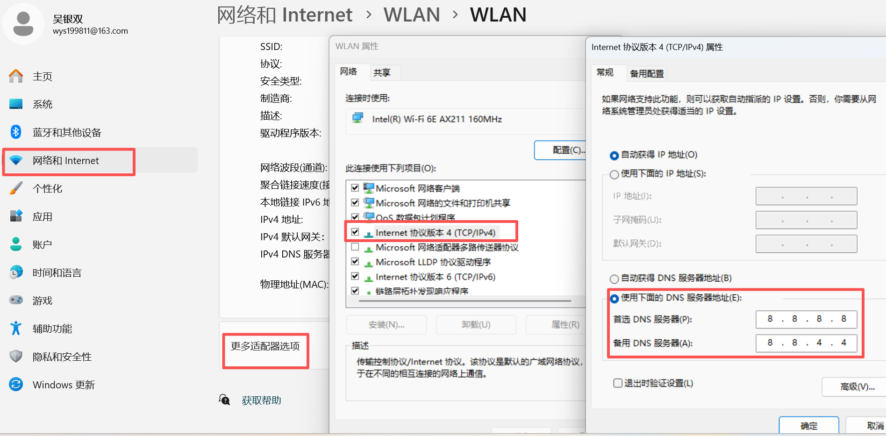

### 一、引言

最近访问github官网时经常访问不进去，网络太慢，收集了一些有用的方法，虽然还是会时不时断掉，已经比一开始好多了。 其实访问慢主要是因为国内dns污染，域名解析后的ip是错误的，所以一般有三种方法。

### 二、操作步骤

#### 1.手动修改hosts文件

window路径：C:\Windows\System32\drivers\etc\hosts

linux路径：/etc/hosts

在文件最后增加以下内容：

```
140.82.112.4 http://github.com
199.59.150.45 http://github.global.ssl.fastly.net
185.199.108.153 http://assets-cdn.github.com
185.199.109.153 http://assets-cdn.github.com
185.199.110.153 http://assets-cdn.github.com
185.199.111.153 http://assets-cdn.github.com
```

其中 assets-cdn.github.com是固定的，github.com和github.global.ssl.fastly.net会随时变动，所以有时候我们需要自己去[站点查询网](https://ip.chinaz.com/github.com)查一下实时的ip然后更新hosts文件。

修改完后更新dns缓存，在cmd命令框中输入以下命令：

```shell
ipconfig /flushdns
```

#### 2.修改DNS解析：

打开设置-网络和Internet设置-WLAN-更多适配器选项-IPV4-属性-DNS服务器地址：

将首选和备用DNS服务器分别改成8.8.8.8 和 8.8.4.4



#### 3、笨方法：

如果上面两种方法都不行，再试试把当前网络断掉，用新的网络（比如换成个人热点），来回切换试试，有时可以有时不行~~~~

### 三、总结

Github一直进不去不要着急，有时候ping他的ip其实是能ping通的，多用上面几种方法试一试，实在不行先放着，事缓则圆。

* * *

**作者**：吴银双

**日期**：2026年4月15日

**平台**：GitHub Pages / 技术博客
