### 一、引言

最近学了Agent相关的思想，整理出来方便自己理清核心概念，也给大家一些参考。

### 二、具体内容

#### （一）什么是Agent?

AI Agent（智能体） 是⼀个具备以下三⼤能⼒的智能系统：

1. ⾃主感知：能够理解当前环境和任务需求

2. ⾃主决策：能够制定执⾏计划并动态调整

3. ⾃主执⾏：能够调⽤⼯具完成实际任务

一句话来说：

<mark>Agent = LLM（⼤脑） + MCP⼯具（⼿脚） + 记忆（经验） + 规划（智慧）</mark>

架构分层：

感知层（接收并理解用户输入）+

认知层（分析、推理、规划）+

执行层（调用工具完成任务）+

记忆层（存储和检索信息）

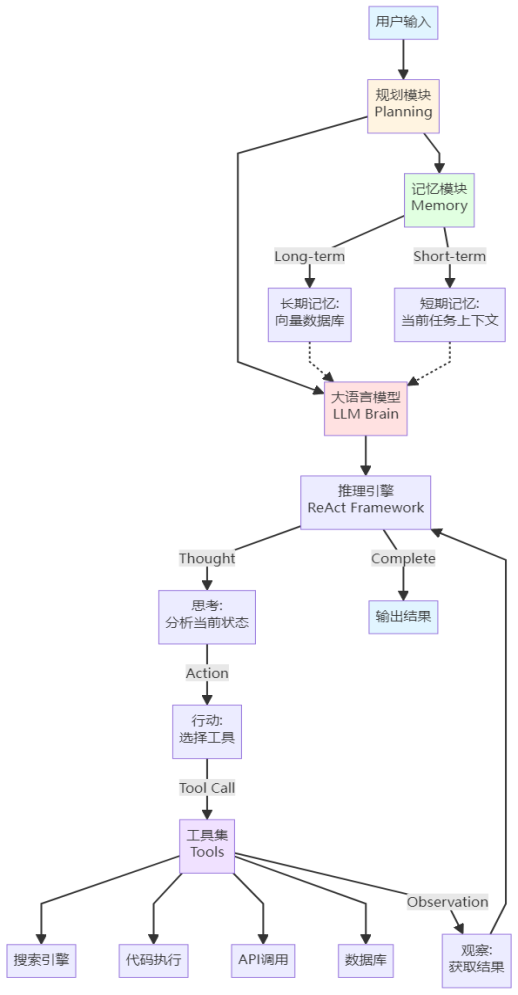

（图片来源：小滴课堂资料）

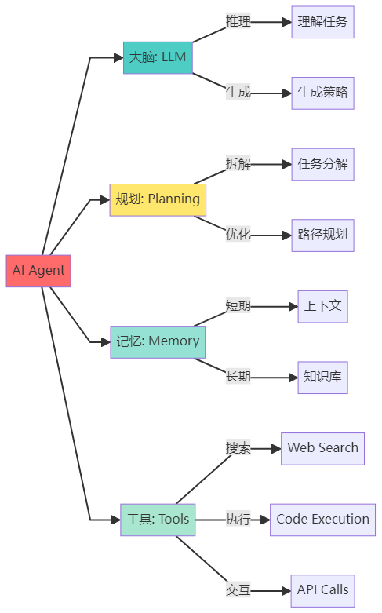

（图片来源：小滴课堂资料）

#### （二）两种主流规划方法

1.ReAct框架（边想边做Reasoning + Acting）

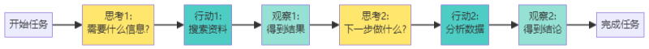

（图片来源：小滴课堂资料）

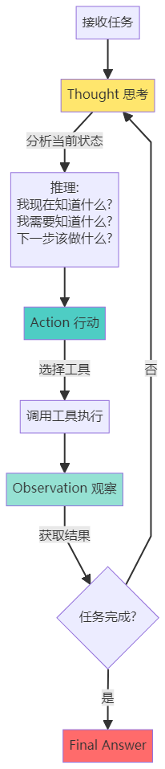

（图片来源：小滴课堂资料）

2.Plan-and-Execute（先计划后执⾏）

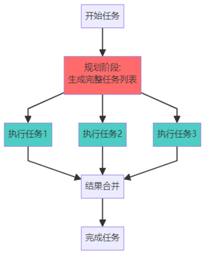     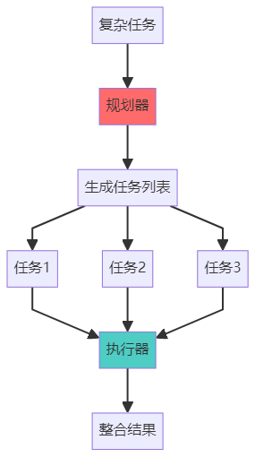

（图片来源：小滴课堂资料）

#### (三)记忆架构图

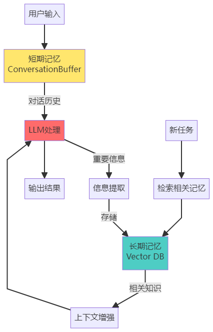

（图片来源：小滴课堂资料）

高级技巧：

（1）自动清理不重要的记忆

（2）记忆的时效性管理

#### （四）构建Agent的五⼤难点与解决⽅案

###### 难点⼀：⽆限循环与任务卡死

⽅案1：设置最⼤迭代次数

⽅案2：优化提⽰词，明确终⽌条件

⽅案3：实现智能终⽌判断

###### 难点⼆：⼯具选择错误

⽅案1：改进⼯具描述

⽅案2：添加⼯具使⽤⽰例

⽅案3：实现⼯具推荐系统

###### 难点三：上下⽂窗⼝溢出

⽅案1：智能压缩上下⽂

⽅案2：分层记忆

⽅案3：动态⼯具加载

###### 难点四：错误处理与鲁棒性

⽅案1：⼯具层⾯的错误处理

⽅案2：Agent层⾯的降级策略

⽅案3：实时监控与告警

###### 难点五：成本控制

⽅案1：模型分级使⽤

⽅案2：缓存机制

⽅案3：批处理

⽅案4：设置预算限制

#### （五）多Agent协同系统设计

1. 多Agent系统架构：
   
   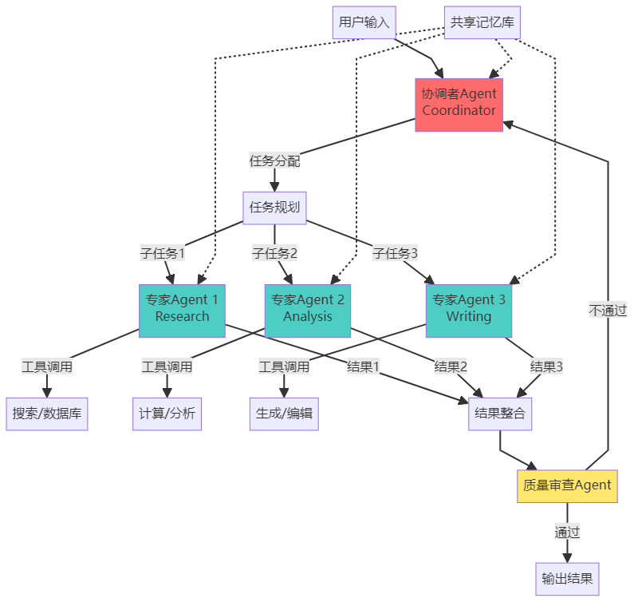
   
   （图片来源：小滴课堂资料）
   
   2.多Agent协作模式：
   
   模式1：层级结构（Hierarchical）
   
    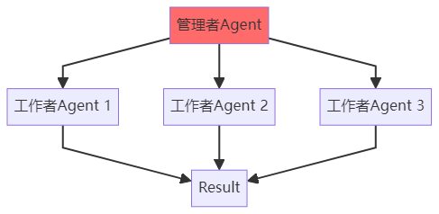
   
   （图片来源：小滴课堂资料）
   
   模式2：平等协作（Collaborative）
   
    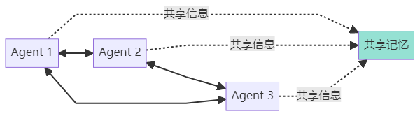
   
   （图片来源：小滴课堂资料）
   
   模式3：流⽔线（Pipeline）
   
    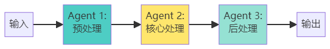
   
   （图片来源：小滴课堂资料）
   
   3.多Agent的关键挑战：
   
   挑战1：通信开销
   
   问题：每次通信都要调⽤_LLM_
   
   解决：使⽤结构化消息，Agent直接处理结构化消息，只在必要时调⽤LLM_
   
   挑战2：死锁和循环依赖
   
   问题：两个Agent互相等待
   
   解决：超时和fallback机制
   
   挑战3：结果冲突
   
   问题：不同Agent给出不同的答案
   
   解决：投票或仲裁机制

### 三、总结

总体来说，Agent已经能够实现比较强大的功能，只是现在还没有在市场上全面铺开，目前我接手的项目也都是用Agent开发业务逻辑，后续应该是大模型开发的主流思想，顺势而为吧。

* * *

**作者**：吴银双

**日期**：2026年4月20日

**平台**：GitHub Pages / 技术博客
