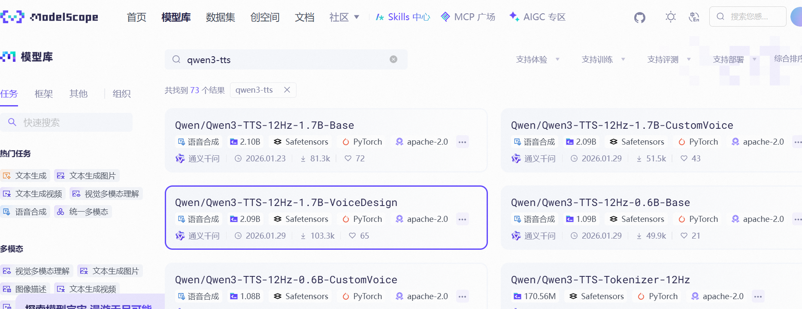
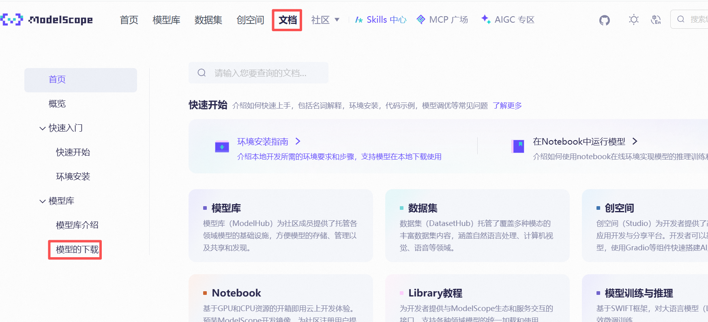
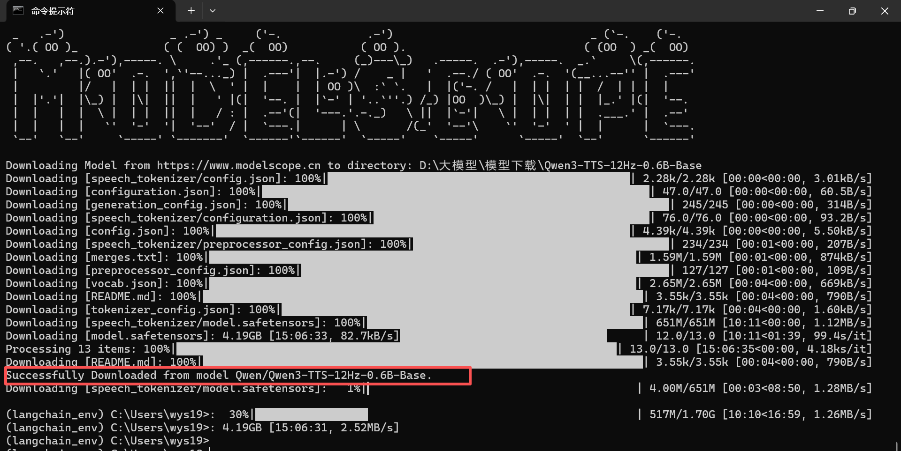

### 一、引言

平常很多模型都要到外网下载，网速很慢，ModelScope（魔搭社区）是**阿里巴巴集团**旗下的AI模型开源社区与平台，由**阿里云**和**达摩院**共同推出，它是阿里官方的“AI模型应用商店”，从他的模型库里下载模型会方便很多。

### 二、具体内容

1. 访问modelscope官网[ModelScope 魔搭社区](https://www.modelscope.cn/my/overview)，没有账号的自己注册一个，点击模型库，搜索自己想下载的模型。

2. 进入模型详情页，点击上方的“文档”标签，再点击左侧的“模型的下载”。
   
   3.下载模型到本地指定路径下：
   先在本地创建激活python环境，然后安装modelscope包，下载指定模型:
   
   ```bash
   # 创建名为 `langchain_env` 的虚拟环境 
   python -m venv langchain_env 
   # 激活虚拟环境 # Windows: 
   langchain_env\Scripts\activate 
   # 3. 安装依赖 
   pip install modelscope
   # 4.再根据模型下载页面的介绍，使用命令行下载对应的模型到指定路径下：
   modelscope download --model Qwen/Qwen3-TTS-12Hz-0.6B-Base --local_dir D:\大模型\模型下载\Qwen3-TTS-12Hz-0.6B-Base
   ```
   
   4.下载完成后，截图如下：
   
   

### 三、总结

命令行下载还是比较简单的，但是要注意虽然官方文档里模型id和本地路径都带引号，但我只要带引号就会报404找不到模型，这算个小坑了。

* * *

**作者**：吴银双

**日期**：2026年5月8日

**平台**：GitHub Pages / 技术博客


