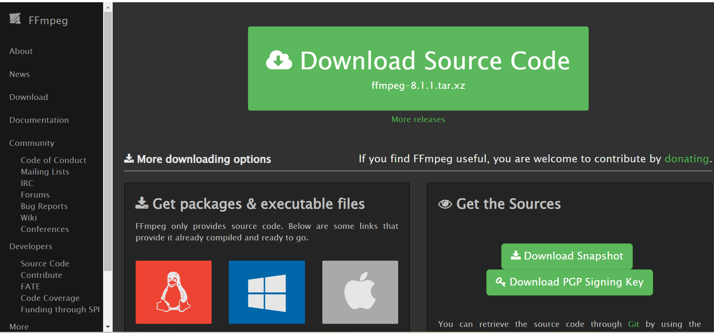
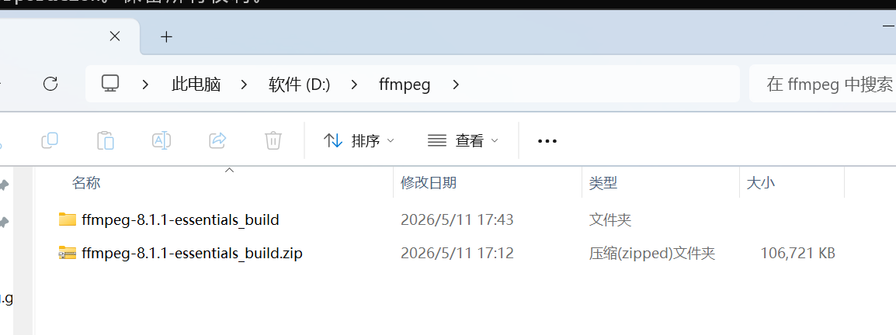
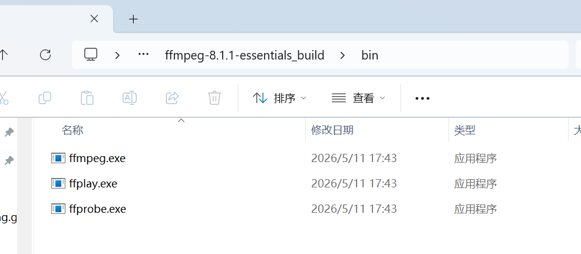
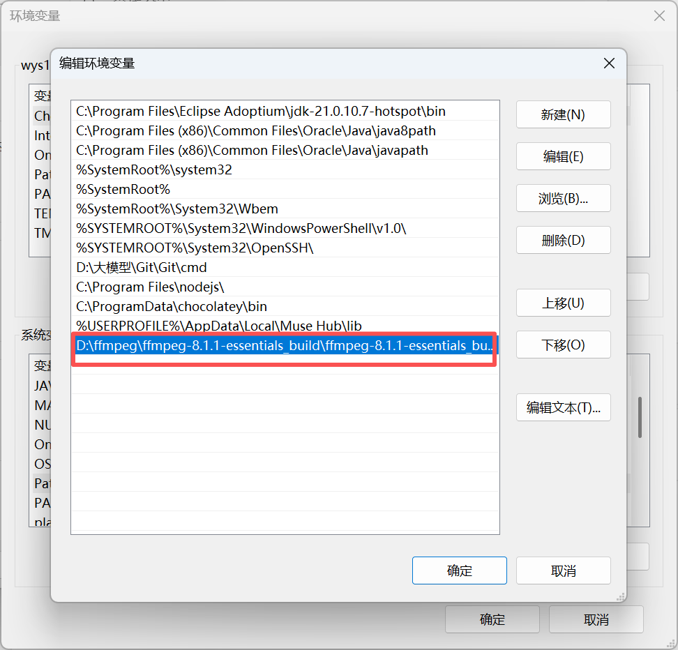
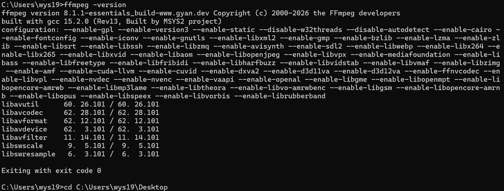
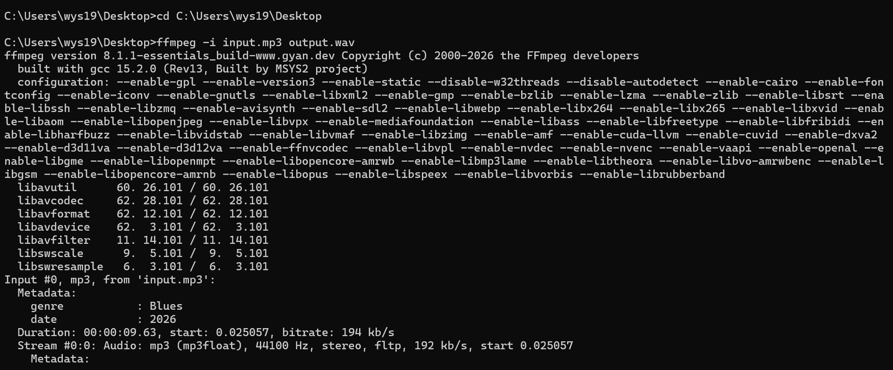
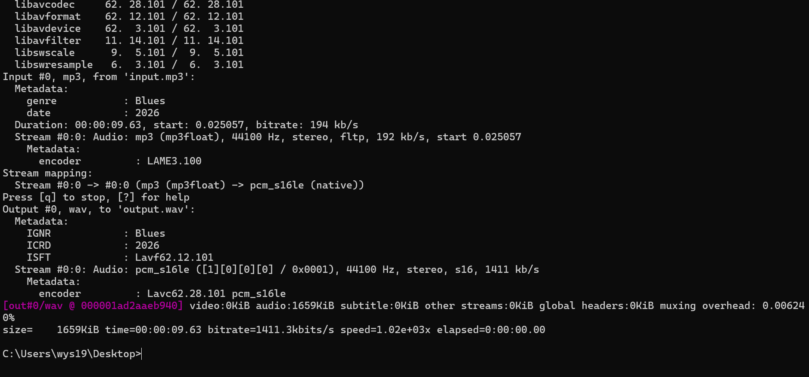
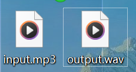

### 一、引言

最近一直在研究asr/tts模型，发现不同的模型对音频格式要求不同，有时候需要把音频格式在wav,m4a,mp3几种格式之间来回转换，所以给电脑安装了ffmpeg。

### 二、具体内容

1. 首先访问ffmpeg官网下载地址：[https://ffmpeg.org/download.html#build-windows](https://ffmpeg.org/download.html#build-windows)，我下载的是windows版本下gyan提供的压缩包：[https://www.gyan.dev/ffmpeg/builds/packages/ffmpeg-8.1.1-essentials_build.zip](https://www.gyan.dev/ffmpeg/builds/packages/ffmpeg-8.1.1-essentials_build.zip)。
   

2. 下载到本地后，全部解压：
   然后把解压后的bin目录复制下来配置到环境变量-系统变量-path中。我的路径是：D:\ffmpeg\ffmpeg-8.1.1-essentials_build\ffmpeg-8.1.1-essentials_build\bin
   



3.添加后打开cmd输入ffmpeg -version查看ffmpeg是否安装成功：



4.使用ffmpeg命令转换音频格式：

```bash
# 将input.mp3转换成wav格式
ffmpeg -i input.mp3 output.wav
# 指定原音频路径和输出路径
ffmpeg -i "C:\Users\wys19\Desktop\input.mp3" "D:\Output\song.wav"
```





转换成功：



### 三、总结

命令行转换比较简单，其实也有一些在线转换网站，但是出于安全合规考虑，还是在自己电脑上转换好一些。

* * *

**作者**：吴银双

**日期**：2026年5月12日

**平台**：GitHub Pages / 技术博客
