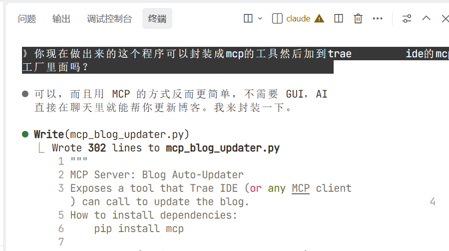
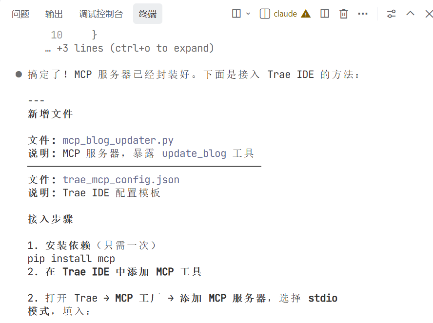
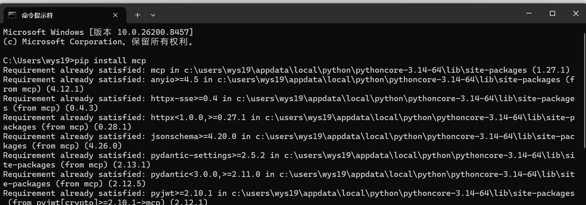
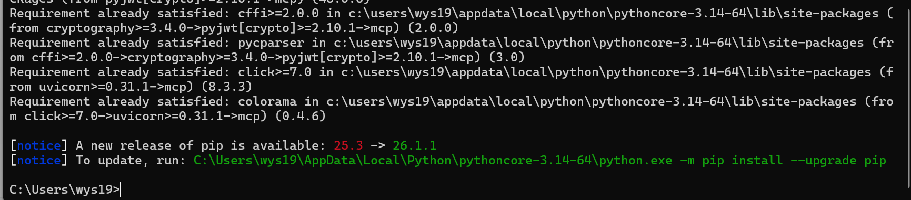
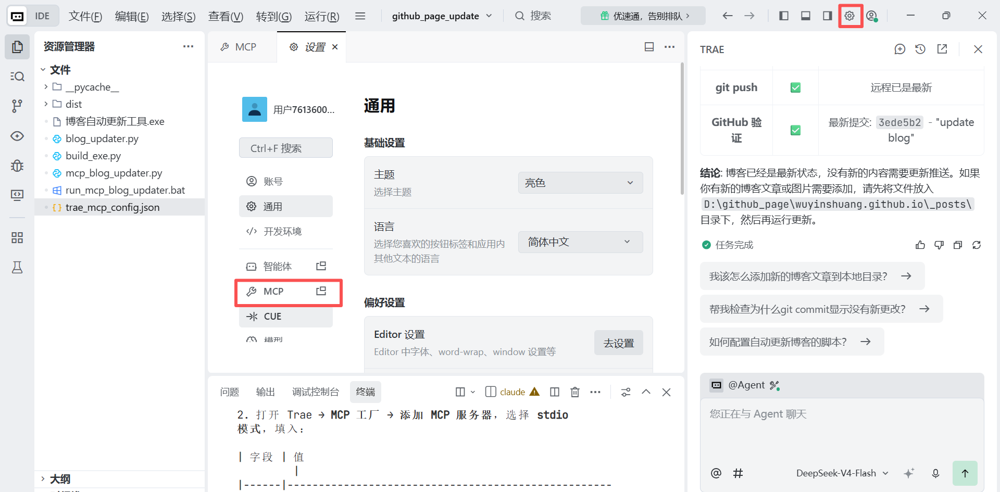
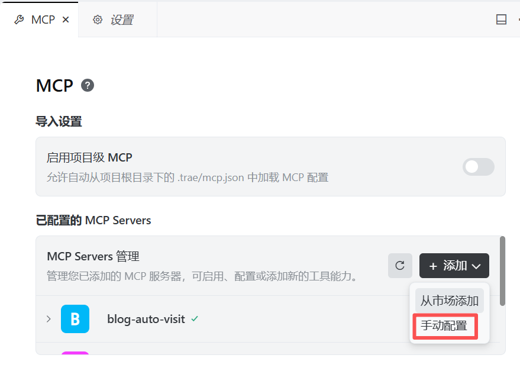
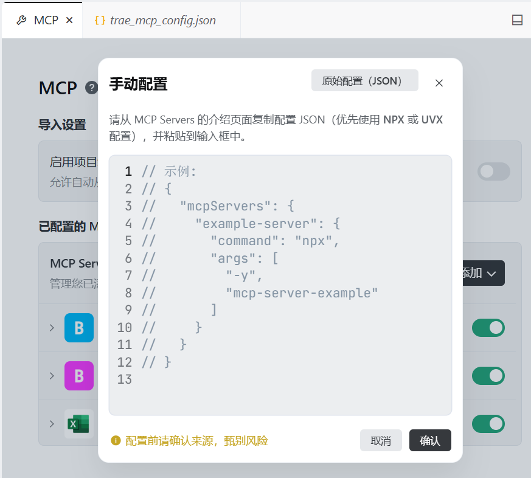
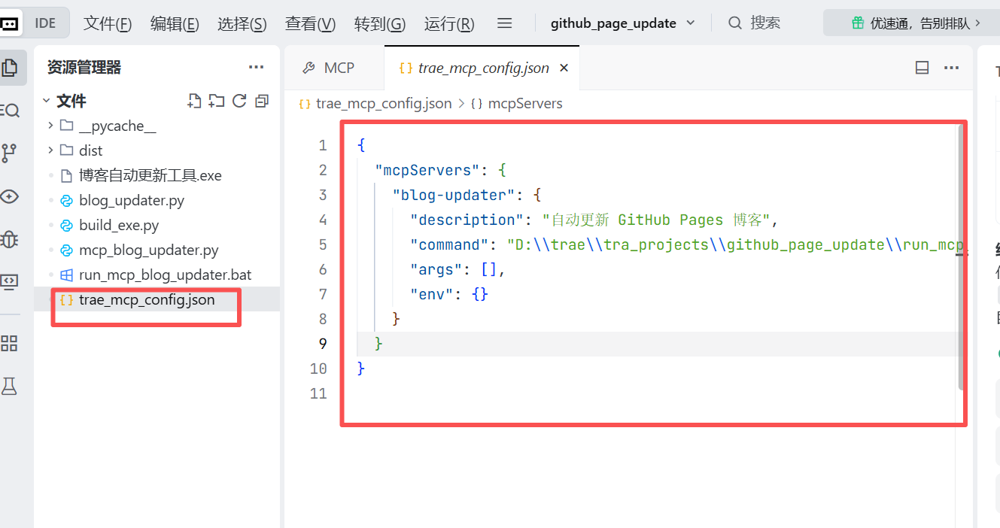
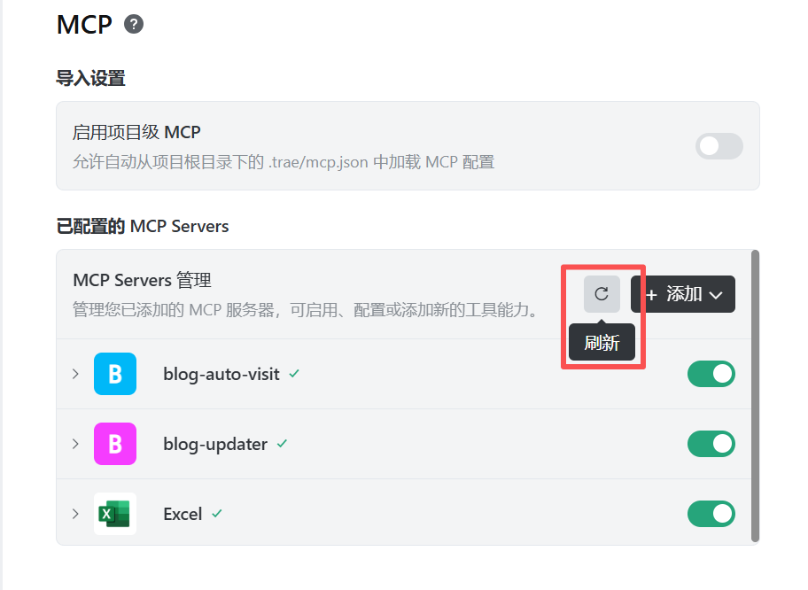
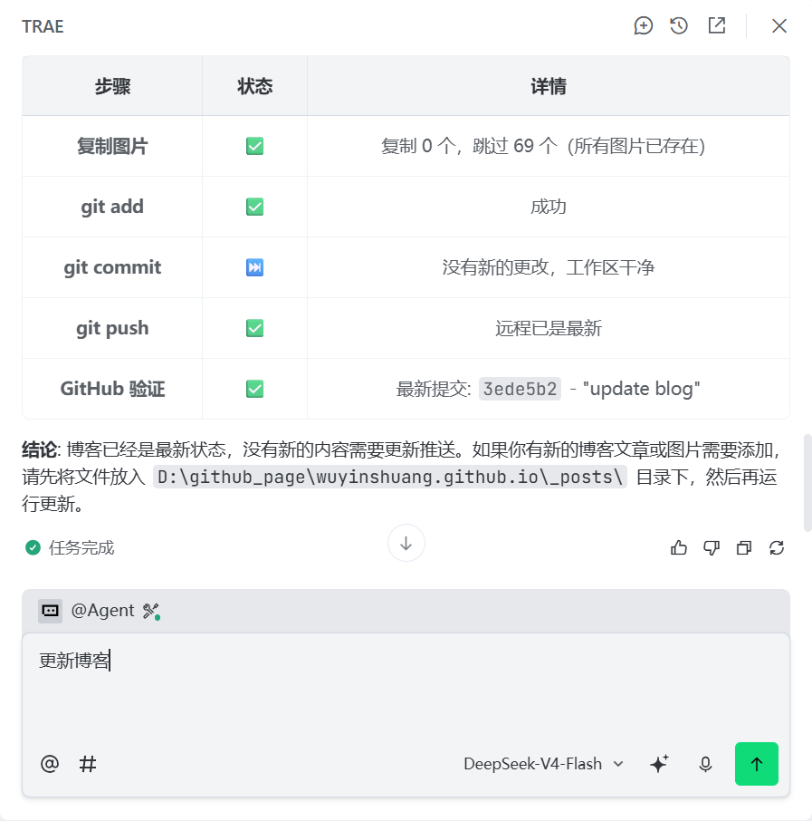

### 一、引言

上一篇已经实践过在trae中使用claude code来实现自己需要的功能，但是程序每次都需要运行。现在来试一下把这些功能封装成mcp协议然后直接在trae ide的mcp工厂里手动添加，以后只需要在trae ide的对话框里输入自然语言，就能自动调用对应的工具了。

### 二、具体内容

#### （一）封装mcp工具

1.直接在claude code对话框里输入“请帮我把你现在做出来的这个程序封装成mcp的工具然后加到trae  ide的mcp工厂里面”





#### （二）在trae ide的MCP工厂里添加工具

1.先按win+R打开cmd命令框，然后输入上面的指令安装mcp:

```bash
pip install mcp
```





2.安装完成后，打开右上角的设置按钮，点击MCP页签，点击手动配置：





3.将claude code生成的mcp.json复制出来，粘贴到手动配置页面，然后点击确认，刷新按钮后出现对号就表明工具加好了，我加的是每次自动推送博客文章的工具。







#### （三）在trae ide的对话框里直接输入指令调用工具

在对话框里直接输入“更新博客”，可以看到我的博客已经自动更新到网站上了。



### 三、总结

Claude Code 和trae真的越用越惊喜，确实可以极大提高自己的效率，后面再继续探索。

* * *

**作者**：吴银双

**日期**：2026年5月14日

**平台**：GitHub Pages / 技术博客
