### 一、引言

最近有空余时间可以研究claude code 和 trae了，今天就从最简单的安装和使用开始。

### 二、具体内容

#### （一）安装trae ide

1.首先访问trae官网下载地址：[https://www.trae.cn/](https://www.trae.cn/),下载trae ide windows版，trae solo其实更适合小白使用，但是我们需要集成开发环境，所以先跳过tra solo。下载完直接双击运行exe即可。
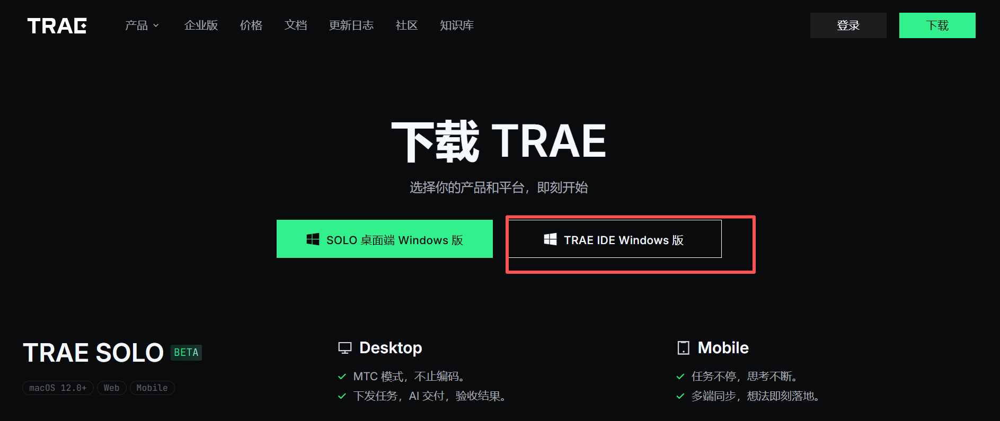

2.打开trae ide，新建一个项目文件夹，一般打开之后会有左边资源管理器，中间代码查看区，右边trae智能助手，如果没有展示终端，我们直接点击顶部菜单栏中的更多-终端-新建终端，终端区域就会跳出来了：

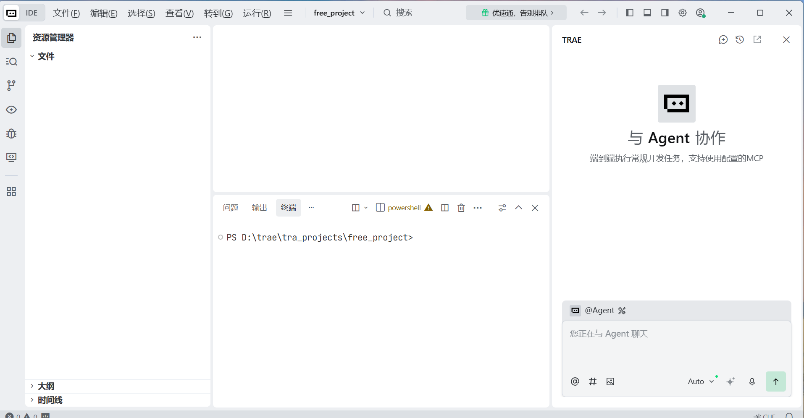

#### （二）安装claude code

1.在终端种输入claude code安装命令，具体命令可以在[claude code官网](https://claude.com/product/claude-code)查看，不知道为什么我的终端输入irm https://claude.ai/install.ps1 | iex命令一直报错（可能是区域限制），所以我最后使用WinGet 安装，在终端输入以下命令：

```bash
winget install Anthropic.ClaudeCode 
```

    安装完成后如图：

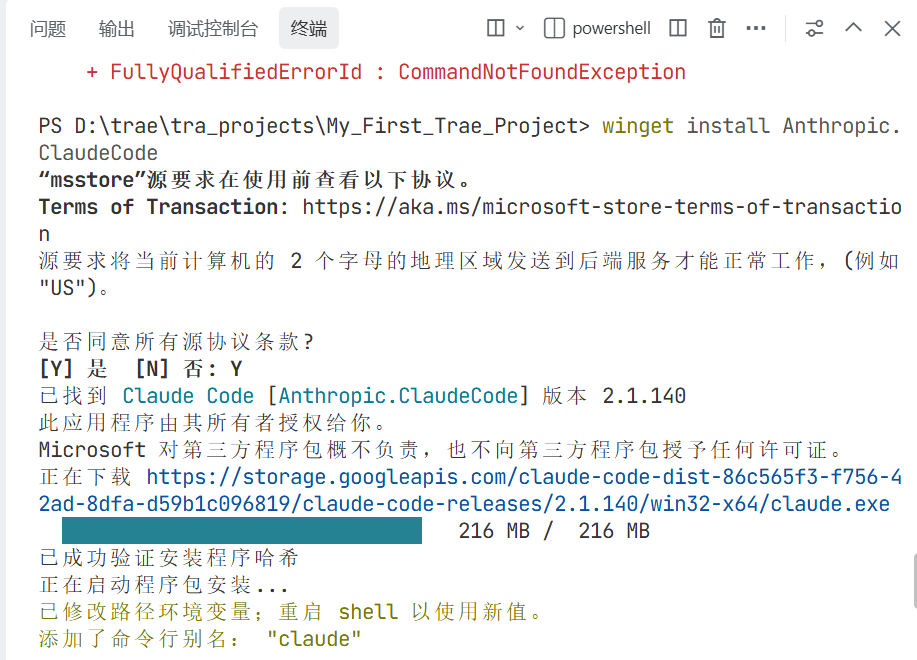

2.安装完成后查看是否成功：

```bash
claude --version
```

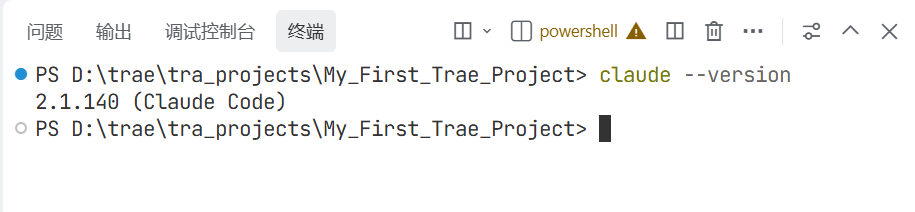

#### （三）安装cc switch

1.访问 GitHub Releases 页面：[Releases · farion1231/cc-switch · GitHub](https://github.com/farion1231/cc-switch/releases)，来到页面最底部展开Assets，下载最新版本的 `CC-Switch-v{版本号}-Windows.msi`文件

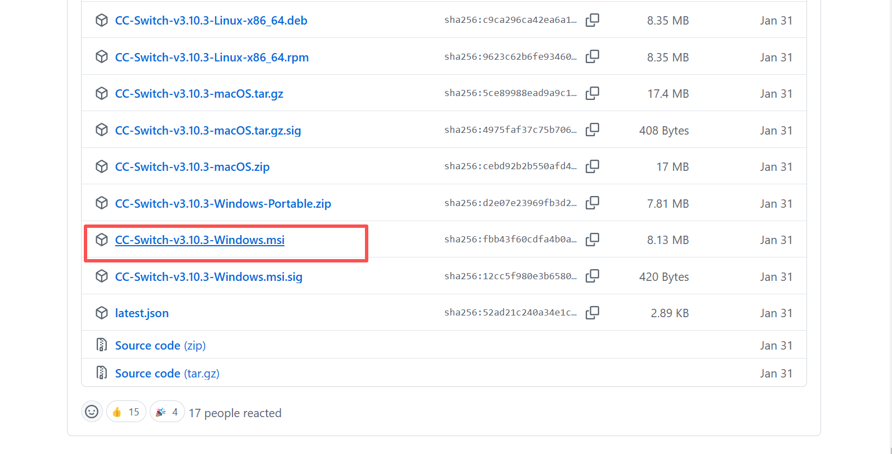

下载之后直接双击运行安装

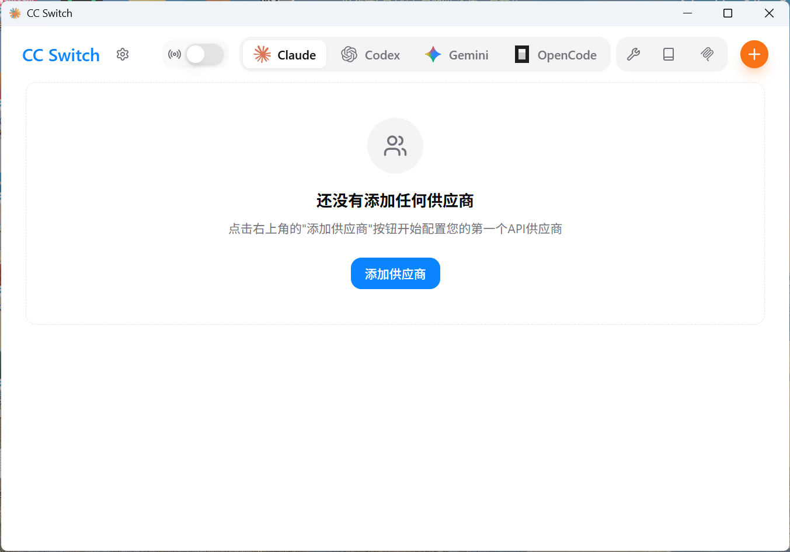

2.配置自己的供应商，（如果没有api-key可以去deepseek、阿里云百炼等官网申请一个，有的会免费赠送一些token，我的都是免费的）我配置了deepseek和阿里云百炼：


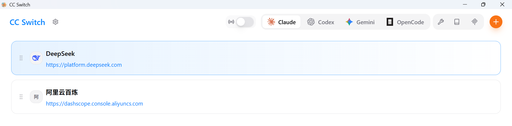

3.在trae ide终端输入claude测试一下，如果能对话就说明此时配置的供应商已经能成功连接了（第一次执行claude命令会让你选择主题颜色之类的，一路enter就行了）

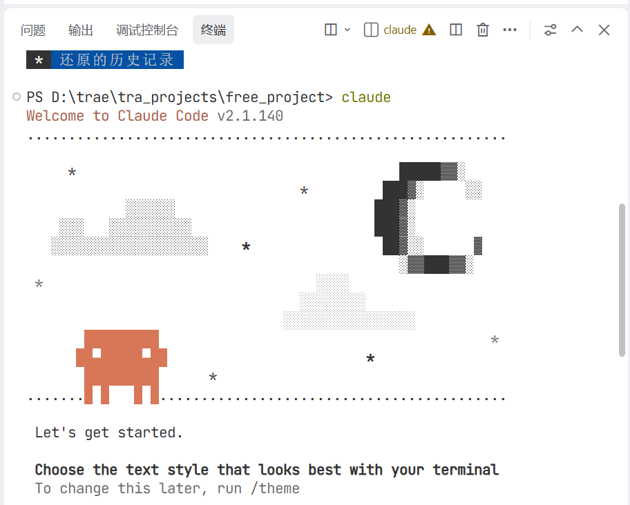

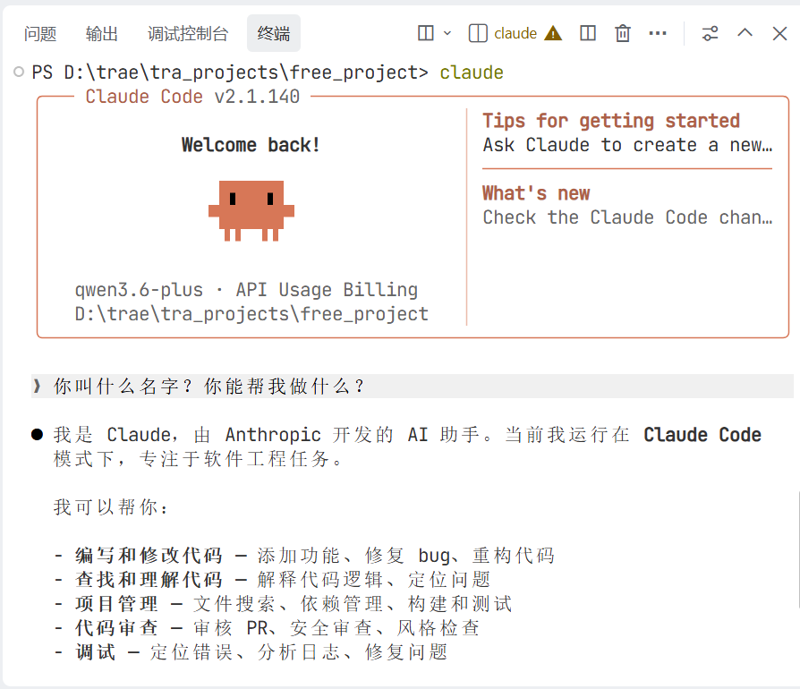

#### （四）项目实践

1.继续在刚才trae ide终端下面与claude code对话，直接告诉他我们的需求。在对话之前先了解一下claude code有三种模式（按shift+tab键循环切换）：

（1）默认模式：claude code自主判断，智能模式切换

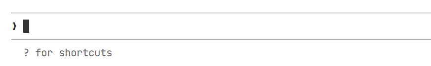

（2）自动编辑：claude code可以自动修改我们的本地文件，运行命令时需要询问

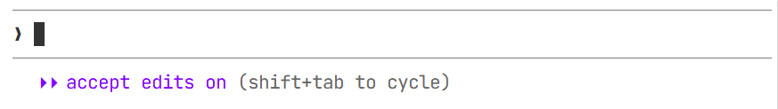

（3）计划模式：claude code先制作计划，得到我们确认后再执行

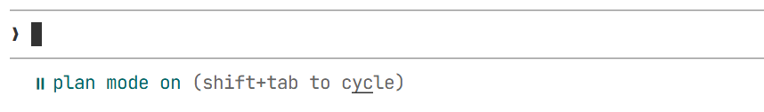

我这里就直接用默认模式了，在对话框输入我的需求，比如我想让他帮我做一个待办事项管理的桌面APP，我直接输入“请你帮我做一个待办事项管理的桌面APP”然后回车：

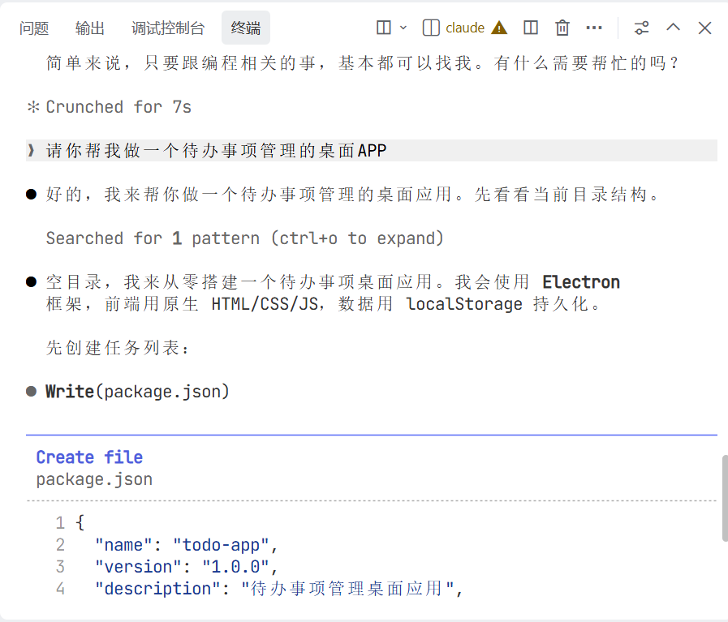

他会在运行过程中询问是否创建文件、执行命令等，我直接选择第2个选项，同意并且以后在这个会话都允许；另外，如果想要不用我们每次点同意，可以直接在claude启动时加上一行命令claude --dangerously-skip-permissions，后面就不会一直问了。

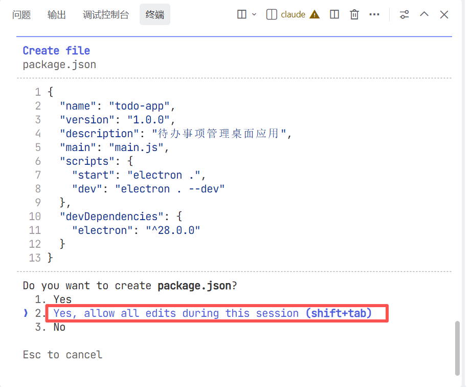

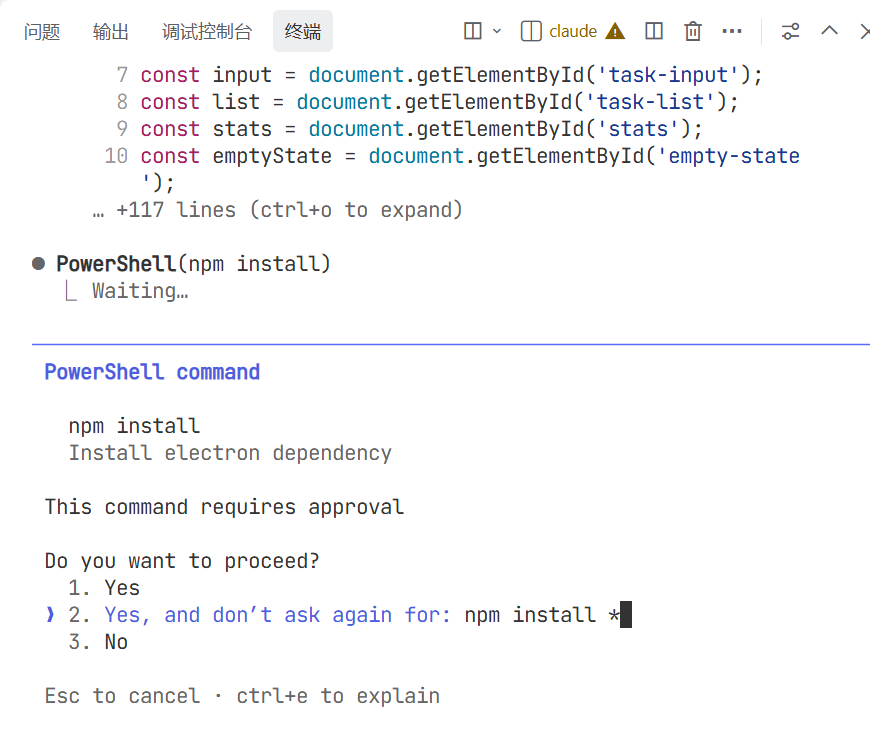

启动成功，待办事项界面直接跳出来了，试了一下功能很丝滑，就是界面比较简单没那么美观（也是因为我给的指令比较简单哈哈哈哈）

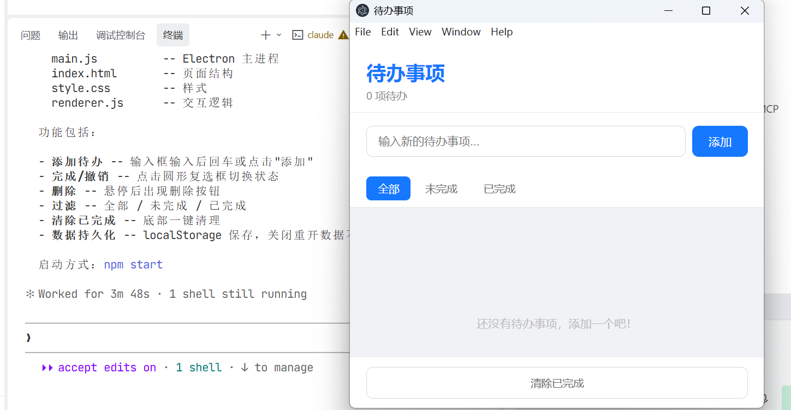

如果想把这个应用停掉，也可以问一下claude code怎么停：

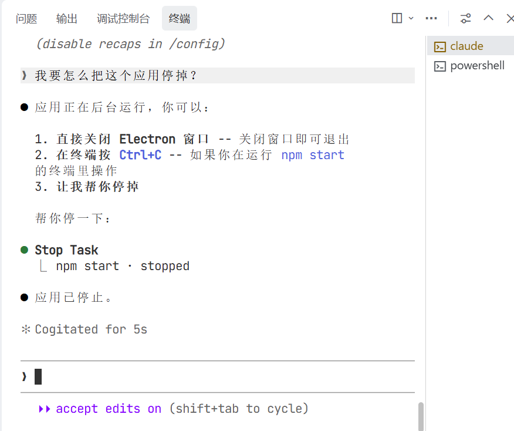下次想再启动这个应用时，直接新建终端，然后输入npm start就可以啦！

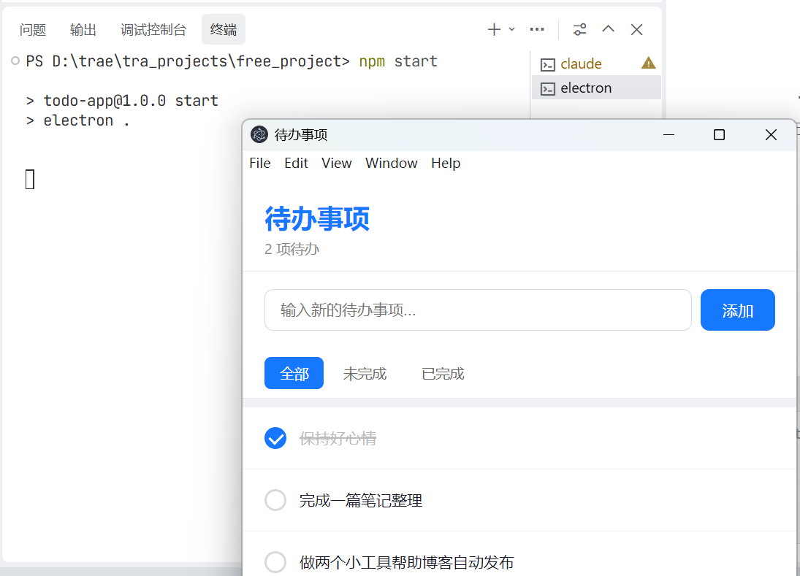

ok，到此，claude code初次尝试就完成啦！

### 三、总结

Claude Code 本身是一个专门为编程优化的 AI 工具，它在代码生成、调试、解释和重构方面确实非常出色。不过我用的是阿里云百炼里的qwen模型，没有用它配套的模型(Sonnet, Opus, Haiku)，因为比较贵，后面有时间再多比较一下不同的模型使用效果的区别。

* * *

**作者**：吴银双

**日期**：2026年5月14日

**平台**：GitHub Pages / 技术博客
