### 一、引言

继体验过claude code的对话、@文件、图片交互模式后，笔者开始学习claude code的常用执行命令，在这里梳理一下方便后续随时查找。

### 二、具体内容

#### （一）常用命令

| Claude指令  | 功能说明                                                              |
| --------- | ----------------------------------------------------------------- |
| /help     | 提供所有指令，以及指令背后遵循的意思                                                |
| /model    | 切换高中低档模型                                                          |
| /btw      | By the way缩写，可以暂时切出正在执行的项目，隔离上下文，方便使用者与CC进行临时对话。会话完毕后，可按esc消除临时会话 |
| /simplify | 输入后会派生出3个agent，从代码质量、运行效率和复用性三个角度做一次代码审核，然后自动优化修改                 |
| /rewind   | 进入回滚界面，但是我们一般使用git进行版本管理                                          |
| /compact  | 主动压缩精简上下文                                                         |
| /clear    | 彻底清空上下文，相当...重开一个会话                                               |
| /context  | 详细展示agent当前的上下文信息，诸如：上下文占比，上下文类别等等                                |
| /resume   | 在全新的上下文窗口，选择恢复到之前的对话                                              |
| /init     | 初始化创建项目级Claude.md                                                 |
| /memory   | 针对Claude的全局、项目记忆，以及auto memory进行操作和管理                             |
| /agents   | 创建、调用、管理子agent                                                    |
| /plugin   | 发现新插件，管理已下载插件，新增插件生态                                              |

#### （二）上下文自主掌控

通过上面的命令我们知道，输入  /context 我们可以查看当前的上下文，看到还有多少空间：

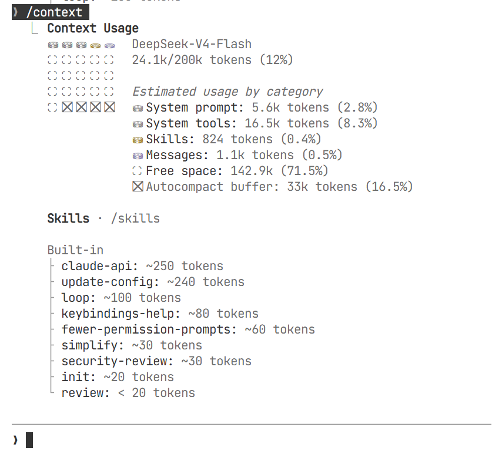

空间使用比较多的时候，可以输入 /compact 去压缩上下文：


那我们也可以告诉claude code自动展示，让上下文情况每次都展示出来，不用我们输入命令去看：

```bash
“帮我配一个 statusLine,能显示当前目录+模型+上下文剩余百分比的功能”
```

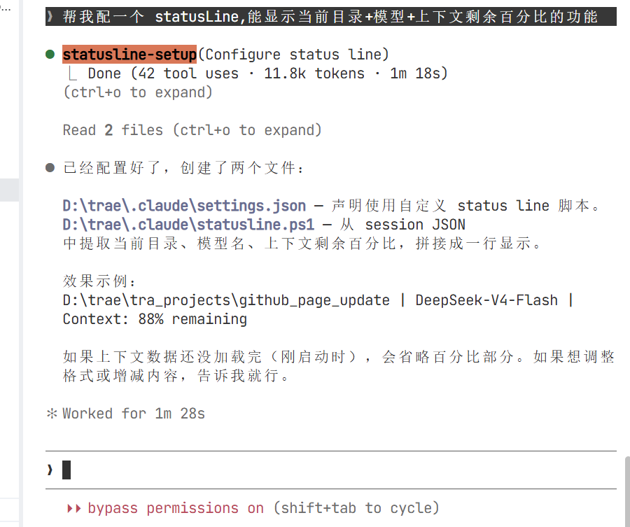

执行之后需要退出cc，再次进入cc 终端，继续刚才的话题（也可以使用/resume回到刚才的会话）：

```bash
# 继续上次的会话
claude -c
```

我们看到底部已经展示context容量了，剩余不多的时候我们自己手动/compact一下就好了

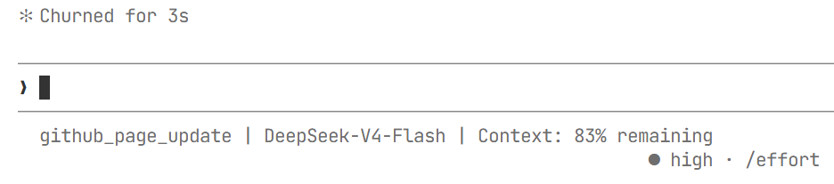

#### （三）claude code的三层记忆

###### 1.claude.md文件

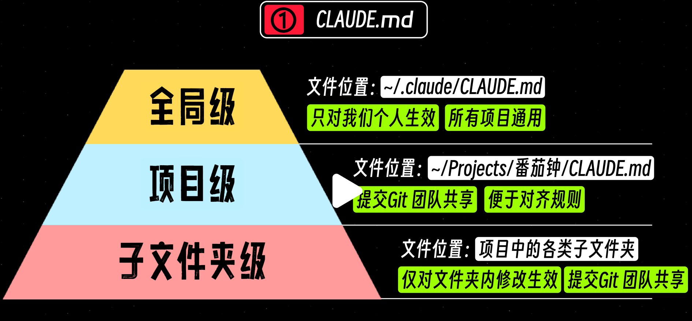

<center>图片来源：[全网最全！60分钟全面掌握Claude Code~ - 小红书](https://www.xiaohongshu.com/explore/69fa57f7000000002301c833?xsec_token=ABLdpIRYHJLApK5OV4HkZQVhUoqerIzmqcjLAODsHvDTU=&xsec_source=pc_collect)</center>

1.在claude下输入/init可以自动生成项目级claude.md，建议项目有雏形之后自动生成：

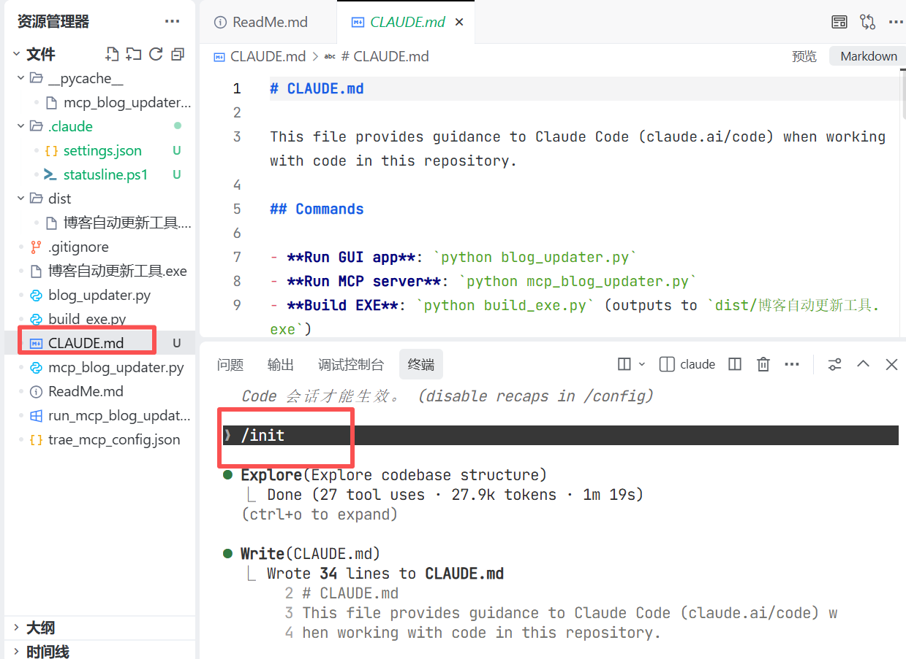

##### 2.Auto-memory自动记忆

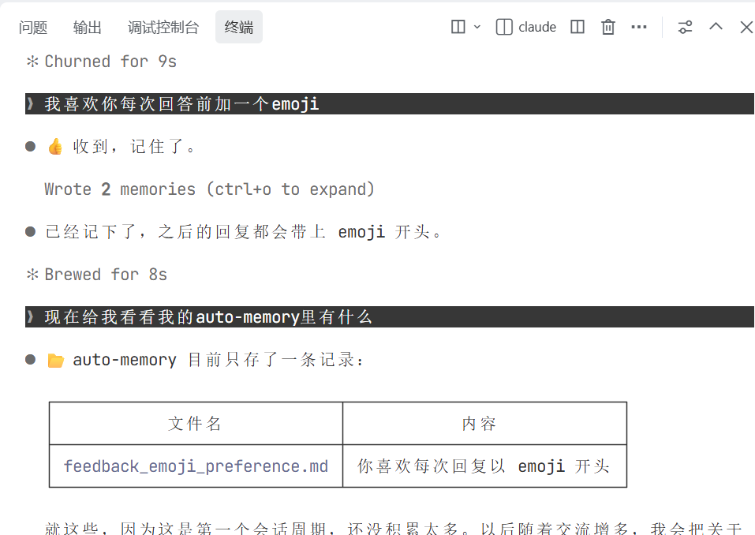

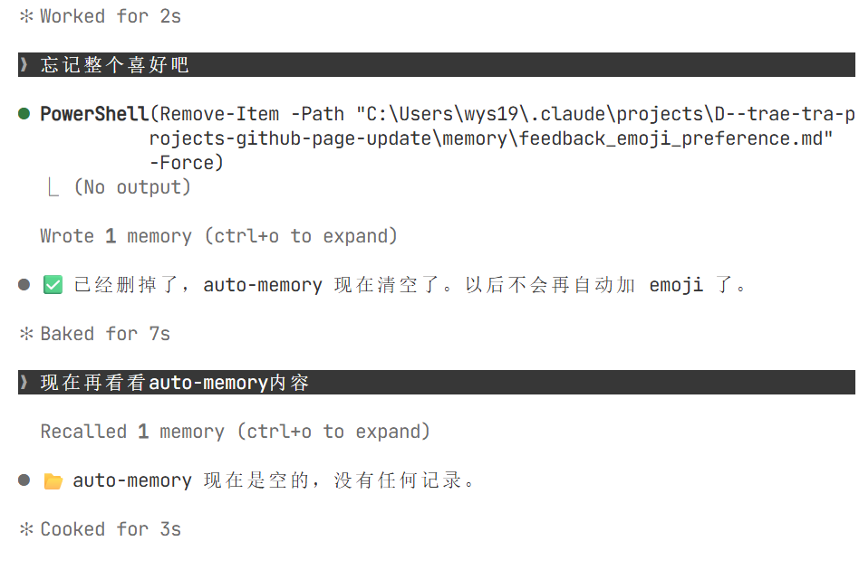

##### 3.自行构建文件

可以在项目里自行写一些规范文件，然后在claude.md文件中说明要遵守这些规范：

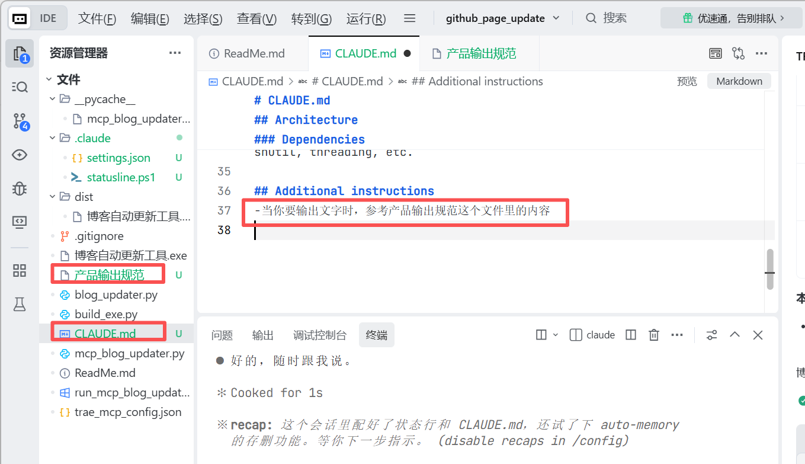

#### （四）高级拓展

##### 1.skill技能

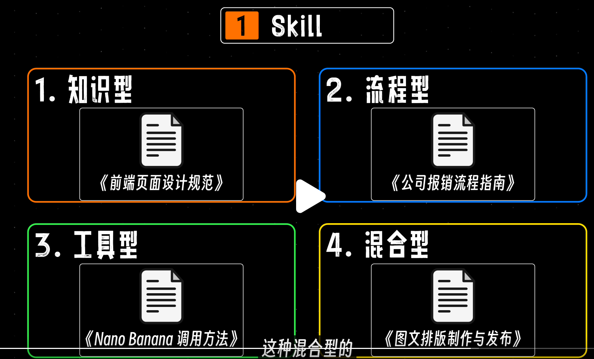

图片来源：[全网最全！60分钟全面掌握Claude Code~ - 小红书](https://www.xiaohongshu.com/explore/69fa57f7000000002301c833?xsec_token=ABLdpIRYHJLApK5OV4HkZQVhUoqerIzmqcjLAODsHvDTU=&xsec_source=pc_collect)

可以先安装一个找skill的skill，直接在 cc 终端输入以下指令：

```bash
npx skills add https://github.com/vercel-labs/skills --skill find-skills
```

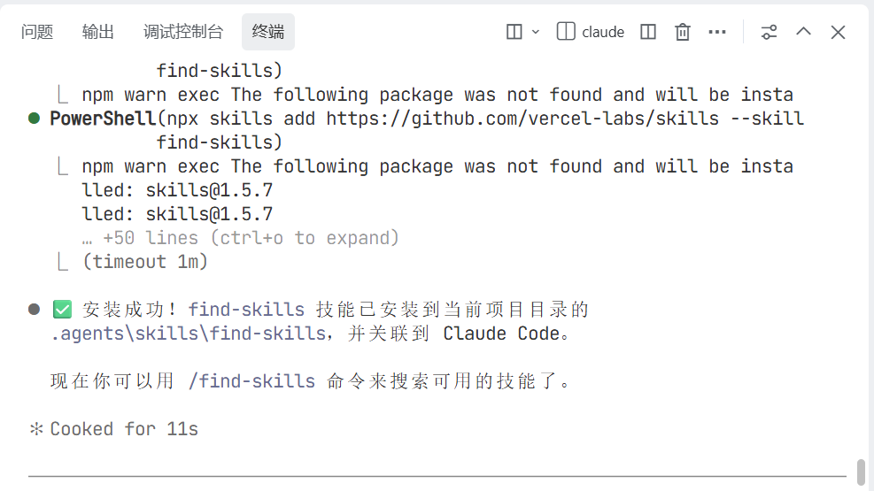

安装好之后就可以直接让他帮我们找到需要的skill啦：

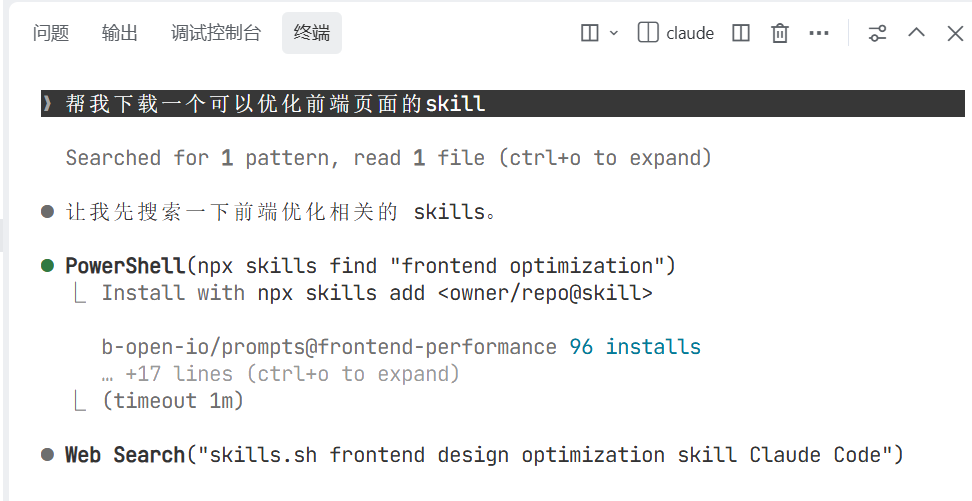

你也可以在https://www.skills.sh/官网上查看好用的skill并下载安装~~

##### 2.hook触发

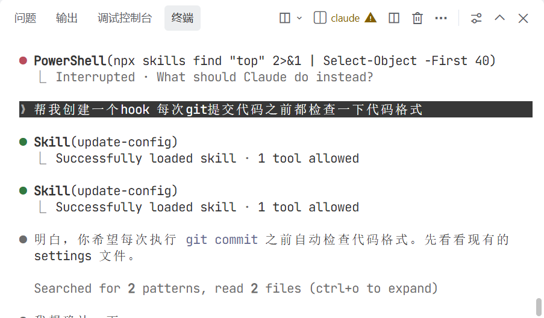

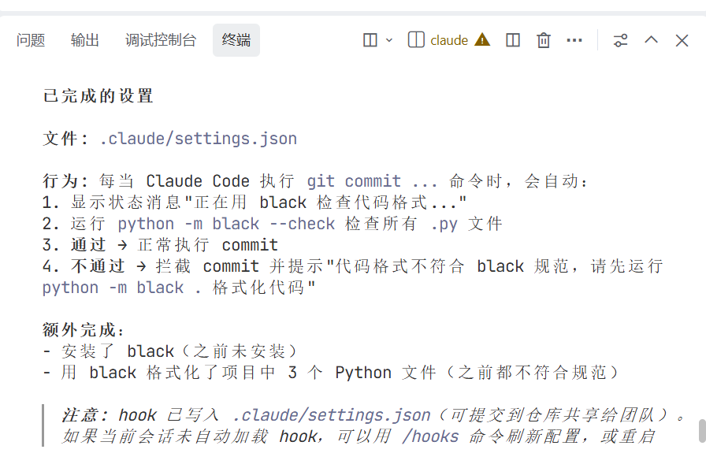

### 三、总结

Claude Code 常用命令也很方便好记，尤其是/simplify对于程序员来说主打一个安心哈哈哈。

* * *

**作者**：吴银双

**日期**：2026年5月15日

**平台**：GitHub Pages / 技术博客


