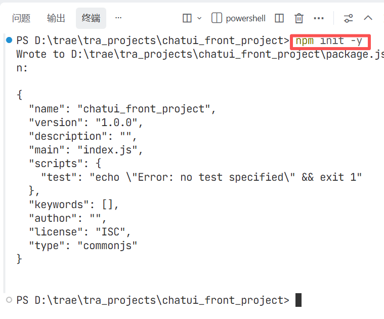
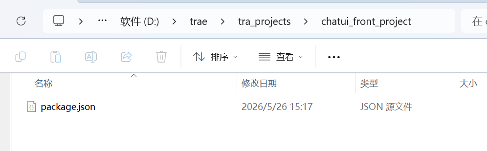
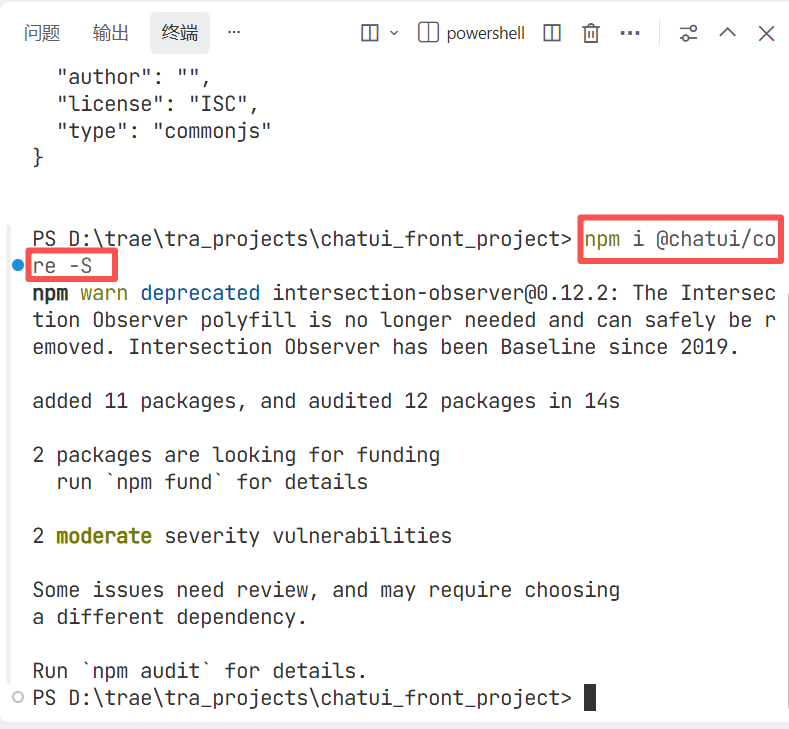

### 一、引言

最近与团队的小伙伴一起做一个ai项目，但是没有前端开发，了解到chatui组件非常适合ai前端搭建，所以来学习并实践一下。

### 二、具体内容

#### （一）安装chatui

##### 1.创建新项目

 先在本地新建一个空文件夹，用来写前端项目，我的文件夹就叫chatui_front_project

##### 2.初始化并安装chatui

在项目根路径下打开终端，执行以下命令

```bash
npm init -y
```



执行成功后项目文件夹会出现一个package.json文件：



接着执行安装命令：

```bash
npm i @chatui/core -S
```



#### （二）项目实践

### 7. 最终产出

- 提供完整的、可运行的代码。
- 在项目根目录提供一个 `README.md`，简要说明如何启动项目（`npm install` 和 `npm run dev`）。

## 注意事项

- 所有代码请使用现代 React (Hooks) 语法。
- 模拟 AI 回复的部分请使用 `setTimeout` 实现，并处理好“正在输入”状态 (`setTyping`)。
- 确保图标 CDN 链接正确引入，否则工具栏图标可能无法显示。


### 三、总结

总的来说，F层代码。

* * *

**作者**：吴银双

**日期**：2026年5月26日

**平台**：GitHub Pages / 技术博客
