### 一、引言

之前一直听大家说FastGPT，只知道他是一个搭建ai应用的平台，具体如何使用、有什么优势、核心功能都不太清楚，最近有空于是学习了一下。

### 二、具体内容

#### （一）核心功能

##### 1.私有知识库和RAG技术

我们知道，现在市场有已经有很多开源大模型可以使用，但是每个模型本身的知识更新时间点是固定的，而每天都会有大量的新信息和新知识产生，所以我们在问大模型问题时，有时候他是回答不出来的甚至可能产生幻觉。所以，我们可以事先把准备好的知识点放在一个数据库里，每当用户提问一个大模型不知道的问题时，我们先把问题向量化，去向量库里查相似文档把相关知识捞出来，然后把检索到的资料+用户问题+系统提示词拼接成完整的prompt发给大模型，大模型基于资料来回答自己不知道的问题。以上说的这一套就是大名鼎鼎的RAG(Retrieval检索+Augment增强+Generation生成)，其中检索资料、拼接上下文、发给大模型就是FastGPT做的。

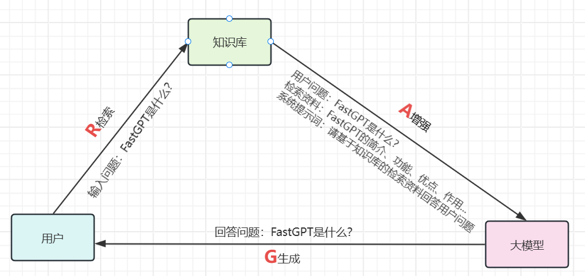

##### 2.可视化工作流编排

FastGPT 提供了一个类似“搭积木”或“画流程图”的拖拽式界面。你可以通过简单的连线，将各种功能模块（如：意图识别、知识库检索、大模型生成、API 调用、代码执行、条件判断等）组合在一起，从而设计出非常复杂的 AI 智能体（Agent）或业务处理流程。

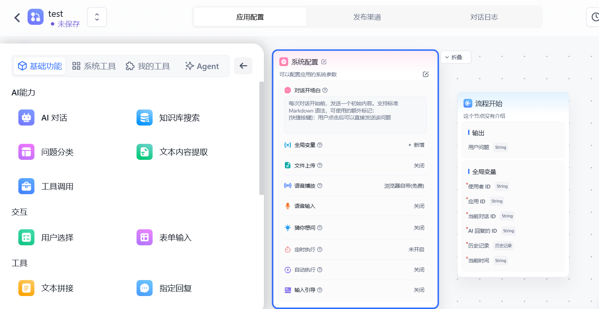

##### 3.多模型兼容

它不绑定任何单一的大模型。你可以在平台中自由接入各种主流的大语言模型 API，包括 OpenAI、Azure、以及国内的通义千问、智谱 AI、文心一言等，甚至支持接入本地部署的开源模型。

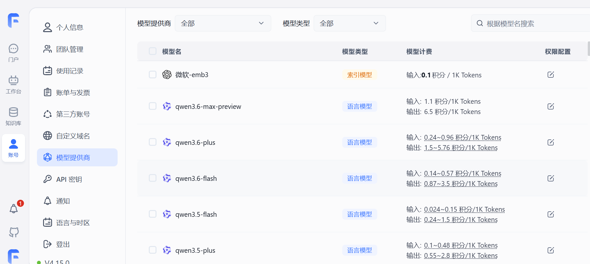

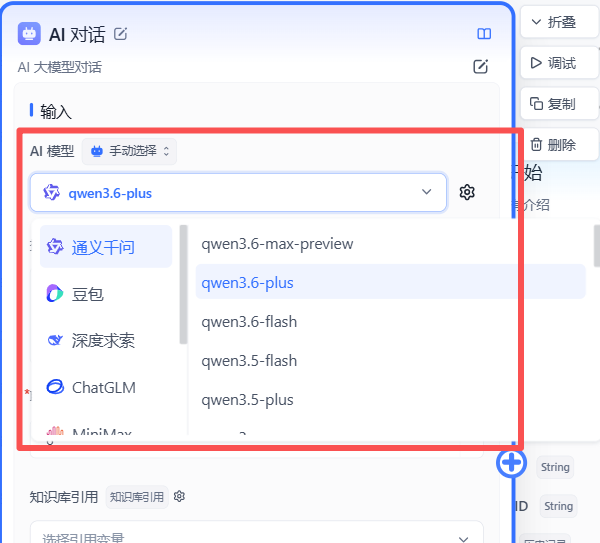

#### （二）实战记录

##### 1.创建知识库

新建一个知识库

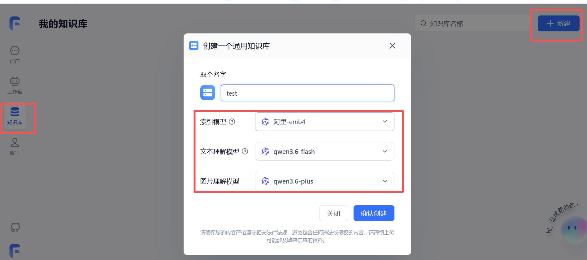

导入数据集

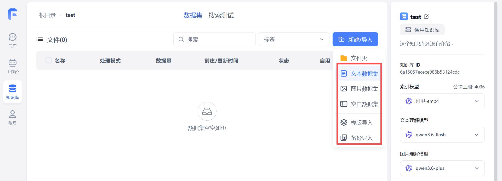

注意如果是按照模板导入自定义问答，则需要严格按照模板文件Q&A格式

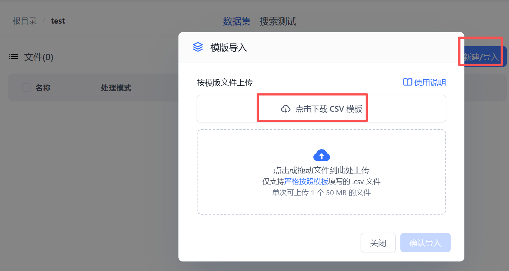

我这里就直接导入文本数据集了

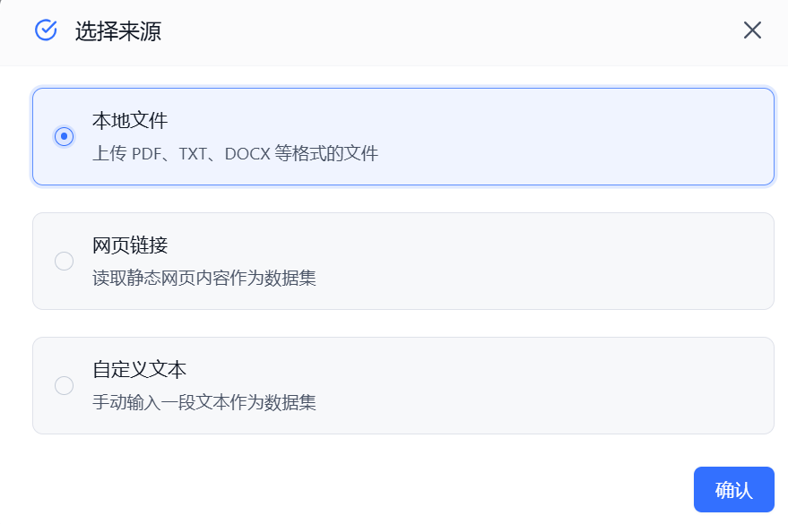

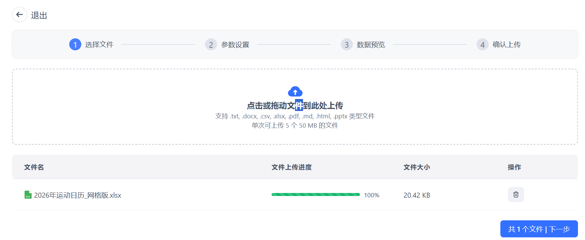

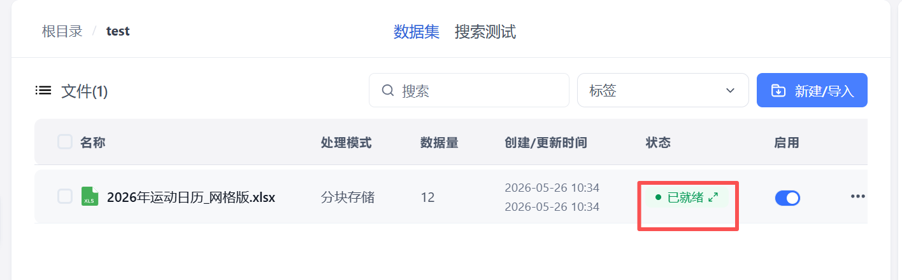

##### 2.创建一个新应用

选择模型，输入系统提示词

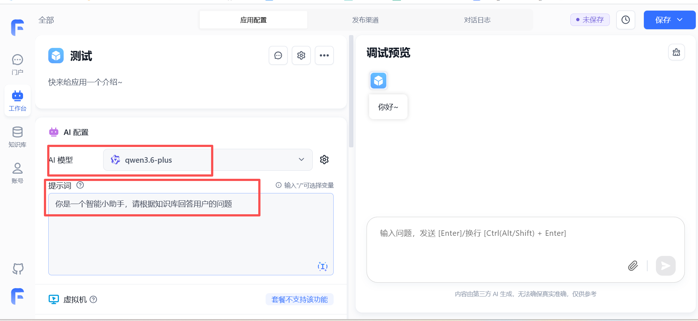

选择刚刚创建好的知识库

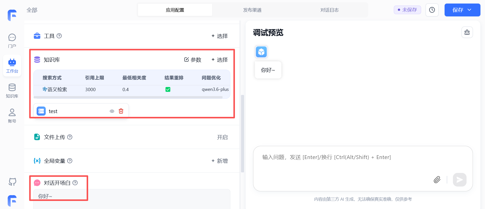

这时候大模型就能根据知识库中的内容进行回答了。

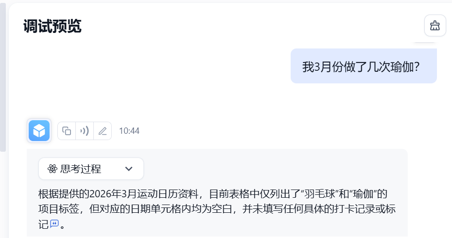如果我们想发布这个应用，也可以点发布渠道，这样别人就能通过链接访问我们创建的应用了。

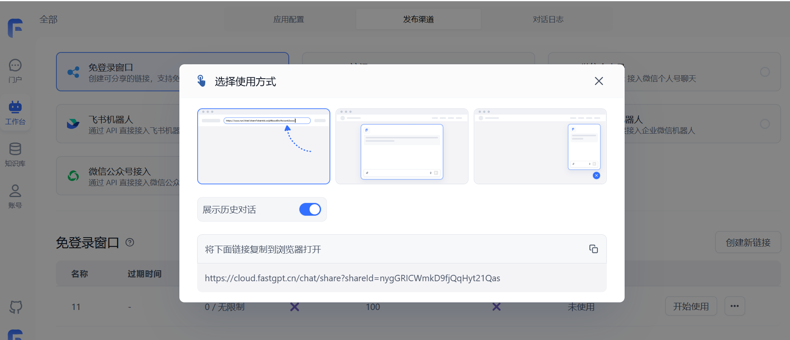

##### 3.工作流编排

从流程开始节点开始，如果需要大模型对话，就拖拽一个AI对话节点，若要调用工具，则拖拽一个工具调用节点，并从最底部菱形连接点去连接要调用的工具，我们可以调用知识库检索、HTTP接口等等，注意每个工具调用完要加一个工具调用结束节点。

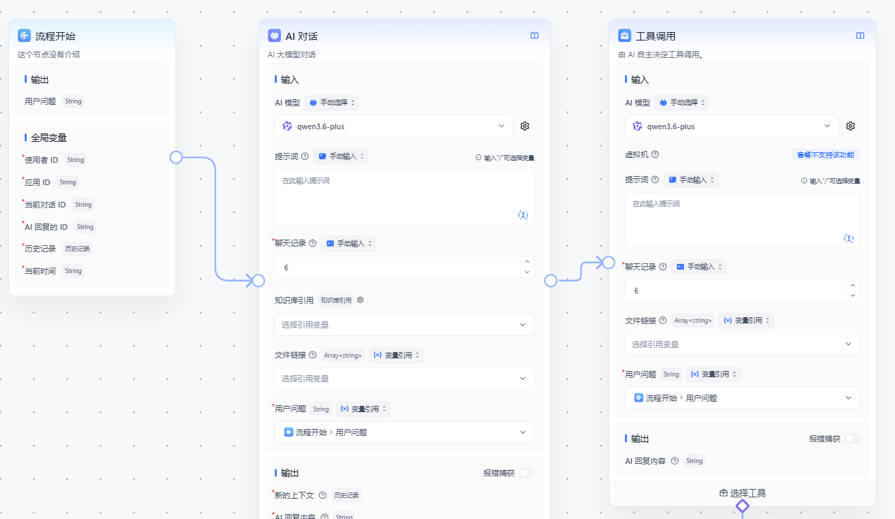

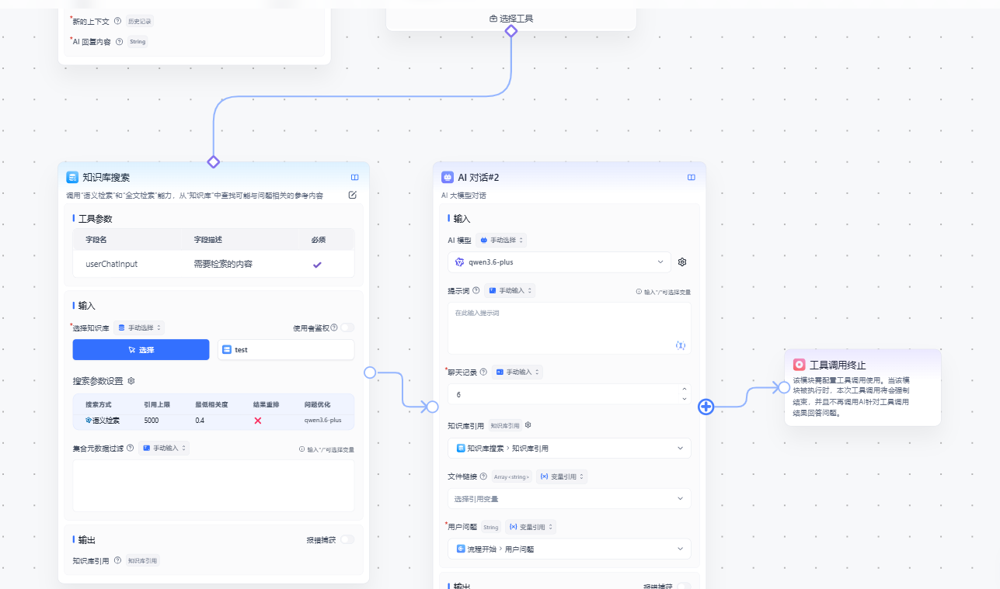

### 三、总结

总的来说，FastGPT 是一个**开源的 AI 知识库与大语言模型（LLM）应用开发平台**。它的核心目标是帮助开发者和企业快速搭建基于大模型的智能应用，而无需从零编写复杂的底层代码。

* * *

**作者**：吴银双

**日期**：2026年5月26日

**平台**：GitHub Pages / 技术博客
