### 一、引言

最近要自己部署一些服务，之前只是搭建博客和静态网页，所以直接放在github page上面了，现在要部署一些数据库等服务，于是开始来巩固linux知识了。

### 二、具体内容

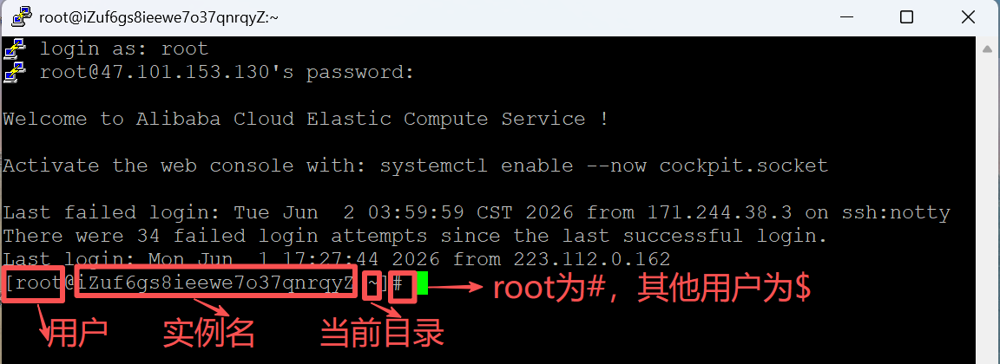

#### （一）Linux常用文件和目录命令

```bash
#列出目录下的内容
ls 
#列出目录下内容的详细信息
ls -l 
#列出目录下包含隐藏文件在内的所有内容
ls -a
```

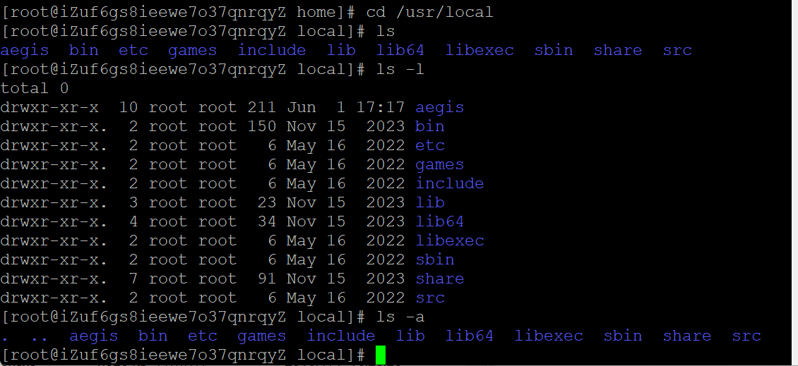

```bash
#切换目录
cd 路径
#显示当前工作目录的完整路径
pwd
```


```bash
#创建文件
touch 文件名
#创建目录或文件
mkdir 目录名或文件名
#创建多级目录
mkdir -p /绝对路径或当前路径
#创建多个同级目录
mkdir 目录1 目录2
```

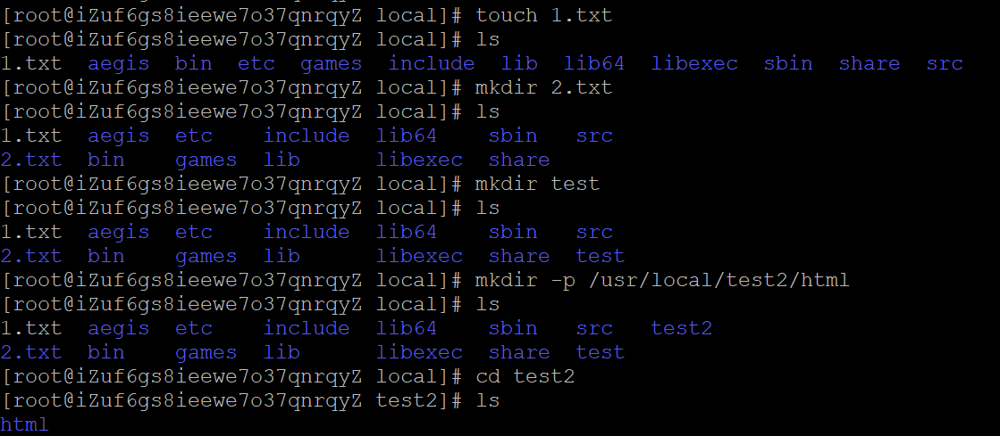

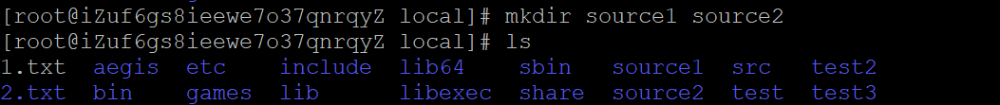

```bash
#删除文件
rm 文件名
#强制删除目录
rm -rf 目录名
#强制删除多个同级目录
rm -rf 目录1 目录2
#递归删除多级目录
rm -rf 父级目录
```

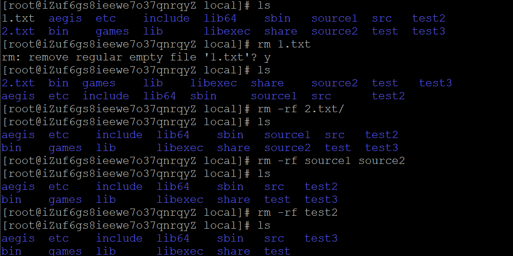

```bash
#复制文件
cp 文件名 目标路径下
#递归复制目录
cp -r 目录 目标路径下
```

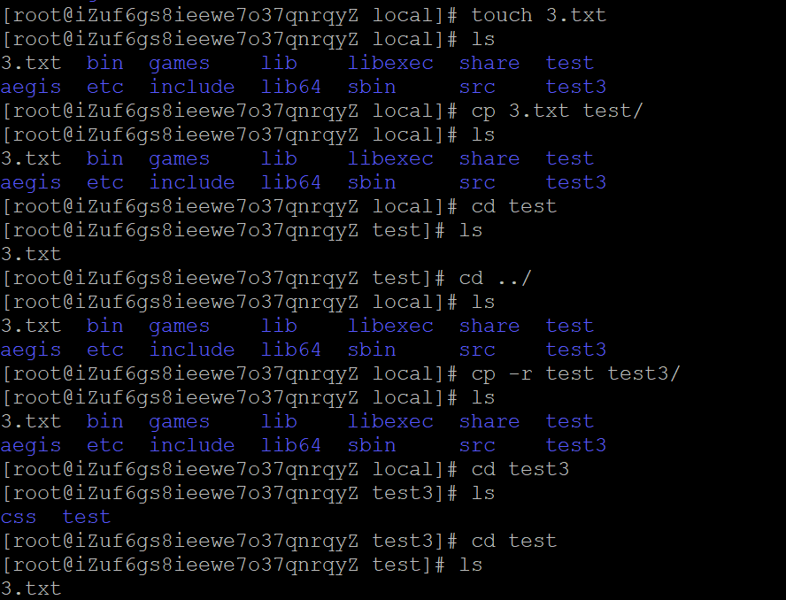

```bash
#移动文件或目录
mv 文件名 目标路径下
#重命名文件或目录
mv 原文件名/原目录名 新文件名/新目录名
```

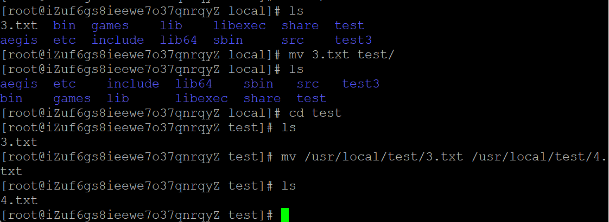

#### （二）Linux常用文件查看和编辑命令

```bash
#编辑文件
vim 文件名
输入i开始编辑
编辑完输入ctrl+c,然后输入:wq即可退出
#查看文件
cat 文件名
#查看文件前面几行
head -行数 文件名
#查看文件结尾（默认10行）
tail -f 文件名
#翻页查看文件（上下箭头翻页）
more 文件名
#查看文件中符合条件的字符串
cat 文件名 | grep '查找的字符串'
#查看文件中符合条件的字符串的总行数
grep '查找的字符串' 文件名 | wc -l
#列出文件中符合条件的字符串的行数
grep -n '查找的字符串' 文件名
```

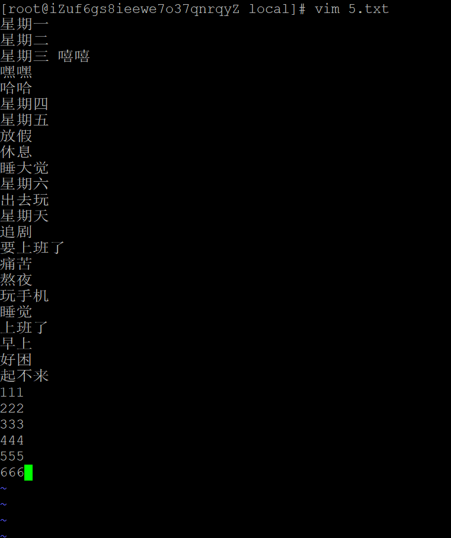


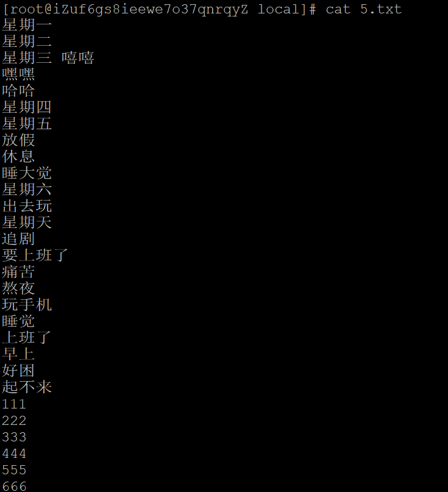

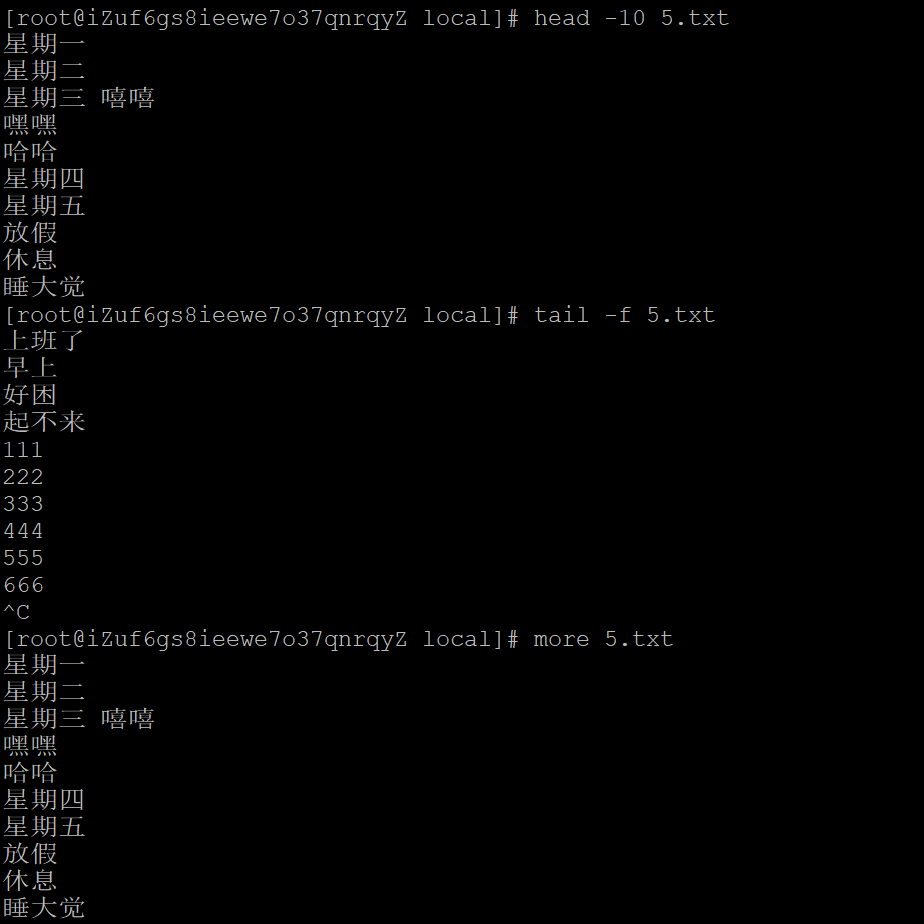

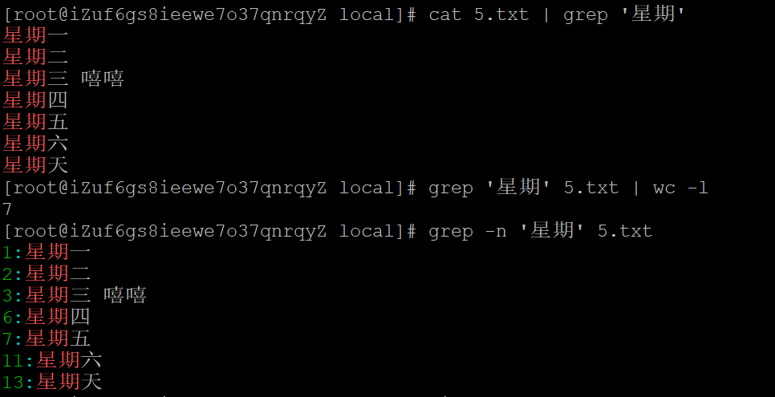

#### （三）Linux常用系统信息查看命令

```bash
#显示所有系统信息
uname -a
#实时显示系统进程信息
top
#显示当前进程状态
ps
#显示所有进程
ps -ef
#查看磁盘占用的空间
df -h
#显示内存使用情况
free -h
```

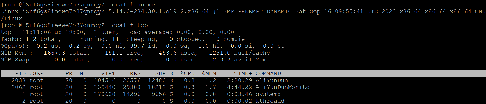

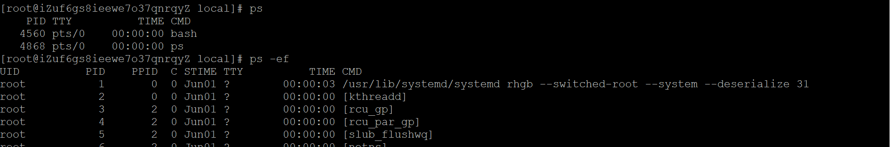

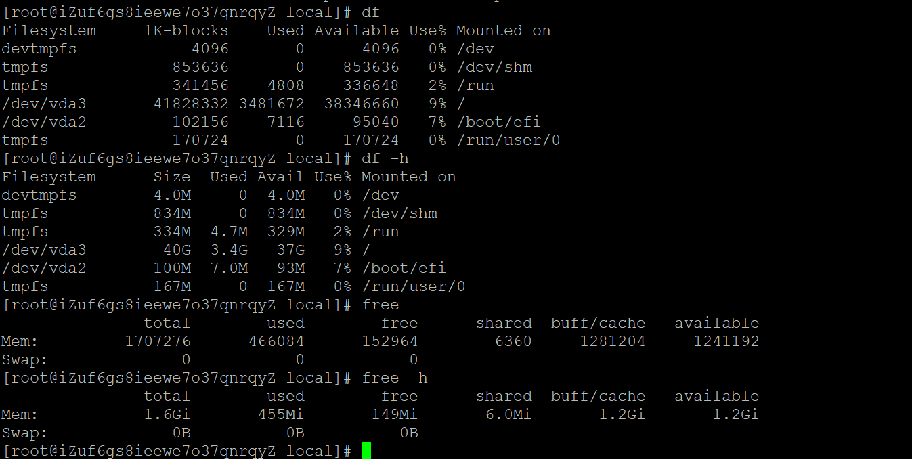

#### （四）Linux常用网络相关命令

```bash
#测试网络连接
ping ip地址或域名
#显示和配置网络接口
ipconfig
#显示网络连接、路由表、接口统计信息等
netstat -tul
#远程登录
ssh 用户名@服务器ip地址
#远程登陆退出
exit
```

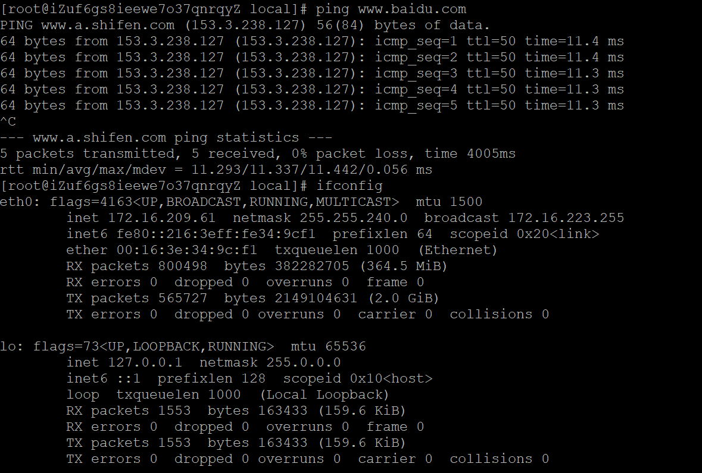

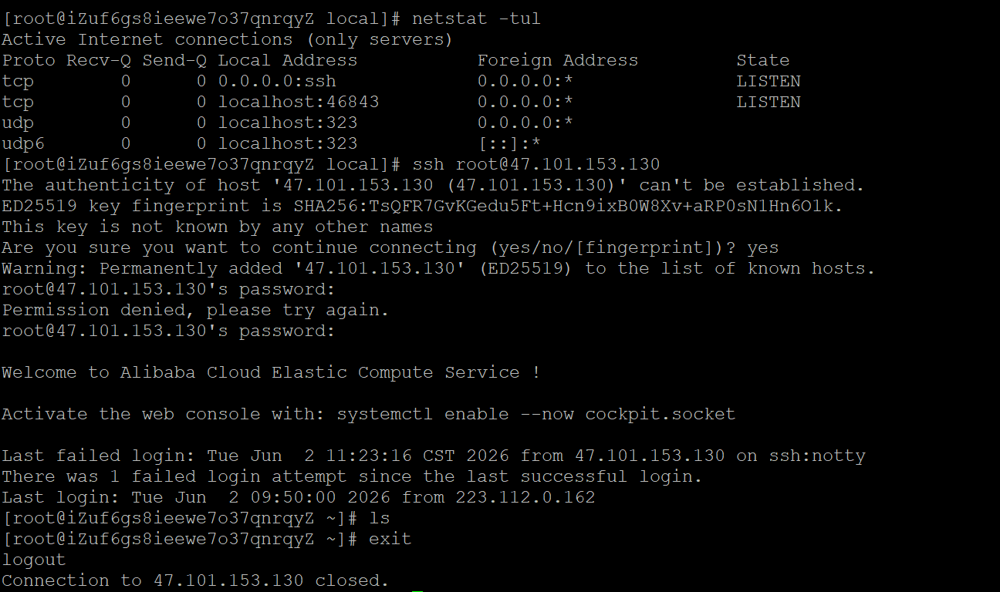

#### （五）Linux常用权限管理操作命令

```bash
#显示权限
ls -lh
#修改文件或目录的权限
chmod 文件 权限
r：读（read，数字表示为 4）
w：写（write，数字表示为 2）
x：执行（execute，数字表示为 1）
用户：
u：文件所有者（user）
g：所属用户组（group）
o：其他用户（others）
a：所有用户（all，即 u+g+o）
chmod 755 file.sh      # 所有者：读+写+执行(4+2+1=7)；组和其他人：读+执行(4+1=5)
chmod 644 config.txt   # 所有者：读+写(6)；组和其他人：只读(4)
chmod 777 script.sh    # 所有人可读、写、执行（慎用，通常不安全）
chmod 600 id_rsa       # 仅所有者可读、写（常用于私钥文件）
操作符：
+：添加权限
-：移除权限
=：精确设置权限
chmod u+x script.sh    # 给所有者添加执行权限
chmod go-w file.txt    # 移除组和其他人的写权限
chmod a=rwx dir/       # 设置所有人可读、写、执行（同777）
chmod o-rwx *          # 移除其他人对所有文件的所有权限
#修改文件或目录的所有者
-R  #递归的意思
chown user:group 123.txt
# 更改文件目录deployuser 的所属者为root用户 跟 所属组为deployuser组
chown -R root:deployuser XD
```

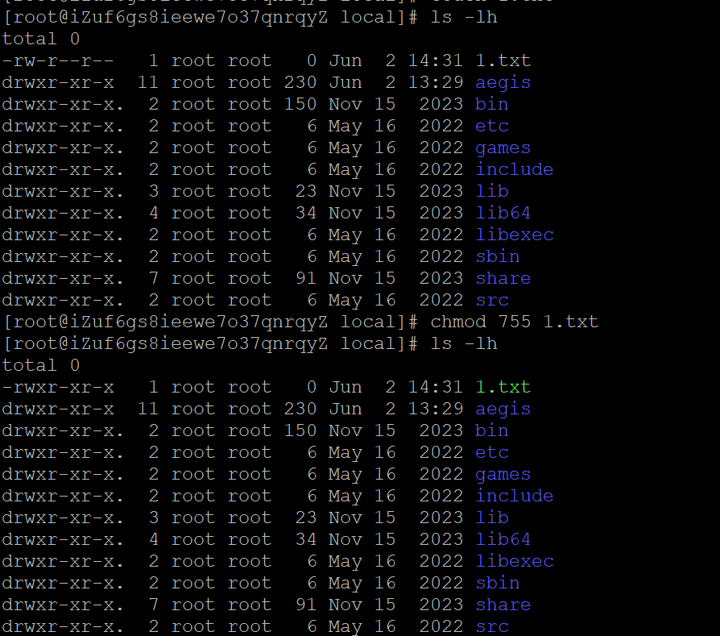

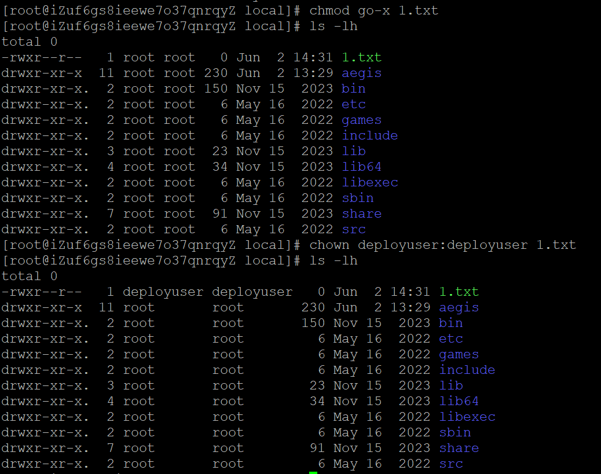

#### （六） Linux常用数据处理和查找命令

```bash
#查找文件或目录
find 查找路径 查找方式
#查找方式
-name：按文件名查找
-type：按文件类型查找（f 表示文件，d 表示目录）
-size：按文件大小查找
-mtime：按文件修改时间查找
# 查找当前目录下所有以 .txt 结尾的文件
find . -name "*.txt"  或 find -name "*.txt"
# 查找 /var/log 目录下大于 1MB 的文件
find /var/log -type f -size + 1M
# 查找/var/log 目录下的日志文件
find /var/log -type f -name "*.log"
```

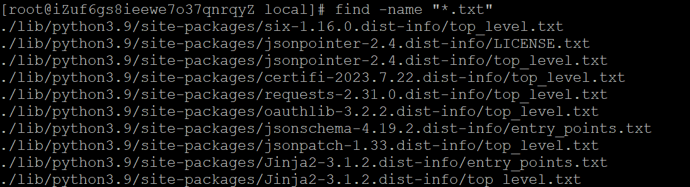


```bash
#指定分隔符进行文件提取
cut -d'分隔符' -f字段列表 [文件名]
#提取CSV文件的特定列
# 提取第一列
cut -d',' -f1 data.csv
# 提取第一和第三列
cut -d',' -f1,3 data.csv
# 提取第二到第四列
cut -d',' -f2-4 data.csv
# 提取/etc/passwd的用户名（第一列）
cut -d':' -f1 /etc/passwd
# 提取用户名和家目录（第1和第6列）
cut -d':' -f1,6 /etc/passwd
```

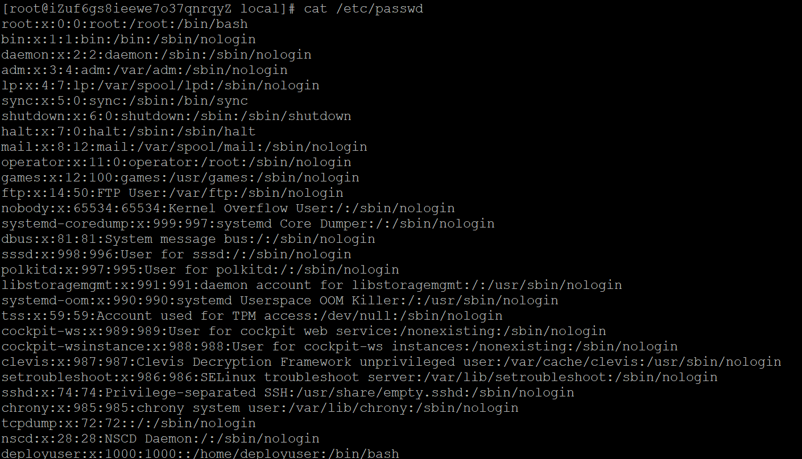

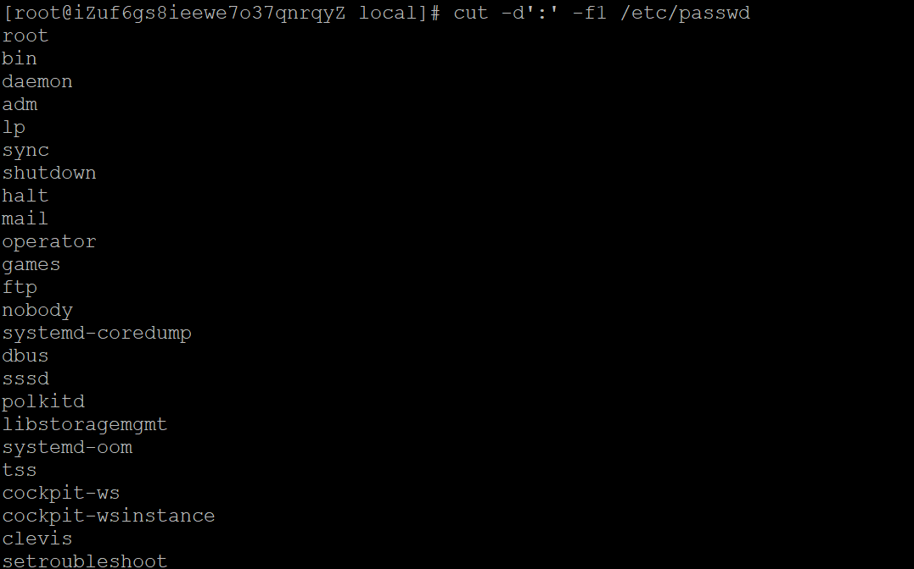

```bash
awk：是一种强大的文本处理工具，支持模式扫描和处理，可对文本文件进行复杂的操作，如提取字段、计算、格式化输出等
# $0代表整行内容，$1、$2、$3分别代表该行的第1、2、3个字段
# 打印 /etc/passwd 文件中的用户名（第一列）
awk -F ':' '{print $1}' /etc/passwd
# 计算文件 data.txt 中第3列的总和
awk '{sum += $3} END {print sum}' data.txt
# 打印文件 data.txt 中第2列大于100的行
awk '$2 > 100 {print $0}' data.txt
```

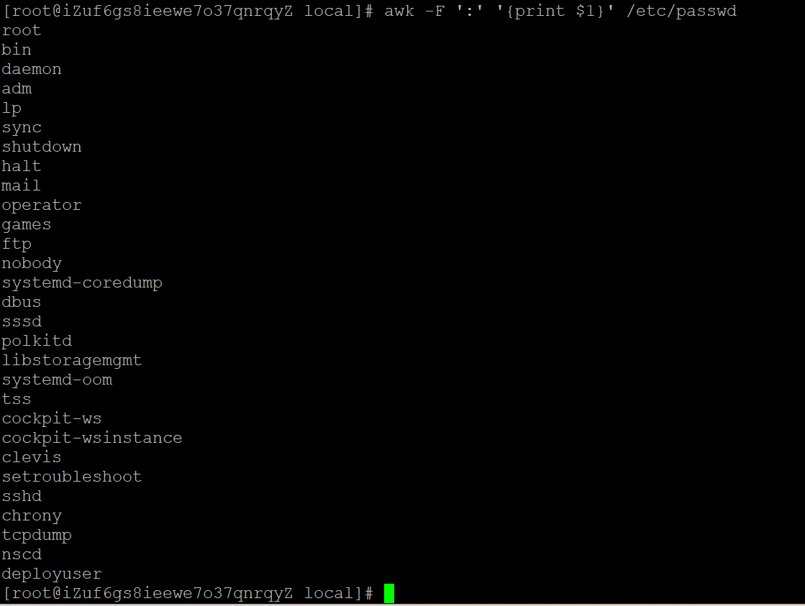

```bash
sed：对文本进行过滤和转换。可以执行查找、替换、删除、插入等操作
常用选项：
s/old/new/：替换文本
d：删除行
p：打印行
-i：直接修改文件内容
# 删除文件中的空行
sed '/^$/d' file.txt
# 直接修改文件，将所有的 "foo" 替换为 "bar"
sed -i 's/foo/bar/g' file.txt
# 打印文件中的第5到第10行
sed -n '5,10p' file.txt
```

#### （七） Linux常用其他命令

```bash
echo:标准输出
echo
help:查看内部命令
示例：
help if    
clear:清屏
who:当前在本地系统上的用户
wc:统计行
示例：
wc -l 123.txt
date:显示系统日期 
cal 2025:显示2025年的日历表
reboot:重启
shutdown -h now:关闭系统
shutdown -r now:重启
df -h:显示已经挂载的分区列表
```

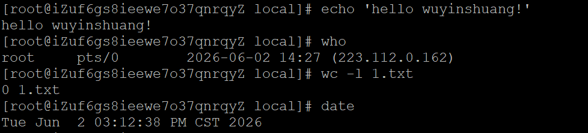

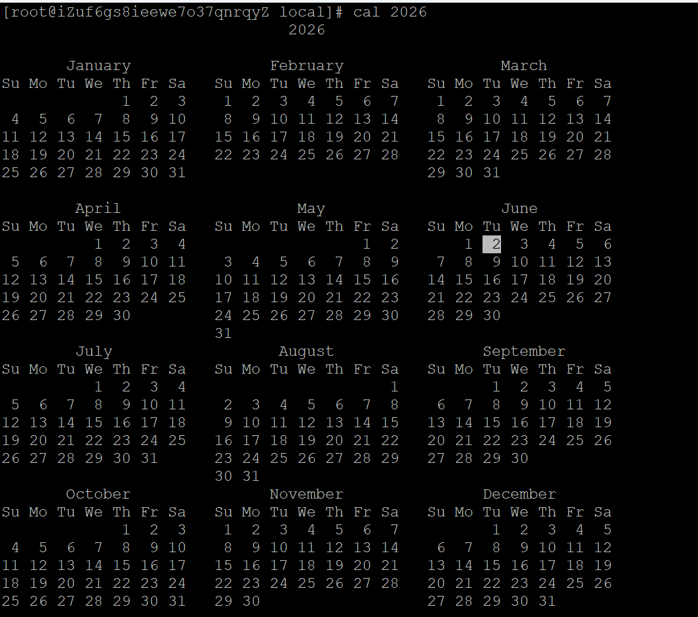

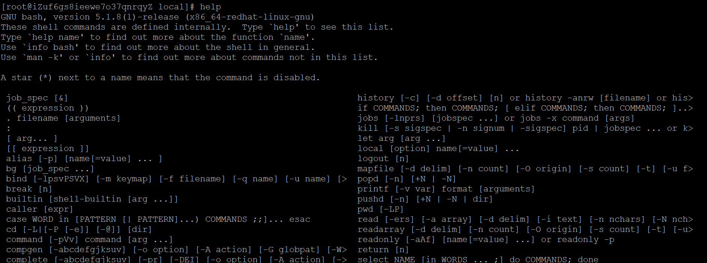

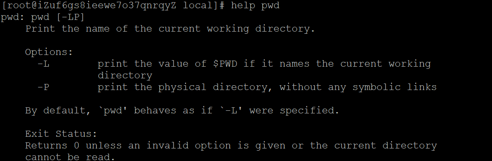

小练习

```bash
需求：
进入用户目录并创建项目结构
在当前项目创建测试日志文件
查看目录结构
模拟日志写入
实时监控错误日志
打包备份

# 进入用户目录并创建项目结构
cd ~
mkdir -p myproject/{src,logs,backup}
# 创建测试日志文件
touch myproject/logs/{access.log,error.log}
# 查看目录结构
tree myproject/  # 若没有tree命令需先安装
# 模拟日志写入
echo "2023-08-20 10:00:00 User login" >> myproject/logs/access.log
# 实时监控错误日志
tail -f myproject/logs/error.log
# 打包备份
tar -czvf myproject_backup.tar.gz myproject/
```


### 三、总结

Linux命令比较多，这次学习了一些常用的基础命令，后面还要学习高级命令。

* * *

**作者**：吴银双

**日期**：2026年6月2日

**平台**：GitHub Pages / 技术博客
