### 一、引言

上一篇已经学习实践了Linux的一些高级命令，现在继续来学习核心命令。

### 二、具体内容

#### （一）firewall防火墙

```bash
开启：
systemctl start firewalld.service
关闭：
systemctl stop firewalld.service
重启：
systemctl restart firewalld
查看firewalld服务状态
systemctl status firewalld.service
查看firewall防火墙的状态
firewall-cmd --state
查看防火墙开放端口规则
firewall-cmd --list-ports
开放9999端口
firewall-cmd --permanent --add-port=9999/tcp （--permanent永久生效，没有此参数重启后就失效）
加载生效开放的端口
firewall-cmd --reload
查询指定端口9999是否开放
firewall-cmd --query-port=9999/tcp
```

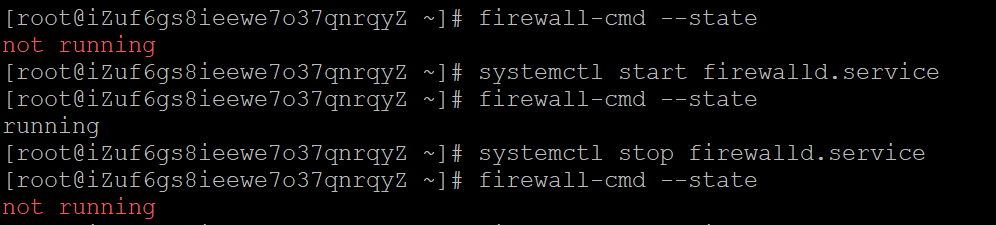

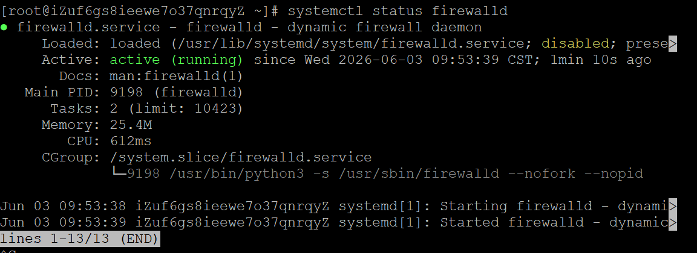

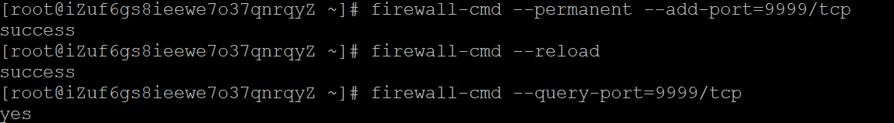


#### （二）Telnet与scp命令

```bash
telnet命令：主要用于测试到某台机器的某个端口是否畅通
telnet命令安装：yum -y install telnet telnet-server  （确认联网状态）
telnet命令用法：telnet IP地址 端口
```

```bash
scp命令：用于服务器之间的文件或者文件目录拷贝
语法：scp 本机文件的存放路径 root@服务器IP:服务器目标路径
# 将本地的C:\Users\wys19\Desktop/1111.txt文件拷贝到47.101.153.130的/root/下
scp C:\Users\wys19\Desktop/1111.txt root@47.101.153.130:/root/
# 从47.101.153.130这台机器的/root/index.tar.gz文件拷贝到本机的/devTools/下
scp root@47.101.153.130:/root/txt.tar.gz  C:\Users\wys19\Desktop
# 拷贝目录/usr/local/bin
scp -r root@47.101.153.130:/usr/local/bin C:\Users\wys19\Desktop
```

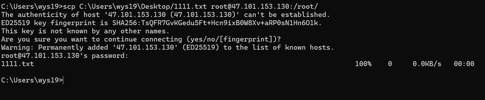

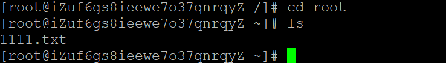

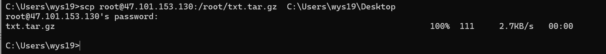

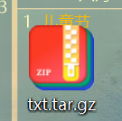

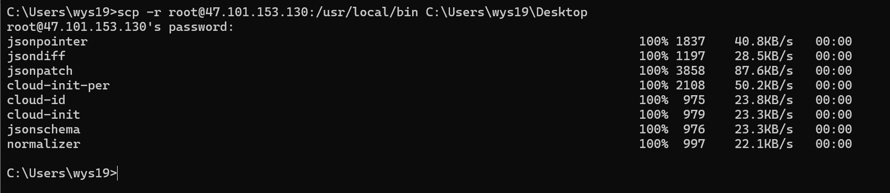

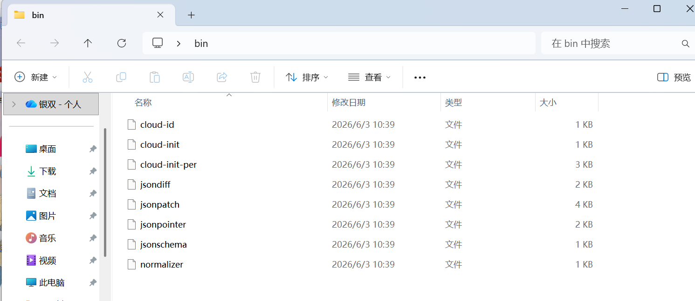

#### （三）ps -ef与ps aux命令

```bash
ps：用于显示当前活动进程信息
ps -ef：列出系统中所有进程的详细信息
[root@localhost ~]# ps -ef | more
UID         PID   PPID  C STIME TTY          TIME CMD
root          2      0  0 Jul30 ?        00:00:00 [kthreadd]
root          3      2  0 Jul30 ?        00:00:06 [ksoftirqd/0]
root          5      2  0 Jul30 ?        00:00:00 [kworker/0:0H]
root          7      2  0 Jul30 ?        00:00:04 [migration/0]
root          8      2  0 Jul30 ?        00:00:00 [rcu_bh]
root          9      2  0 Jul30 ?        00:00:00 [rcuob/0]
root         10      2  0 Jul30 ?        00:00:00 [rcuob/1]

UID：用户ID
PID：进程ID
PPID：父进程号
C：CPU的占用率
STIME：进程的启动时间
TTY：TTY终端
TIME：进程执行起到现在总的CPU占用时间
CMD：启动这个进程的命令


ps aux：显示当前系统中所有用户的进程信息
[root@localhost ~]# ps aux | more
USER        PID %CPU %MEM    VSZ   RSS TTY      STAT START   TIME COMMAND
root          2  0.0  0.0      0     0 ?        S    Jul30   0:00 [kthreadd]
root          3  0.0  0.0      0     0 ?        S    Jul30   0:06 [ksoftirqd/0]
root          5  0.0  0.0      0     0 ?        S<   Jul30   0:00 [kworker/0:0H]
root          7  0.0  0.0      0     0 ?        S    Jul30   0:04 [migration/0]
root          8  0.0  0.0      0     0 ?        S    Jul30   0:00 [rcu_bh]
root          9  0.0  0.0      0     0 ?        S    Jul30   0:00 [rcuob/0]
root         10  0.0  0.0      0     0 ?        S    Jul30   0:00 [rcuob/1]
root         11  0.0  0.0      0     0 ?        S    Jul30   0:00 [rcuob/2]

USER：哪个用户启动了这个命令
PID：进程的ID
%CPU：CPU的占用率
%MEM：内存的使用率
VSZ：如果一个程序完全驻留在内存中一共需要使用多少内存空间
RSS：进程当前占用了多少内存
TTY：tty终端
STAT：表示当前进程的状态（S#处于休眠的状态；D#不可中断的状态 ；Z#僵尸进程 ；X#死掉的进程）
START：启动这个命令的时间点
TIME：进程执行起到现在总的CPU占用时间
COMMAND：启动这个进程的命令
```

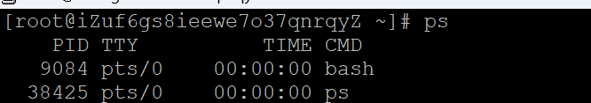 

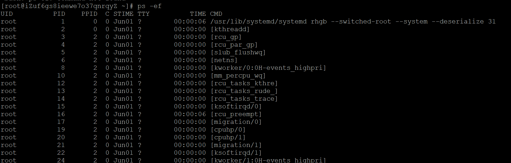

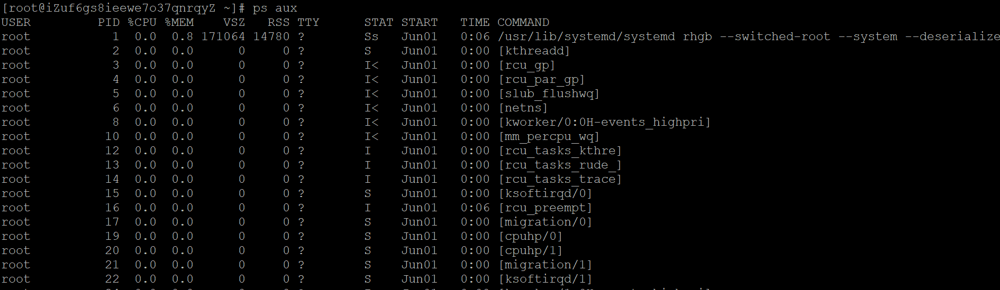

### 三、总结

Linux命令比较多，这次学习了一些核心命令，常用命令基本掌握。

* * *

**作者**：吴银双

**日期**：2026年6月3日

**平台**：GitHub Pages / 技术博客
