### 一、引言

上一篇已经学习实践了Linux的一些高级命令，现在继续来学习核心命令。

### 二、具体内容

#### （一）Linux输入/输出重定向命令

```bash
输入重定向: <
输入重定向允许将文件内容作为某个命令的输入
输出重定向：>  #代表覆盖写入 ；  >>  #代表追加写入
输出重定向允许将命令的输出发送到文件而不是屏幕
错误重定向：2>  #代表覆盖写入 ；  2>>  #代表追加写入
错误重定向允许将命令的错误信息发送到文件而不是屏幕
linux中一切皆文件
文件描述符：
posix名称          文件描述符      用途
/dev/stdin          0            标准输入
/dev/stdout         1            标准输出
/dev/stderr         2            标准错误输出

#将 input.txt 文件的内容作为 wc -l 命令的输入，统计文件的行数
wc -l < input.txt
#将 `echo` 命令的输出写入 `output.txt` 文件，如果文件已存在，内容将被覆盖
echo "Hello, World!" > output.txt
#将 `echo` 命令的输出追加到 `output.txt` 文件的末尾
echo "Hello again!" >> output.txt
#将 `ls` 命令的错误信息写入 `error.txt` 文件，如果文件已存在，内容将被覆盖
ls /etc/passwd root1 2> error.txt
#将 `ls` 命令的错误信息追加到 `error.txt` 文件的末尾
ls /etc/passwd root2 2>> error.txt
```

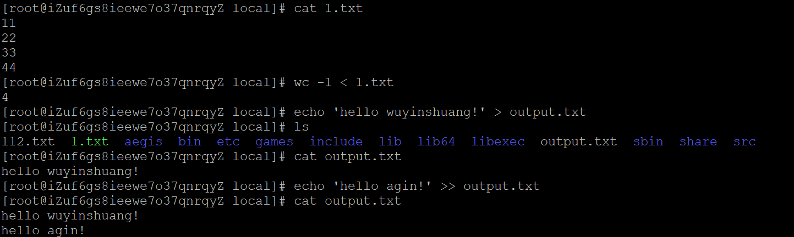

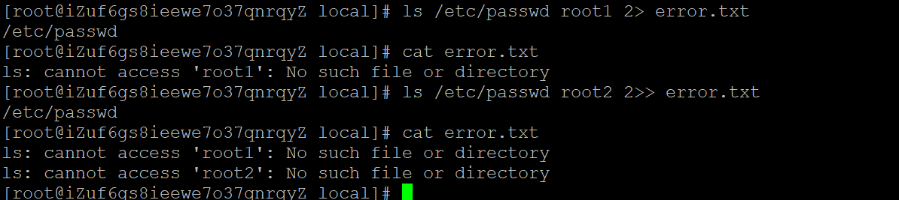

#### （二）Linux目录

Linux目录结构

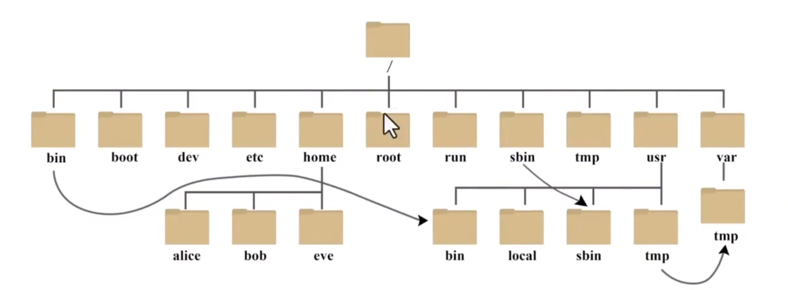

```bash
/：根目录，一般根目录下只存放目录，不要存放文件，也不要修改，或者删除目录下的内容
/mnt：测试目录
/root：root用户的家目录
/home：普通用户的家目录
/tmp：临时目录(比如文件上传时)
/var：存放经常修改的数据，比如程序运行的日志文件
/boot：存放的启动Linux 时使用的内核文件，包括连接文件以及镜像文件
/etc：系统默认放置配置文件的地方
/bin：所有用户都能执行的程序
/sbin：只有root才能执行的程序
/usr：用户自己的软件都可以放到这儿来
/dev：存放硬件设备的地方(/dev/cdrom)
/media：挂载光盘使用的 
挂载光盘：mount /dev/cdrom /media
卸载光盘：umount /dev/cdrom
```

```bash
./ 代表当前目录
cd ./
../ 代表上一级目录
cd ../
```

#### （三）Linux编辑文本命令vi

```bash
vi编辑器的两种模式:命令模式/插入模式

命令模式:
进入方式:
启动 vi 编辑器时默认进入命令模式，或者在插入模式下按 Esc 键返回命令模式
用途:
在命令模式下，用户可以执行各种编辑命令，如复制、粘贴、删除、保存、退出等

插入模式
进入方式:
在命令模式下按 i、a、o 等键进入插入模式

常用命令
#启动vi：输入 `vi 文件名`，如果文件存在则打开，如果文件不存在则创建新文件
vi myfile.txt
#退出vi
保存并退出：在命令模式下输入 `:wq` 或 `:x`
不保存退出：在命令模式下输入 `:q!`
仅保存：在命令模式下输入 `:w`用途
在插入模式下，用户可以输入和编辑文本

命令模式下：
光标移动
上下左右移动:
命令模式下使用 h（左）、j（下）、k（上）、l（右）键
行首和行尾:
命令模式下按 0 移动到行首，按 $ 移动到行尾
翻页:
命令模式下按 Ctrl + f（向前翻页）、Ctrl + b（向后翻页）
查找和替换
#查找
`/关键词`：向下查找关键词
`?关键词`：向上查找关键词
#替换
`:s/旧文本/新文本`：替换当前行的第一个匹配项
`:s/旧文本/新文本/g`：替换当前行的所有匹配项
`:%s/旧文本/新文本/g`：替换整个文件中的所有匹配项
```

#### （四）Linux用户与组管理

```bash
linux用户的分类：
超级用户root：拥有至高无上的权限  
普通用户：权限有一定的限制，可以登录系统。一般可以执行/usr/local/bin或者/bin或者/usr/bin或者用户家目录
系统用户（伪用户）：一般不会登录系统，一般情况是用来维持某个服务程序 
#查看系统中的所有用户：
cat /etc/passwd
#展示列解析：
root :x          :0       :0   : root      :/root           :/bin/bash
用户  密码占位符   UID     GID   用户描述    用户家目录       登录后使用的shell解释
/sbin/nologin #是不可登录的
/bin/bash     #可以登录
#查看所有用户的密码信息：
cat /etc/shadow
#添加用户命令：
useradd
-u  #指定用户UID 
-d  #指定用户主目录
-g  #指定用户所属组
-r  #指定用户是系统用户
-s  #用户登录shell解释器
示例：
# 创建一个用户deployuser，指定UID为1010，指定家目录为/home/deployuser ，指定所属组为deployuser组，指定登录shell为/bin/bash
useradd -u 1010 -d /home/deployuser -g deployuser -s /bin/bash deployuser
删除用户命令：
userdel
-r #连同家目录一块删除
添加用户组命令：
groupadd
删除用户组命令：
groupdel 
修改用户的信息命令：
usermod 
-u  #指定用户UID
-d  #指定用户主目录
-g  #指定用户所属组
设置用户密码命令passwd
passwd 用户名
```

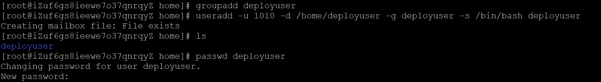

#### （五）Linux文件归档与解压缩

```bash
gzip：不能压缩目录，只能压缩**单个**文件，压缩速度最快，但是压缩比例比较低。扩展名：.gz
不保留源文件压缩：gzip 123.txt
保留源文件压缩：gzip -c 345.txt > 345.txt.gz
不保留源文件的解压：gunzip 123.txt.gz
保留原文件的解压：gunzip -c 345.txt.gz > 234.txt
不保留源文件解压：gzip -d 345.txt.gz
xz ：可以压缩目录和文件压缩的速度比较慢，但是压缩比例最高。扩展名：.xz
不保留源文件压缩：xz 123.txt
保留源文件压缩：xz -c 345.txt > 345.txt.xz
不保留源文件的解压：unxz 345.txt.xz
保留原文件的解压：xz -d -k 123.txt.xz
不保留源文件解压：xz -d 123.txt.xz
tar：归档与压缩命令,​将多个文件或目录合并成一个归档文件（.tar包）
-c：创建新文件
-f：指定文件格式
-v：显示详细过程
-z：以gzip方式归档压缩 
-C：指定解压路径
# 将index.html 打包为tar并压缩为gz格式
tar -zcvf index.tar.gz index.html
# 将11.txt 22.txt 33.txt 55.txt 打包为tar并压缩为gz格式
tar -czvf txt.tar 11.txt 22.txt 33.txt 55.txt
# 将file目录 打包为tar并压缩为gz格式
tar -czvf file.tar file
# 解压index.tar.gz 到当前目录下
tar -zxvf index.tar.gz
# 解压index.tar.gz 到 /home/www 目录下
tar -zxvf index.tar.gz -C www/
```

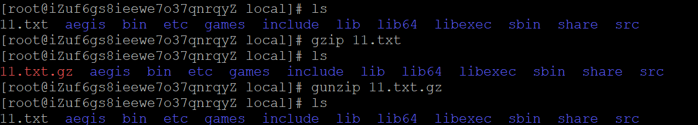

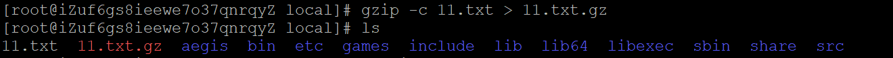

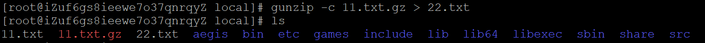

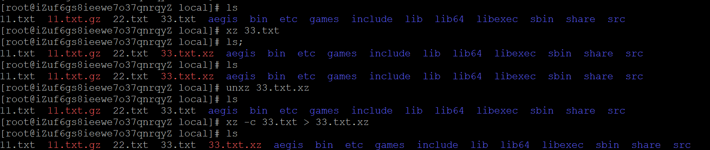

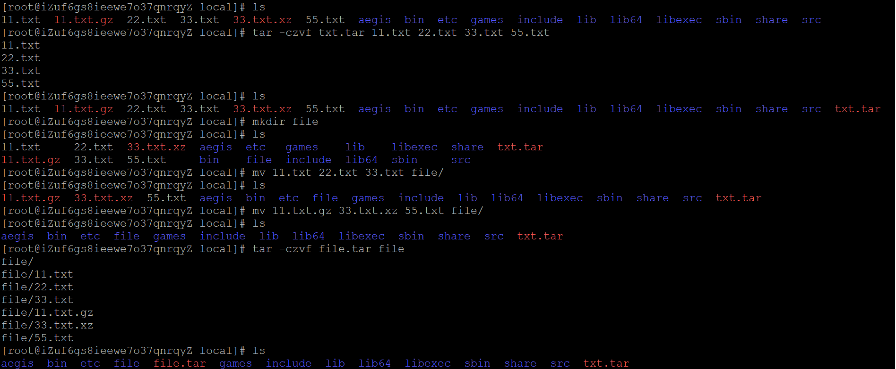

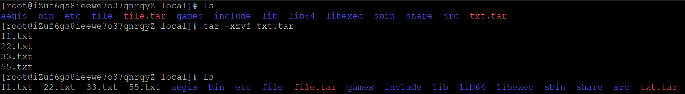

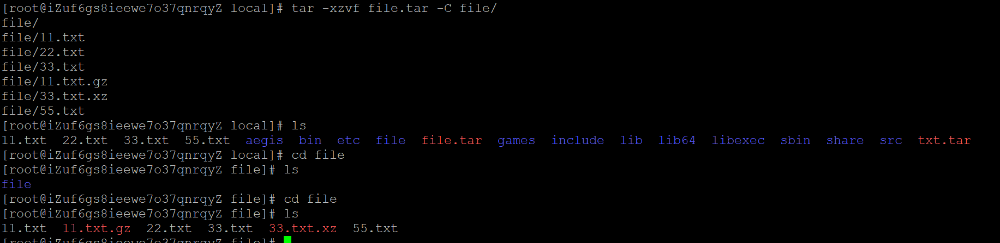

### 三、总结

Linux命令比较多，这次学习了一些常用的高级命令，后面还要学习核心命令。

* * *

**作者**：吴银双

**日期**：2026年6月2日

**平台**：GitHub Pages / 技术博客
