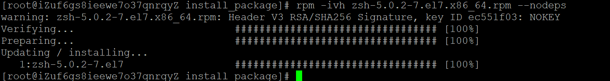
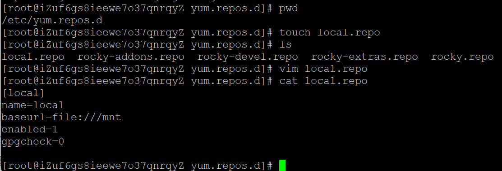
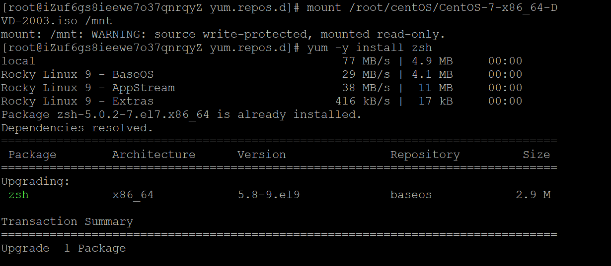
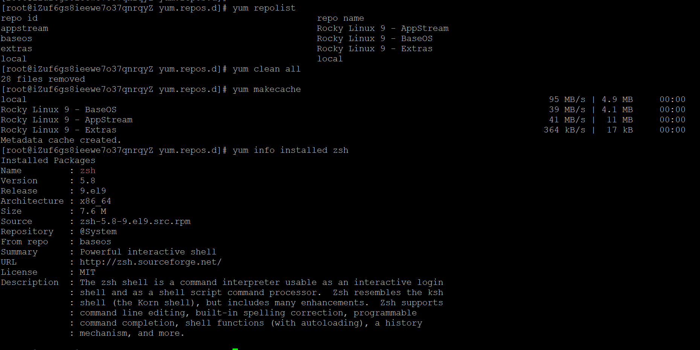

### 一、引言

之前已经学习了linux常用命令，现在继续来学习Linux下的软件安装命令。

### 二、具体内容

#### （一）rpm

```bash
rpm介绍: RPM是一个在Linux和其他类Unix操作系统下广泛使用的包管理器，用于安装、升级、查询和删除软件包
为什么使用rpm: RPM包管理器可以帮助用户，自动化地处理软件的安装和更新过程，简化了软件的管理和维护
rpm：安装别人编译好的软件包
rpm安装优点：
软件已经编译打包，所以传输和安装方便，让用户免除编译
在安装之前，会先检查系统的磁盘、操作系统版本等，避免错误安装
rpm安装缺点：
软件包安装的环境必须与打包时的环境一致或相当
必须先安装依赖的软件包，否则直接执行rpm包可能会报错

RPM包的命名规则：
which-2.20-7.el7.x86_64.rpm
which  #代表软件名称
2.20   #代表软件版本号；
7      #代表发布版本号，指的是这个rpm软件包是第几次编译生成的
el7    #代表企业版的7操作系统
X86    #代表CPU架构
64     #代表系统的位数

安装rpm软件包：
-i：install 安装软件包
-v：输出更多的详情信息
-h：输出哈希标记（#）
--nodeps：不验证软件的依赖

rpm -ivh zsh-5.0.2-7.el7.x86_64.rpm 
rpm -ivh mariadb-server-5.5.35-3.el7.x86_64.rpm --nodeps

rpm包下载地址
http://rpmfind.net/
http://rpm.pbone.net/

rpm 查询功能：rpm -q 
-a：查询所有已安装的软件包  rpm -qa zsh
-f：查询文件所属软件包  rpm -qf /usr/bin/zsh
-p：查询软件包    rpm -qip 查询未安装的软件包
-i：查询软件包的详细信息   rpm -qi 包名
-l：显示软件包中的文件列表   rpm -ql 包名
-d：查询软件包的帮助文档    rpm -qd 包名

rpm 包升级:
-U：升级rpm软件服务
rpm -Uvh zsh-5.0.2-7.el7.x86_64.rpm
rpm 包卸载:
-e：卸载
rpm -e zsh
```



#### （二）yum

```bash
yum介绍：Yum（全称为Yellowdog Updater Modified）是一个在RedHat以及CentOS中的Shell前端软件包管理器
为什么使用yum：是基于rpm包管理，能够从指定的服务器，自动下载rpm包并且安装，可以自动处理依赖性关系，并且一次安装所有依赖的软件包，无须繁琐地一次次下载、安装
yum信息的位置：yum的一切信息都存储在，一个叫yum.reops.d目录下的配置文件中，通常位于/etc/yum.reops.d目录下
yum安装：基于 C/S （客户端）架构，yum安装称之为傻瓜式安装（如360软件管理）
yum安装优点：方便快捷，不用考虑包依赖，自动下载软件包
yum安装缺点：人为无法干预，无法设定想要的参数
配置本地yum源：
配置文件的路径：[/mnt/Packages]#  cd /etc/yum.repos.d/
创建一个任意名称以.repo结尾的文件，如：local.repo
[local]                 #yum源名称，唯一的，用来区分不同的 yum 源
name=local              #对yum源描述信息
#file表示本地  ://为固定写法
baseurl=file:///mnt     #yum源的路径（repodata目录所在的目录）
enabled=1               #表示启用 yum 源
gpgcheck=0              #为1表示使用公钥检验 rpm 的正确性

yum安装方式的使用：
yum repolist	         #查看yum源列表
yum clean all          #清空之前yum缓存
yum makecache          #创建yum缓存，为后续安装更加快速
yum -y install         #安装软件，如yum -y install zsh
yum info zsh           #查看zsh软件包信息（不管安装了没都会有信息）
yum update             #升级软件
yum info installed zsh  #查看已经安装好的软件信息
yum -remove zsh         #卸载软件
yum search gcc          #搜索gcc软件

本地yum不需要联网
# 在断网的情况下，使用在线yum源
[yum.repos.d]# ping www.baidu.com  访问不了
# 在断网的情况下，使用本地yum源
[yum.repos.d]#yum install -y zsh  能正常安装
```

 






### 三、总结

目前来看，还是yum比较方便，不用手动安装和考虑依赖。

* * *

**作者**：吴银双

**日期**：2026年6月3日

**平台**：GitHub Pages / 技术博客
