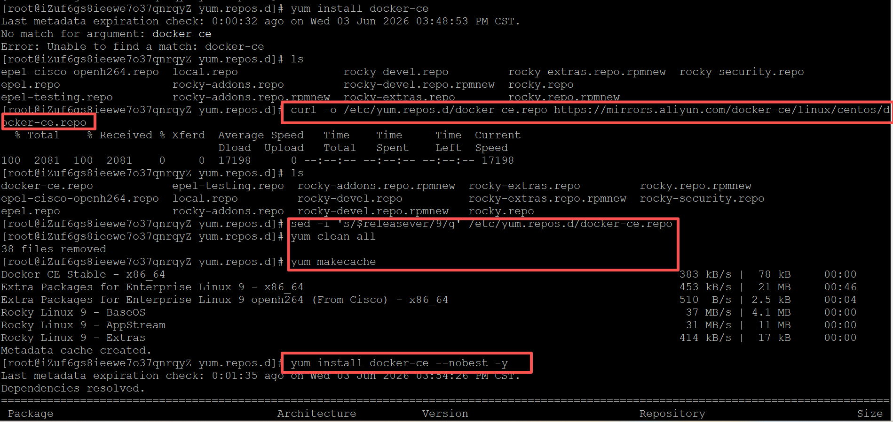
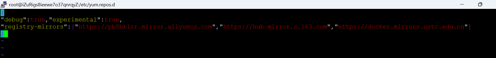
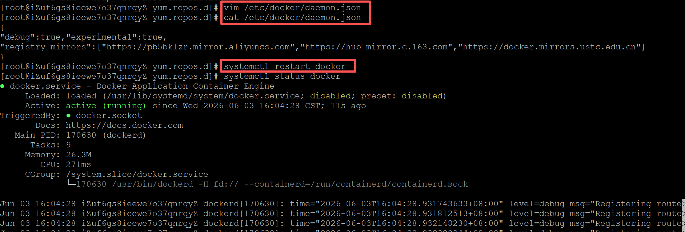
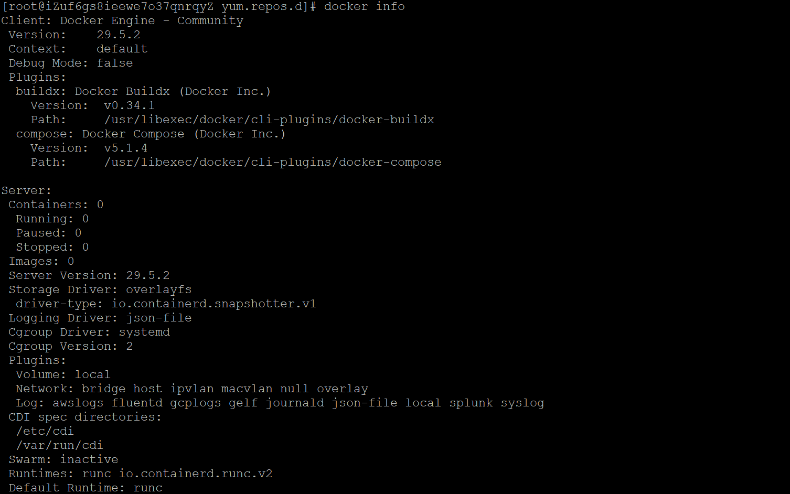
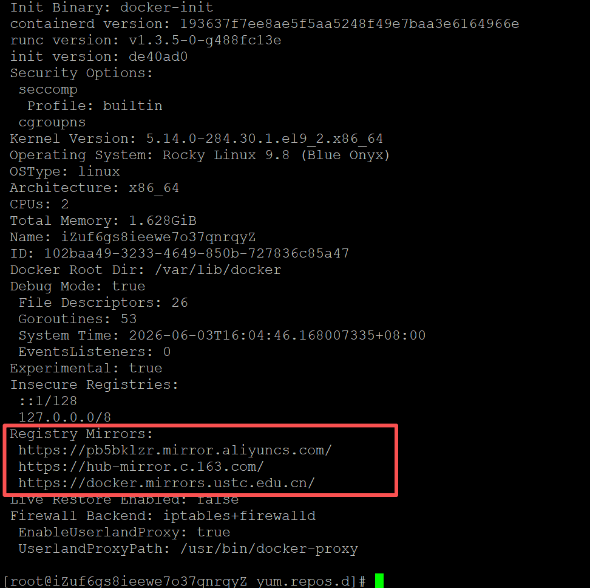
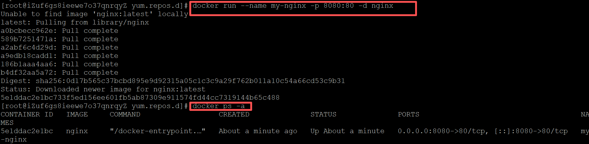
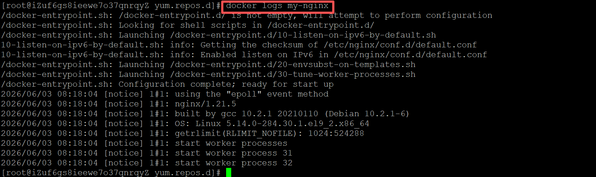
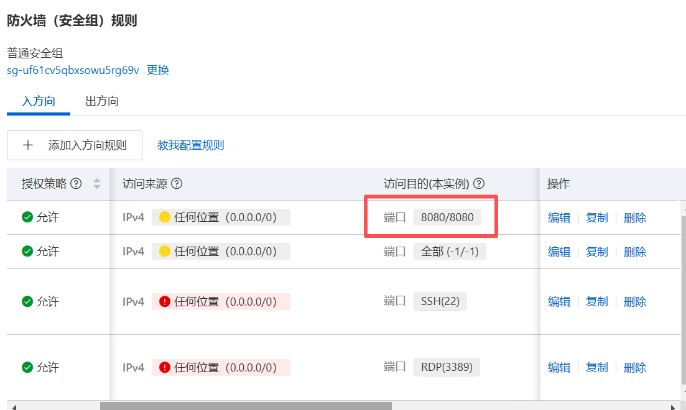
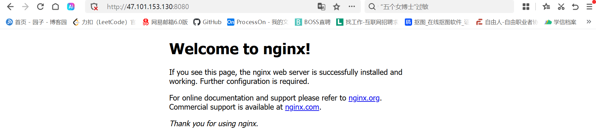

### 一、引言

今天继续学习在Linux系统中安装并使用docker。

### 二、具体内容

#### （一）docker介绍与使用场景

```bash
什么是Dokcer: 
一个开源的应用容器引擎，让开发者可以打包他们的应用以及依赖包到一个可移植的容器中，然后发布到任何流行的 Linux 机器上，也可以实现虚拟化。
容器是完全使用沙箱机制，相互之间不会有任何接口，使用go语言编写，在linux容器基础上进行的封装。

简单来说：
就是可以快速部署启动应用
实现虚拟化，完整资源隔离
一次编写，四处运行
但有一定的限制，比如Docker是基于Linux 64bit的，无法在32bit的linux/Windows/unix环境下使用

为什么要用：
提供一次性的环境，假如需要安装Mysql、RocketMQ、RabbitMQ，则需要安装很多依赖库、版本等，如果使用Docker则通过镜像就可以直接启动运行。
快速动态扩容，使用docker部署了一个应用，可以制作成镜像，然后通过Dokcer快速启动。
组建微服务架构，可以在一个机器上模拟出多个微服务，启动多个应用。
更好的资源隔离和共享。
一句话：开箱即用，快速部署，可移植性强，环境隔离

使用场景：
开发环境一致性：
Docker 可以确保开发、测试和生产环境的一致性
持续集成与持续部署（CI/CD）：
Docker 可以简化 CI/CD 流程，确保每次构建都在相同的环境中进行
微服务架构：
Docker 非常适合微服务架构，每个服务可以打包为一个独立的容器，便于部署和扩展
快速部署与扩展：
Docker 容器可以快速启动和停止，非常适合需要快速扩展的应用场景
多平台支持：
Docker 容器可以在任何支持 Docker 的平台上运行，包括 Linux、Windows 和 macOS
```

#### （二）云服务器安装Docker

```bash
安装docker前依次运行以下命令添加更新yum源：
yum update
#epel-release是一个软件包，提供额外的软件包源，以安装和更新不包含在官方仓库中的软件包
yum install epel-release -y
yum clean all
yum list

安装Docker： 
# 下载阿里云 Docker 源文件：
curl -o /etc/yum.repos.d/docker-ce.repo https://mirrors.aliyun.com/docker-ce/linux/centos/docker-ce.repo  
# 修改源文件适配 Rocky Linux 9
sed -i 's/$releasever/9/g' /etc/yum.repos.d/docker-ce.repo
# 安装社区版
# 清理一下缓存
yum clean all
# 重新生成缓存
yum makecache
# 安装 Docker
yum install docker-ce --nobest -y

修改镜像仓库地址：
vim /etc/docker/daemon.json
# 改为下面内容，然后重启docker
{
"debug":true,"experimental":true,
"registry-mirrors":["https://pb5bklzr.mirror.aliyuncs.com","https://hub-mirror.c.163.com","https://docker.mirrors.ustc.edu.cn"]
}
# 注意：需要重启docker
systemctl restart docker

运行docker:
#检查安装结果
docker info
#启动使用Docker
systemctl start docker     #运行Docker守护进程
systemctl stop docker      #停止Docker守护进程
systemctl restart docker   #重启Docker守护进程

```











#### （三）docker 部署nginx实践

```bash
#docker部署nginx,外层宿主机访问8080端口后映射到容器内nginx监听的80端口，默认展示欢迎页面
docker run --name my-nginx -p 8080:80 -d nginx

--rm：容器终止运行后，自动删除容器文件
--name my-nginx：容器的名字叫做my-nginx,名字自己定义
-p: 端口进行映射，将本地 8080 端口映射到容器内部的 80 端口
-d：容器启动后，在后台运行

#docker容器启动命令
docker ps               # 查看容器
docker logs -f 容器id   # 查看日志信息
docker stop 容器id      # 停止某个容器
docker start 容器id     # 启动某个容器

#其他docker命令
docker search xxx       #搜索镜像
docker images           #列出当前系统存在的镜像
docker pull xxx         #拉取镜像 xxx是具体某个镜像名称(格式 REPOSITORY:TAG) 镜像的仓库源：镜像的标签
docker ps               #列举当前运行的容器
docker ps -a            #列举全部容器
docker inspect 容器id   #检查容器内部信息
docker rmi 容器id       #删除镜像,强制移除镜像不管是否有容器使用该镜像 增加 -f 参数
docker rm 容器名称      #移除某个容器：（容器必须是停止状态）

# 阿里云服务器上配置网络安全组，新增8080入口并保存
# 浏览器访问地址：云服务器公网ip:8080 
```









### 三、总结

docker作为现在企业中非常普及的工具，具有强大的功能和优势，是必须掌握的核心技能之一。

* * *

**作者**：吴银双

**日期**：2026年6月3日

**平台**：GitHub Pages / 技术博客
