### 一、引言

上一篇已经在自己的阿里云服务器上安装好了docker，接下来安装一下常用的软件环境。

### 二、具体内容

#### （一）安装JDK21

1.打开[jdk官网](https://www.oracle.com/technetwork/java/javase/downloads/)，下载对应版本的jdk。

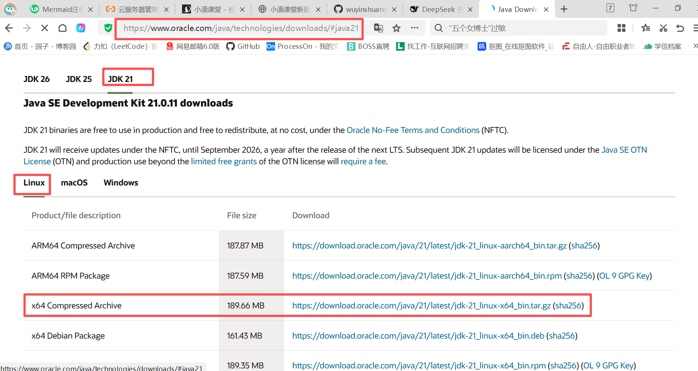

2.将下载好的jdk上传到linux服务器上，我这里是/usr/local/路径下：

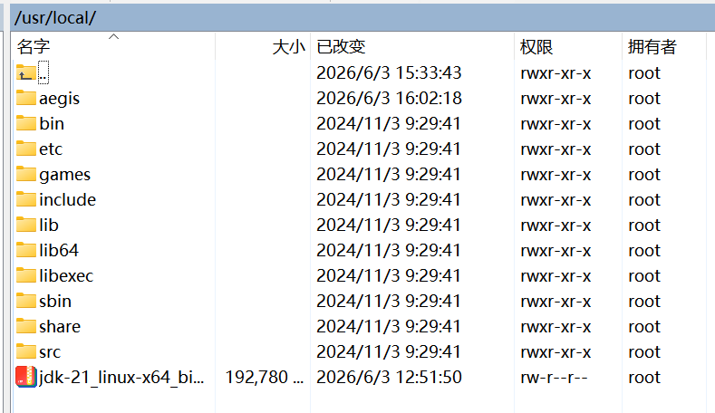

3.解压jdk压缩包并重命名：

```bash
tar -xzvf jdk-21_linux-x64_bin.tar.gz
mv jdk-21.0.6 jdk21
```

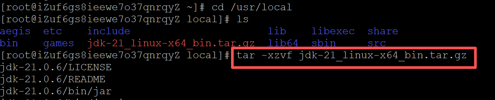

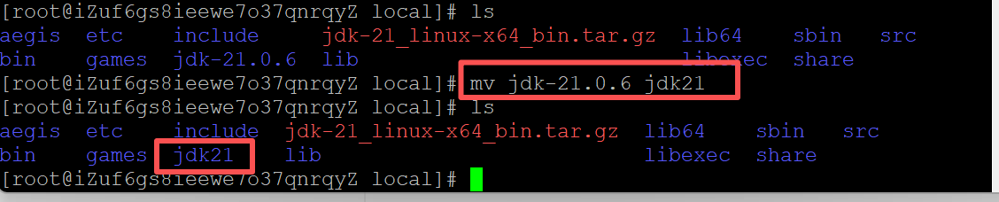

4.编辑/etc/profiel配置文件修改环境变量，在文件末尾新增以下三行：

```bash
export JAVA_HOME=/usr/local/jdk21  #自己的jdk安装路径
export CLASSPATH=$:CLASSPATH:$JAVA_HOME/lib/
export PATH=$PATH:$JAVA_HOME/bin
```

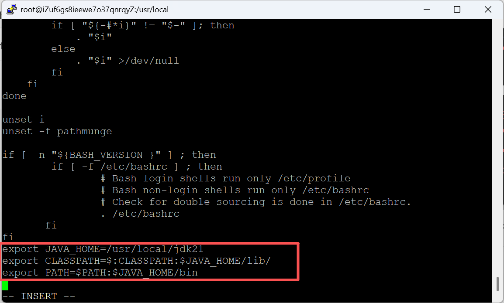

使修改后的配置文件生效：

```bash
source /etc/profile
```

验证java是否安装并配置成功：

```bash
java -version
```

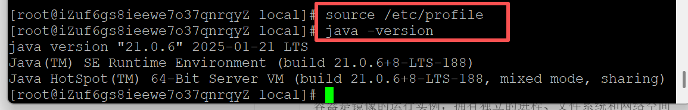

#### （二）安装MySQL 8.4.9

1.从[mysql官网](https://www.mysql.com/)下载mysql：

点击downloads

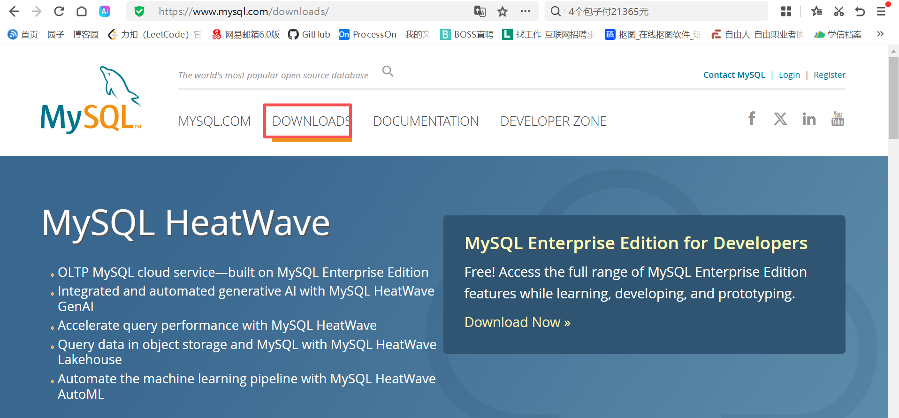

往下拉找到mysql community(GPL) downloads并点击

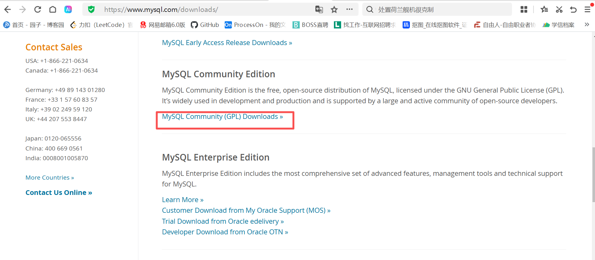

点击mysql community server

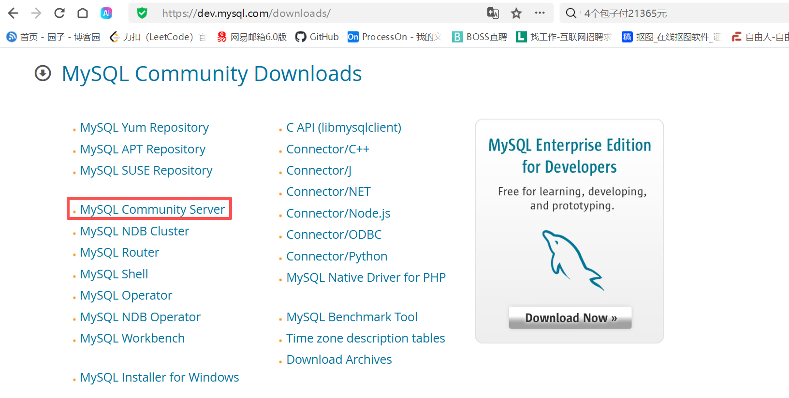

选择8.4.9 LTS，既不是最新版本也不是老版本，兼顾稳定性与功能性，下载tar.xz文件

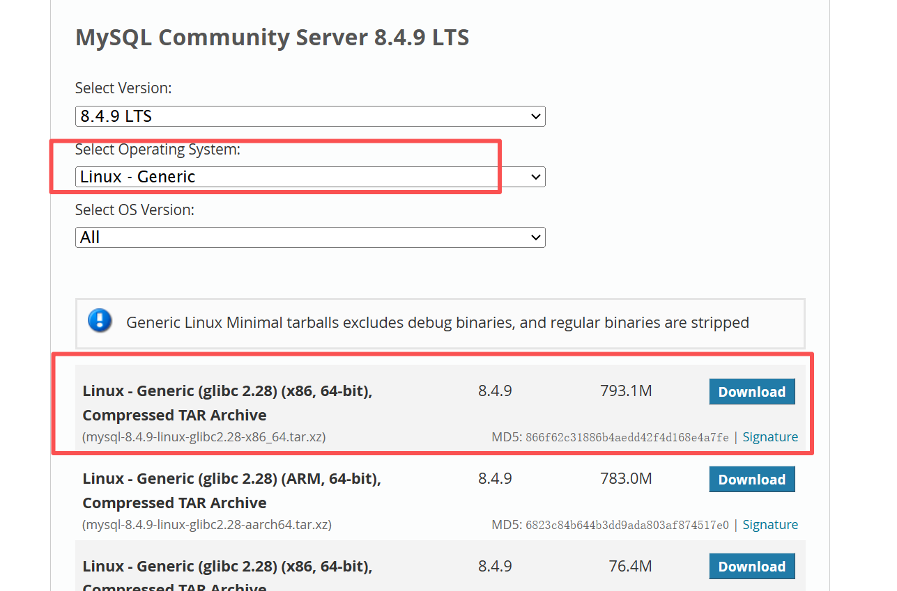

2.linux服务器安装必要依赖

```bash
yum install libaio numactl -y
```

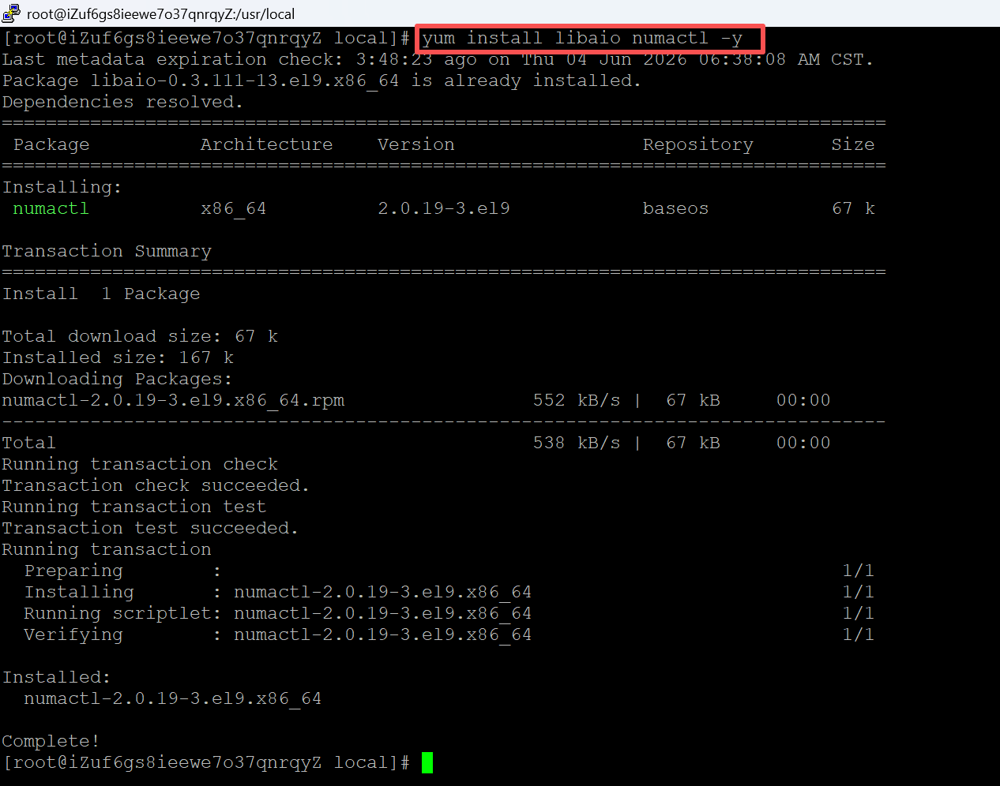

3.将下载好的mysql.tar.gz上传并解压到linux服务器/usr/local下：

```bash
# 解压
tar -xvf mysql-8.4.9-linux-glibc2.28-x86_64.tar.xz
# 重命名
mv mysql-8.4.9-linux-glibc2.28-x86_64 mysql
```


4.创建专用用户并初始化

```bash
# 1. 创建mysql用户
groupadd mysql
useradd -r -g mysql -s /bin/false mysql

# 2. 进入目录并初始化（核心步骤）
cd /usr/local/mysql
mkdir mysql-files
chown mysql:mysql mysql-files
chmod 750 mysql-files

# 3. 初始化数据库，会生成一个临时root密码（务必保存！）
bin/mysqld --initialize --user=mysql
```

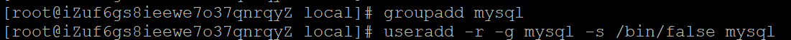

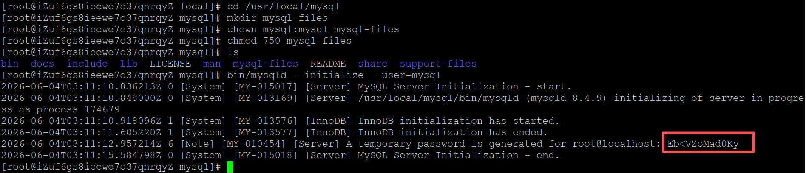

5.启动mysql并修改密码

```bash
# 1. 启动MySQL服务
bin/mysqld_safe --user=mysql &

# 2. 使用临时密码登录（将下方密码换成你刚才记下的）
输入：bin/mysql -u root -p后按enter键，再输入刚才的临时密码

-- 进入mysql命令框后，修改root密码（把'YourNewPassword123!'换成你自己的强密码）
ALTER USER 'root'@'localhost' IDENTIFIED BY 'YourNewPassword123!';
FLUSH PRIVILEGES;
EXIT;

# 使用新密码登录，成功就说明一切正常
/usr/local/mysql/bin/mysql -u root -p
```

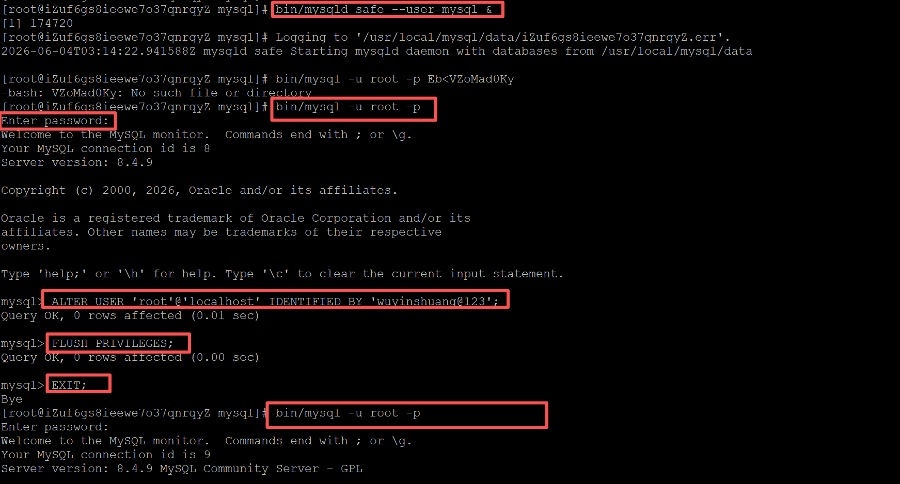

6.配置环境变量，以后mysql命令就不用写绝对路径了

```bash
echo 'export PATH=/usr/local/mysql/bin:$PATH' >> ~/.bashrc && source ~/.bashrc
```

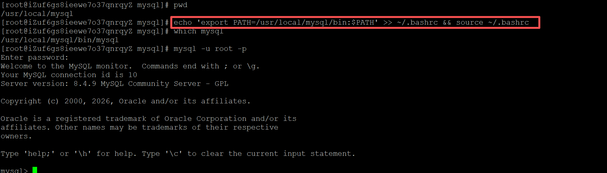

7.安装navicat可视化软件访问mysql数据库：

先将阿里云服务器的入方向加入3306端口

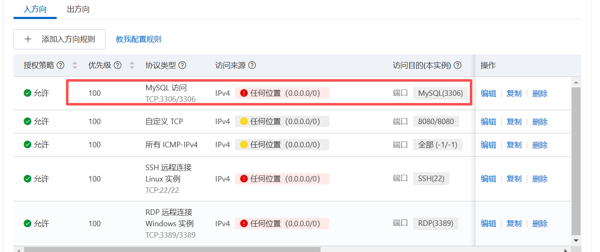

然后本地用navicat连接mysql服务器

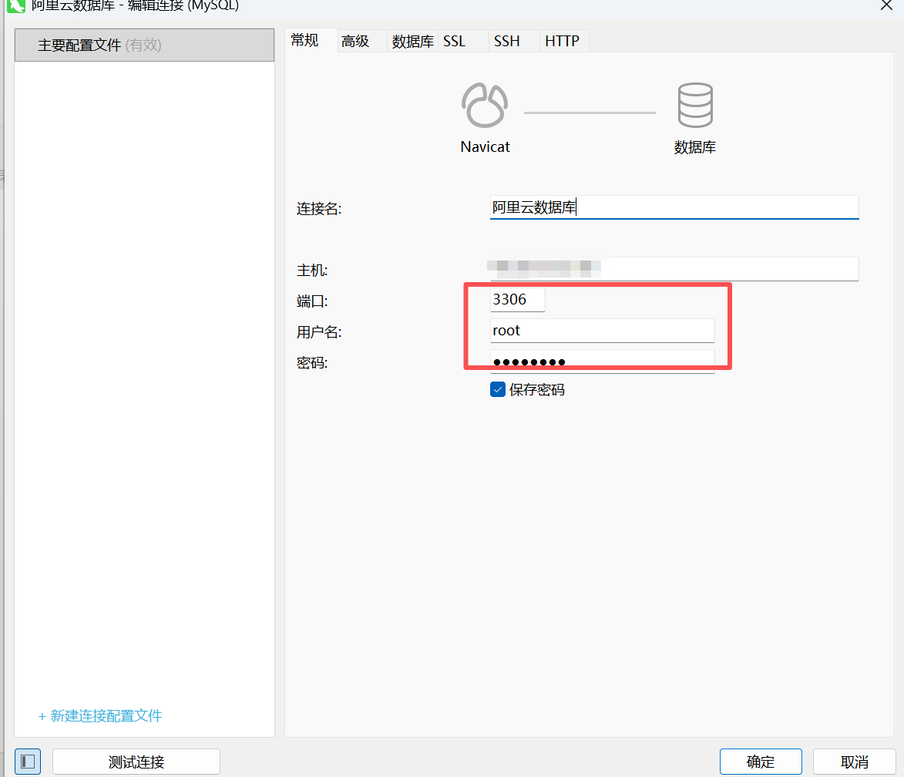

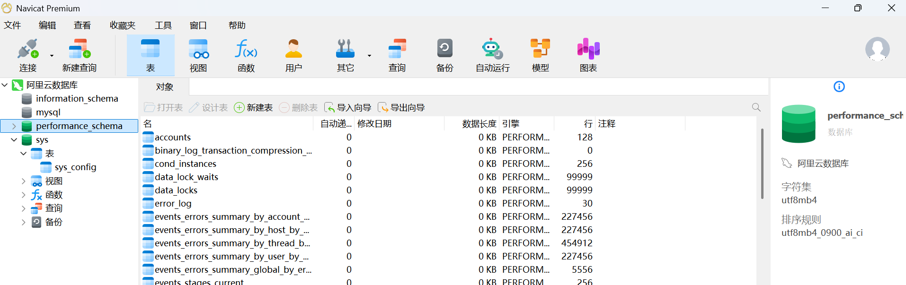

8.创建非root的普通用户以及数据库：

```sql
-- 0. 创建用户
CREATE USER 'ai'@'%' IDENTIFIED BY '你的密码';

-- 1. 创建数据库（名字取你项目的名字，比如 myapp_db）
CREATE DATABASE myai_db CHARACTER SET utf8mb4 COLLATE utf8mb4_unicode_ci;

-- 2. 给 ai 用户授予这个数据库的所有权限
GRANT ALL PRIVILEGES ON myai_db.* TO 'ai'@'%';

-- 3. 刷新权限
FLUSH PRIVILEGES;

-- 4. 验证一下
SHOW GRANTS FOR 'ai'@'%';
```

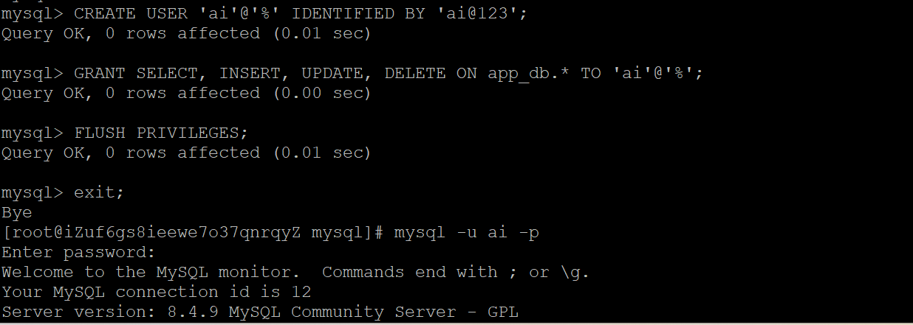

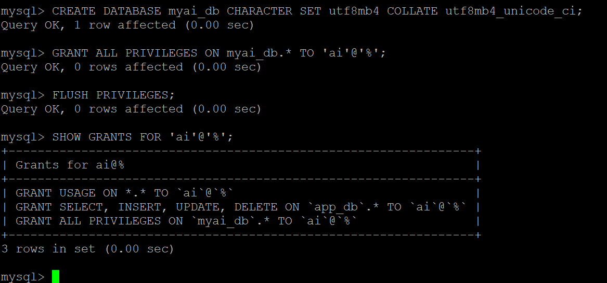

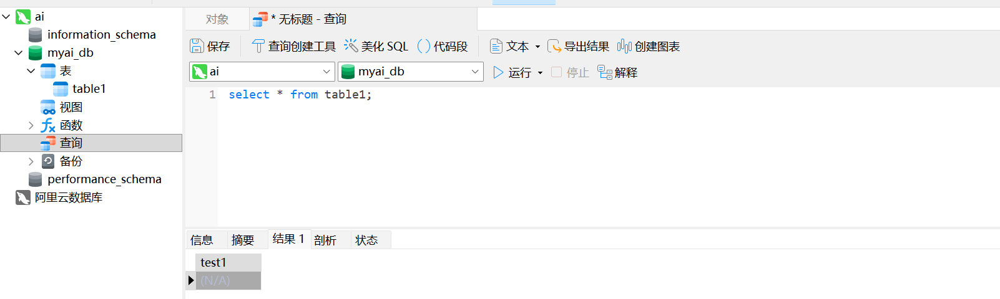

9.解决mysql远程连接不上的问题：

（1）排查防火墙，增加3306端口

（2）排查是否 SELinux状态是否为enforce

   (3)排查mysql绑定地址是否为0.0.0.0，如果不是，修改etc/my.conf文件

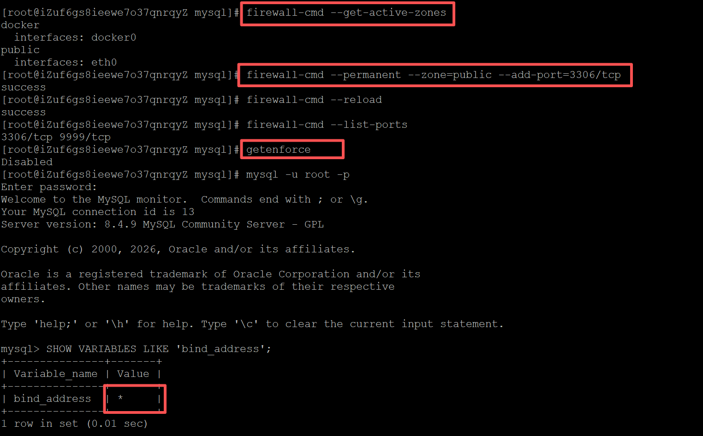


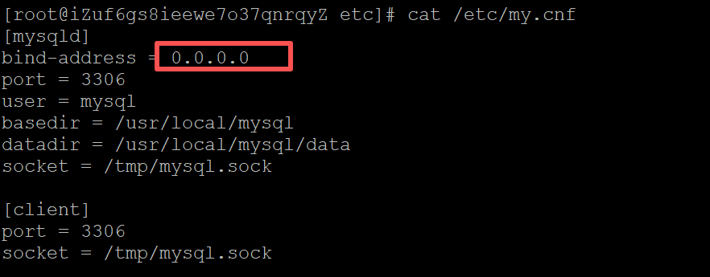

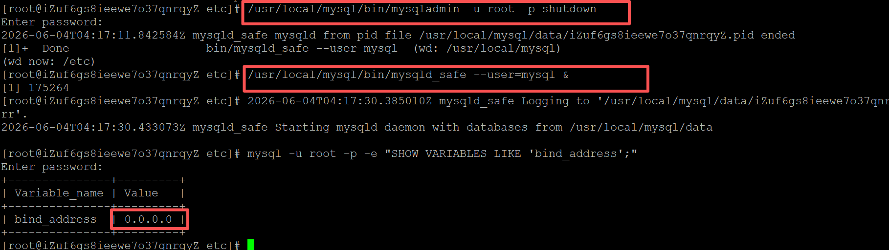

（4）修复 root 用户远程权限

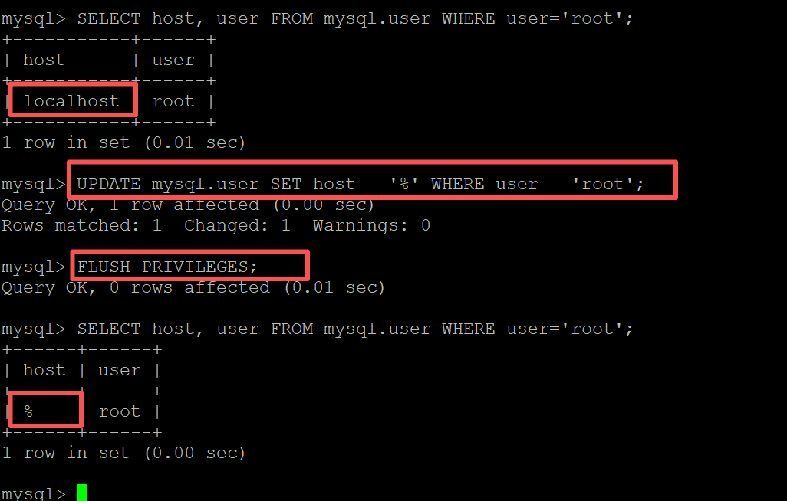

一般做完以上操作就可以正常连接啦！

#### （三）安装Tomcat11

1.下载tomcat11压缩包

```bash
Tomcat：是一个开源免费的Web应用服务器，性能稳定，是目前比较流行的Web应用服务器
tomcat官网下载：
http://tomcat.apache.org/
下载：
yum install -y wget
# 清华园下载
wget http://mirrors.tuna.tsinghua.edu.cn/apache/tomcat/tomcat-11/v11.0.3/bin/apache-tomcat-11.0.3.tar.gz
```

2.上传压缩包到linux服务器并解压

```bash
 # 解压
 tar -xzvf apache-tomcat-11.0.2.tar.gz
 # 重命名
 mv apache-tomcat-11.0.2 tomcat11
```

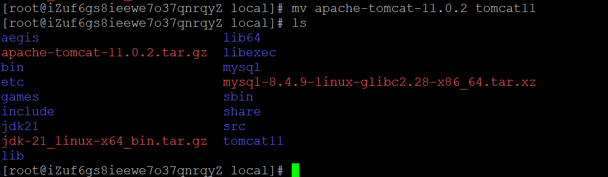

3.关闭防火墙

```bash
# 关闭防火墙
systemctl stop firewalld.service 
```

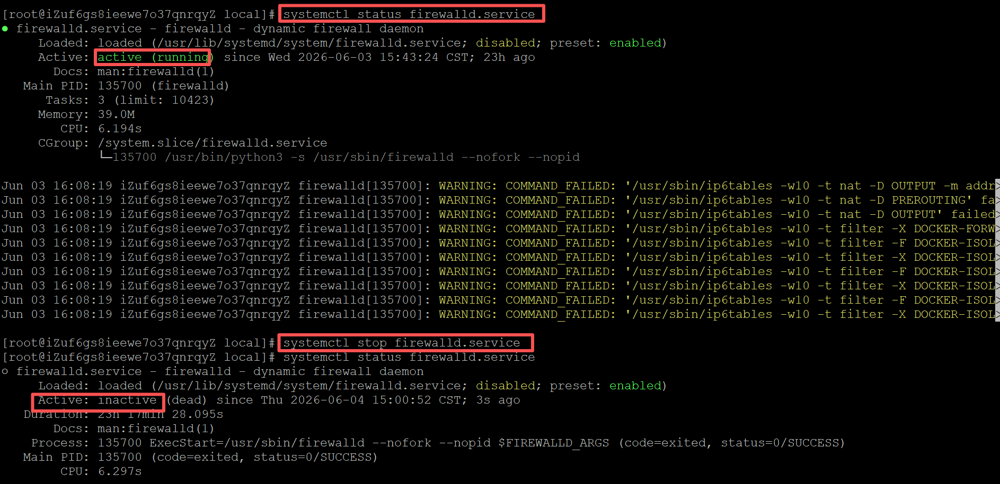

4.启动tomcat服务

```bash
# 启动服务
sh startup.sh
# 查看日志
cd /usr/local/tomcat11/logs
tail -f catalina.out
# 查看tomcat进程
ps -ef | grep tomcat
# 查看tomcat进程监听的端口
netstat -tunlp | grep 进程id
```

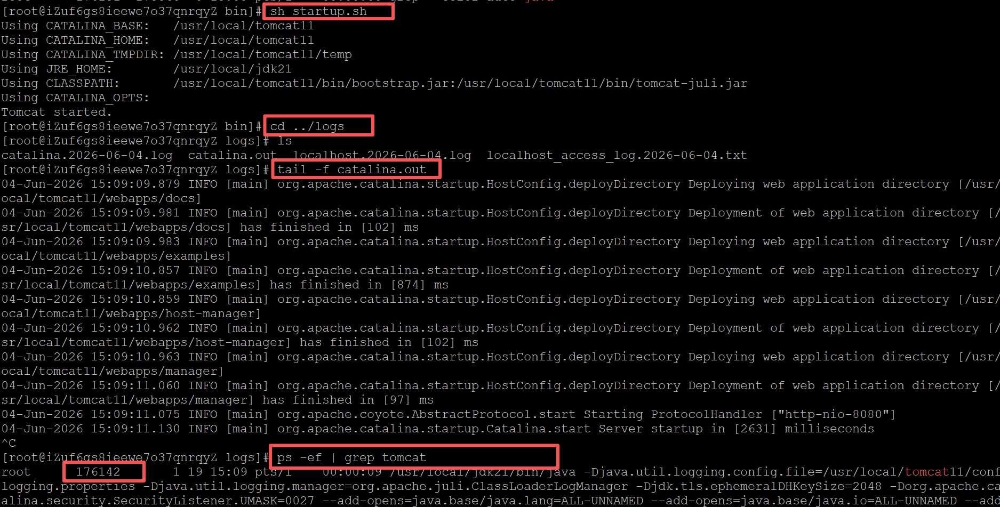

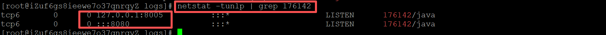

验证启动是否成功：

浏览器访问tomcat地址：http://47.101.153.130:8080

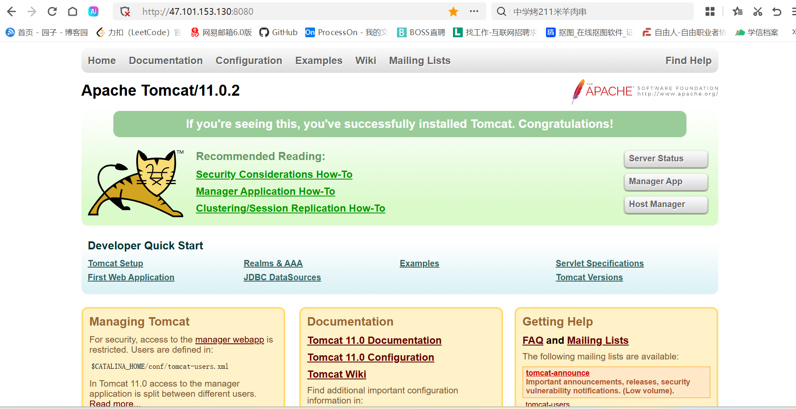

#### （四）安装nginx

```bash
nginx官网：https://nginx.org/
nginx 简介：Nginx是一款高性能的 HTTP 和反向代理服务器
Nginx的优点：
1.高并发量：根据官方给出的数据，能够支持高达 50,000 个并发连接数的响应
2.内存消耗少：处理静态文件，同样起web 服务，比apache 占用更少的内存及资源，所有它是轻量级的
3.简单稳定：配置简单，基本在一个conf文件中配置，性能比较稳定，可以7*24小时长时间不间断运行
4.模块化程度高：Nginx是高度模块化的设计，编写模块相对简单
5.负载均衡服务器：Nginx可以做高并发的负载均衡，且Nginx是开源免费的，如果使用F5等硬件来做负载均衡，硬件成本比较高
6.可移植性高：Nginx代码完全用C语言编写
Nginx的缺点：
1.动态处理差：nginx处理静态文件好,耗费内存少，但是处理动态页面比较差
2.rewrite弱：虽然nginx支持rewrite功能，但是相比于Apache来说，Apache比nginx 的rewrite 强大。

编译安装：
使用docker拉取nginx镜像：
docker pull nginx
启动nginx服务：
# docker ps -a 查看退出的nginx
# docker rm nginx的id  删除已经退出的nginx
docker run --name nginx -p 80:80 -d nginx
#在阿里云实例中配置网络安全组，关闭后在启动
查看启动状态：
docker ps 
配置防火墙：如果防火墙正在运行，允许HTTP和HTTPS流量：
firewall-cmd --add-service=http --permanent
重新加载Nginx
systemctl reload nginx

打开浏览器测试:
http://47.101.153.130:80/
```

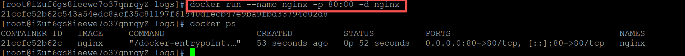

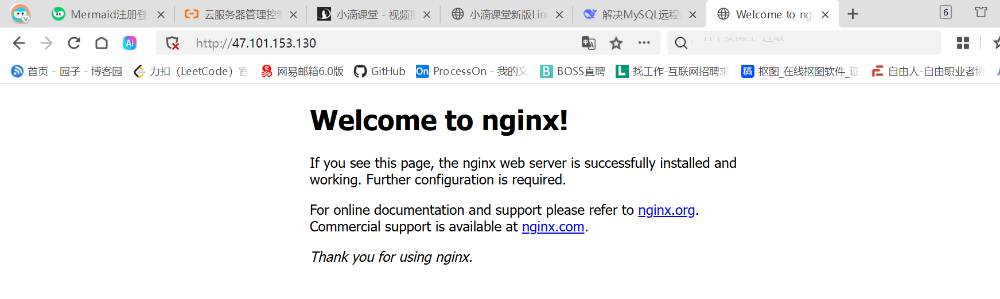

#### （五）安装Maven

```bash
什么是Maven：Apache组织开源的项目,一个软件项目管理和综合工具，基于项目对象模型（POM）的概念
最核心的功能就是能够自动下载项目依赖库。
使用Maven管理的Java 项目都有着相同的项目结构：
有一个pom.xml 用于维护当前项目都用了哪些jar包
所有的java代码都放在 src/main/java下面，所有的测试代码都放在src/test/java 下面

使用maven前：找依赖包，下载，添加到lib包，添加的build path
使用maven后：直接maven仓库添加配置，指定版本，自动下载

官网：https://maven.apache.org/
包地址：https://maven.apache.org/download.cgi
核心目录：bin/mvn
环境要求：JDK1.8及以上， mac/win/linux都是可以的

安装:
# 解压
tar -zxvf apache-maven-3.9.9-bin.tar.gz
# 重命名
mv apache-maven-3.9.9 maven3
#修改全局配置文件
vim /etc/profile
# jdk上面已经配置好
export JAVA_HOME=/usr/local/jdk-21  
export CLASSPATH=$:CLASSPATH:$JAVA_HOME/lib/
export PATH=$PATH:$JAVA_HOME/bin
# 追加如下配置
export MAVEN_HOME=/usr/local/maven3
export PATH=$PATH:$MAVEN_HOME/bin
# 环境变量立刻生效
source /etc/profile
# 查看安装情况 
mvn -v
```

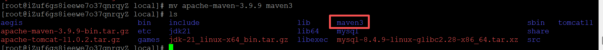

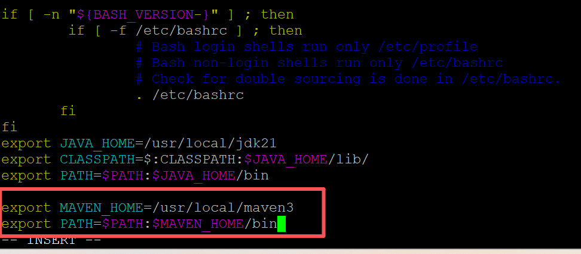

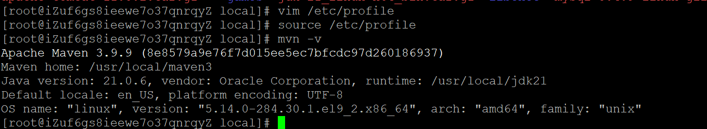

### 三、总结

常用的编译环境已经安装得差不多了，后面有空再把redis也装一下，如果服务器空间大，也可以尝试下载一个大模型直接调用。

* * *

**作者**：吴银双

**日期**：2026年6月4日

**平台**：GitHub Pages / 技术博客
