### 一、引言

最近了解到一种新的开发流程工具包，叫做spec kit。今天就系统地学习一下它的思想与使用。

### 二、具体内容

#### （一）什么是spec kit？

**Spec Kit** 是 GitHub 官方开源的规范驱动开发（Spec-Driven Development, SDD）工具包。它帮助我们更好地实现ai开发产品，促进全流程的规范性。

传统开发流程：

```
需求-代码-文档
```

Spec Kit流程：

```
 规范→计划→任务→实现
```

**关键区别**：

* **规范先行**：在写任何代码之前，先明确要构建什么

* **技术无关**：规范阶段专注于"什么"和"为什么"，而不是"如何实现"

* **可追溯性**：从用户需求到代码实现的完整追溯链

* **增量交付**：每个用户故事都是独立可测试的

#### （二）为什么要用Spec Kit？

1. **提高质量**：通过规范驱动减少返工

2. **加速开发**：AI 理解需求更准确，生成代码更精准

3. **降低风险**：早期发现需求不明确的地方

4. **团队协作**：规范成为团队的共同语言

5. **知识沉淀**：所有决策都有文档记录

#### （三）核心概念理解

##### 1. 规范驱动开发（SDD）

规范驱动开发是一种软件开发方法论，它将**规范文档**作为开发的核心驱动力，而不是代码。

**传统开发的问题**：

* 需求不明确就开始编码

* 频繁返工和修改

* 文档经常缺失或过时

* AI 生成代码时理解不准确

**SDD 的优势**：

* 先明确"做什么"，再考虑"怎么做"

* 规范成为可执行文档

* 减少沟通成本

* AI 能更准确地理解需求

##### 2. 项目原则（Constitution）

项目原则是整个项目的**最高指导文件**，它定义了：

* 核心开发原则

* 技术约束

* 质量标准

* 开发流程

* 治理规则

**作用**：

* 指导所有后续开发决策

* 确保团队一致性

* 作为代码审查的依据

* 新成员快速理解项目

##### 3. 功能规范（Specification）

功能规范详细描述要构建的功能，包括：

* 用户场景和故事

* 功能需求

* 成功标准

* 关键实体

* 边界和约束

**关键特点**：

* **技术无关**：不涉及具体实现

* **用户导向**：从用户视角描述

* **可测试**：每个需求都可验证

* **可测量**：成功标准可量化

##### 4. 技术计划（Implementation Plan）

技术计划将功能规范转化为技术设计，包括：

* 技术栈选择

* 项目结构

* 架构决策

* 数据模型

* 接口契约

**关键特点**：

* 基于规范的技术设计

* 考虑项目原则约束

* 解决技术不确定性

* 为任务分解做准备

##### 5. 任务列表（Tasks）

任务列表将技术计划分解为可执行的任务，包括：

* 按用户故事组织

* 依赖关系图

* 并行执行机会

* 独立测试标准

**关键特点**：

* 每个任务都可独立完成

* 支持并行开发

* 清晰的执行顺序

* 可追踪进度

#### （四）SpecKit完整工作流程

```bash
┌─────────────────────────────────────────────────────────────┐
│  1. /speckit.constitution - 建立项目原则              │
└─────────────────────────────────────────────────────────────┘
                           ↓
┌─────────────────────────────────────────────────────────────┐
│  2. /speckit.specify - 创建功能规范                  │
└─────────────────────────────────────────────────────────────┘
                           ↓
              ┌──────────────┴──────────────┐
              │  可选：/speckit.clarify   │
              │  澄清需求                │
              └──────────────┬──────────────┘
                           ↓
┌─────────────────────────────────────────────────────────────┐
│  3. /speckit.plan - 创建技术计划                    │
└─────────────────────────────────────────────────────────────┘
                           ↓
              ┌──────────────┴──────────────┐
              │  可选：/speckit.checklist │
              │  质量检查清单            │
              └──────────────┬──────────────┘
                           ↓
┌─────────────────────────────────────────────────────────────┐
│  4. /speckit.tasks - 分解为任务                     │
└─────────────────────────────────────────────────────────────┘
                           ↓
              ┌──────────────┴──────────────┐
              │  可选：/speckit.analyze    │
              │  一致性分析              │
              └──────────────┬──────────────┘
                           ↓
┌─────────────────────────────────────────────────────────────┐
│  5. /speckit.implement - 执行实现                   │
└─────────────────────────────────────────────────────────────┘
```

##### 1. 建立项目原则

**命令**：`/speckit.constitution`

**目的**：创建项目的核心原则和开发准则

**输入**：项目原则的描述

**输出**：`.specify/memory/constitution.md`

**示例**：

```bash
/speckit.constitution 创建一个注重代码质量、测试标准、 用户体验一致性和性能要求的项目原则
```

**生成的文档包含**：

* 核心原则（如：测试优先、代码质量、性能标准）

* 技术约束

* 开发流程

* 治理规则
  
  
  
  

##### 2. 创建功能规范

**命令**：`/speckit.specify <功能描述>`

**目的**：用自然语言描述要构建的功能

**关键原则**：

* 专注于"什么"和"为什么"

* 不要涉及"如何实现"

* 从用户视角描述

* 确保可测试和可测量

**输入**：功能描述

**输出**：

* 新的功能分支

* `specs/[###-feature-name]/spec.md`

**示例**：

`/speckit.specify 构建一个待办事项应用，用户可以添加、编辑、 删除和标记完成待办事项。待办事项应该按优先级分类（高、中、低）。 应用需要支持本地存储，数据不会上传到服务器。 界面简洁易用，支持移动端访问。`

**生成的规范包含**：

* 用户场景和故事（按优先级排序）

* 功能需求

* 成功标准（可测量）

* 关键实体

* 边界和约束

**用户故事的特点**：

* **独立可测试**：每个故事都可以独立开发和测试

* **按优先级排序**：P1、P2、P3 等

* **用户导向**：描述用户旅程

* **可交付**：每个故事都是可用的功能增量
  
  
  
  

##### 3. 澄清需求

**命令**：`/speckit.clarify`

**目的**：在规划之前提出结构化问题，降低模糊领域的风险

**何时使用**：

* 规范中有不明确的地方

* 需要做出重要决策

* 有多个合理的解释

**输出**：结构化的问题和选项

**示例**：

```bash
## 问题 1：数据存储方式 
**上下文**：应用需要支持本地存储 
**需要知道**：使用哪种本地存储方式？ 
**建议答案**： 
| 选项 | 答案 | 影响 | 
|------|------|------| 
| A | localStorage | 简单易用，但容量有限（5-10MB） | 
| B | IndexedDB | 容量大，但 API 复杂 | 
| C | SQLite | 功能强大，但需要额外库 | 
**您的选择**：_
```

##### 4. 创建技术计划

**命令**：`/speckit.plan <技术栈描述>`

**目的**：提供技术栈和架构选择，将功能规范转化为技术设计

**输入**：技术栈和架构选择

**输出**：

* `specs/[###-feature-name]/plan.md`

* `specs/[###-feature-name]/research.md`

* `specs/[###-feature-name]/data-model.md`

* `specs/[###-feature-name]/quickstart.md`

* `specs/[###-feature-name]/contracts/`

**示例**：

```bash
/speckit.plan 应用使用原生 HTML、CSS 和 JavaScript， 不依赖任何框架。
使用 localStorage 进行数据持久化。 
采用响应式设计，支持移动端和桌面端。 
遵循渐进增强原则，确保基本功能在所有浏览器中可用。
```

**生成的计划包含**：

1. **技术上下文**：语言/版本、主要依赖、存储方式、测试框架、目标平台、性能目标、约束条件、规模/范围

2. **项目结构**：文档结构、源代码结构、测试结构

3. **宪法检查**：验证是否符合项目原则、识别违规（如果有）、提供简化替代方案

4. **研究文档**：技术决策、决策理由、考虑的替代方案

5. **数据模型**：实体定义、字段和关系、验证规则

6. **接口契约**：API 规范、命令模式、UI 契约

7. **快速开始**：集成场景、测试步骤

##### 5. 质量检查清单

**命令**：`/speckit.checklist`

**目的**：生成质量检查清单以验证需求的完整性、清晰度和一致性

**何时使用**：

* 在 `/speckit.plan` 之后

* 在 `/speckit.tasks` 之前

**输出**：`specs/[###-feature-name]/checklists/`

**检查清单类型**：

* UX 检查清单

* 安全检查清单

* 性能检查清单

* 测试检查清单

##### 6. 分解为任务

**命令**：`/speckit.tasks`

**目的**：将技术计划分解为具体的、可执行的任务列表

**输入**：自动读取规范和计划文档

**输出**：`specs/[###-feature-name]/tasks.md`

**任务组织原则**：

* **按用户故事组织**：每个用户故事都有独立的任务组

* **独立可测试**：每个任务都可以独立完成和测试

* **依赖关系清晰**：明确任务的执行顺序

* **支持并行**：标记可以并行执行的任务

**任务格式**：

```bash
- [ ] T001 创建项目结构 
- [ ] T002 [P] 实现认证中间件 
- [ ] T003 [US1] 创建用户模型`
```

**格式说明**：

* `- [ ]`：复选框

* `T001`：任务 ID（按执行顺序）

* `[P]`：可并行执行（可选）

* `[US1]`：用户故事标签（用户故事阶段必需）

* 描述：清晰的行动和文件路径

##### 7. 一致性分析

**命令**：`/speckit.analyze`

**目的**：跨工件一致性和对齐报告

**何时使用**：

* 在 `/speckit.tasks` 之后

* 在 `/speckit.implement` 之前

**输出**：一致性分析报告

**分析内容**：

* 规范与计划的一致性

* 计划与任务的一致性

* 跨工件对齐检查

* 潜在问题识别

##### 8.执行实现

**命令**：`/speckit.implement`

**目的**：按照任务列表执行所有任务，构建功能

**输入**：自动读取任务列表和相关文档

**执行规则**：

* **按阶段执行**：完成每个阶段后再进入下一个

* **尊重依赖**：按顺序执行顺序任务，并行任务可以一起执行

* **TDD 方法**：如果需要，先执行测试任务

* **基于文件的协调**：影响同一文件的任务必须按顺序执行

* **验证检查点**：在继续之前验证每个阶段的完成

**实现规则**：

1. **设置优先**：初始化项目结构、依赖、配置

2. **测试先行**：如果需要，先编写测试

3. **核心开发**：实现模型、服务、命令、端点

4. **集成工作**：数据库连接、中间件、日志、外部服务

5. **完善和验证**：单元测试、性能优化、文档

**进度跟踪**：

* 每个完成的任务后报告进度

* 如果任何非并行任务失败，则停止执行

* 对于并行任务 [P]，继续成功的任务，报告失败的任务

* 提供清晰的错误消息和调试上下文

* **重要**：对于已完成的任务，确保在任务文件中将其标记为 [X]

**完成验证**：

* 验证所有必需任务已完成

* 检查实现的功能是否与原始规范匹配

* 验证测试通过且覆盖率满足要求

* 确认实现遵循技术计划

* 报告最终状态和已完成工作的摘要

#### （五）SpecKit实战

##### 1.安装uv

```bash
# 在pwershell终端中输入以下命令安装uv 
powershell -ExecutionPolicy ByPass -c "irm https://astral.sh/uv/install.ps1 | iex"
```

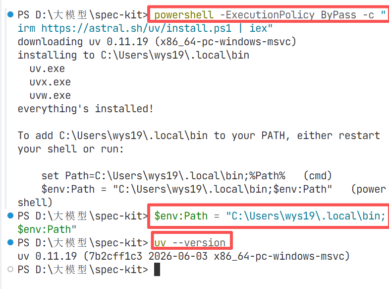

##### 2.全局安装 specify-cli（只需一次）

```bash
# 安装specify-cli
uv tool install specify-cli --from git+https://github.com/github/spec-kit.git
# 验证
specify --version
# 如果换了一个终端又显示没有安装specify，那就手动刷新一下环境变量
$env:Path = [System.Environment]::GetEnvironmentVariable("Path","Machine") + ";" + [System.Environment]::GetEnvironmentVariable("Path","User")
```

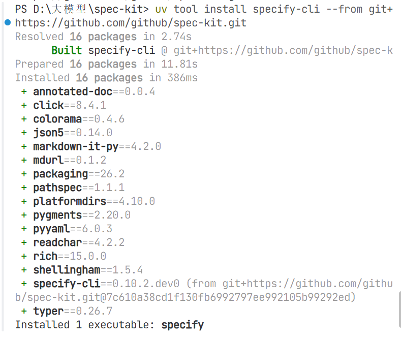


##### 3.初始化项目

```bash
# 在需要初始化的项目根目录下执行以下命令（老版本不能直接指定--ai 后面的大模型，需要手动选择模型和powershell）
specify init .
```

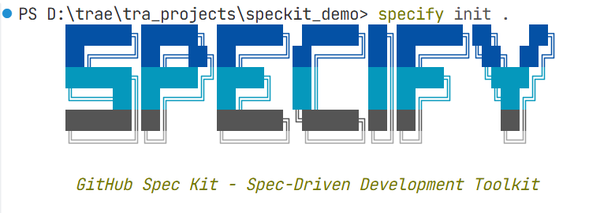

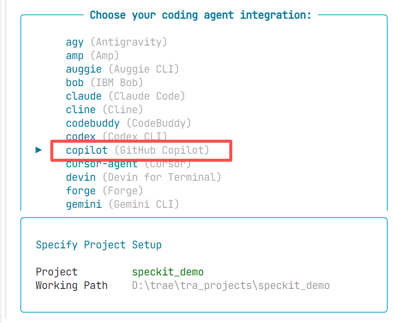

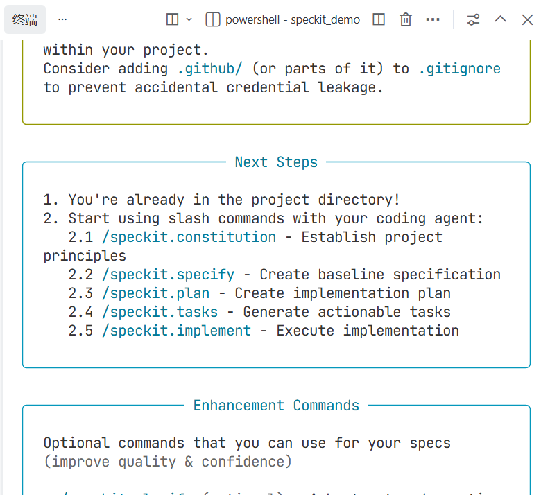

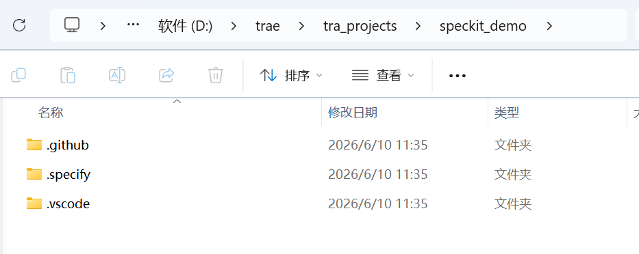

##### 4.工程化项目-用户代办事项

打开trae右边的AI聊天窗口依次执行命令：

(1)创建项目原则

```bash
/speckit.constitution 这是一个纯前端项目，注重代码质量、测试标准、用户体验一致性和性能要求。
```

可以看到大模型已经帮我们建立好了一个constitution.md文件，里面就是规范化的项目原则。

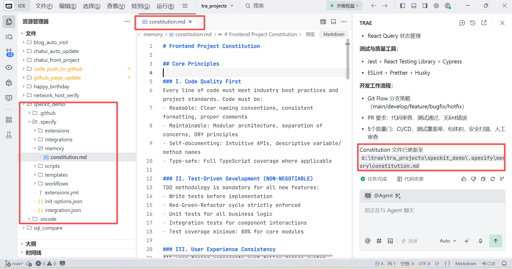

（2）创建功能规范

```bash
/speckit.specify 构建一个待办事项应用，用户可以添加、编辑、删除和标记完成待办事项。待办事项应该按优先级分类（高、中、低）。应用需要支持本地存储，数据不会上传到服务器。界面简洁易用，支持移动端访问。
```

可以看到在specs文件夹下新建了一个001-todo-app分支，并生成了

-- spec.md - 功能规格说明

    4个用户故事（P1: 创建管理待办事项、本地存储；P2: 优先级筛选、移动端支持）、10个功能需求、5个成功标准、边界情况处理

-- plan.md - 实施计划

    技术栈：React 18 + TypeScript + Vite + TailwindCSS

    Constitution 检查：✅ 全部通过

    完整的项目结构规划、性能目标和约束

-- research.md - 技术研究

    技术选型分析和决策、本地存储实现策略、响应式设计策略、性能优化方案、

-- data-model.md - 数据模型

    4个核心实体：TodoItem、PriorityLevel、TodoFilter、TodoFormData、完整的CRUD操作、数据验证和完整性检查、性能优化考虑

-- contracts 接口契约

    storage-service.md ：本地存储服务接口

    todo-service.md ：待办事项业务逻辑接口

    包含行为规范、测试用例、性能要求

-- quickstart.md - 快速开始指南

    安装和配置说明、开发工作流程、测试和构建命令、故障排除指南

-- tasks.md - 任务列表

    80个详细任务，分为7个阶段

    按用户故事组织，支持独立开发和测试

    包含并行开发机会

    Constitution 合规性检查清单

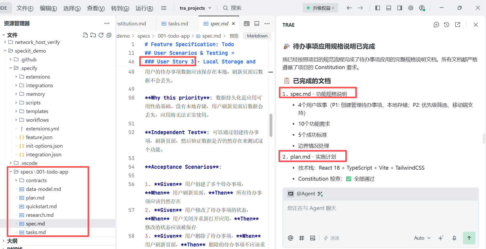

（3）创建技术计划

```bash
/speckit.plan 应用使用原生 HTML、CSS 和 JavaScript，不依赖任何框架。使用 localStorage 进行数据持久化。采用响应式设计，支持移动端和桌面端。遵循渐进增强原则，确保基本功能在所有浏览器中可用。
```

可以看到plan.md等文件已更新

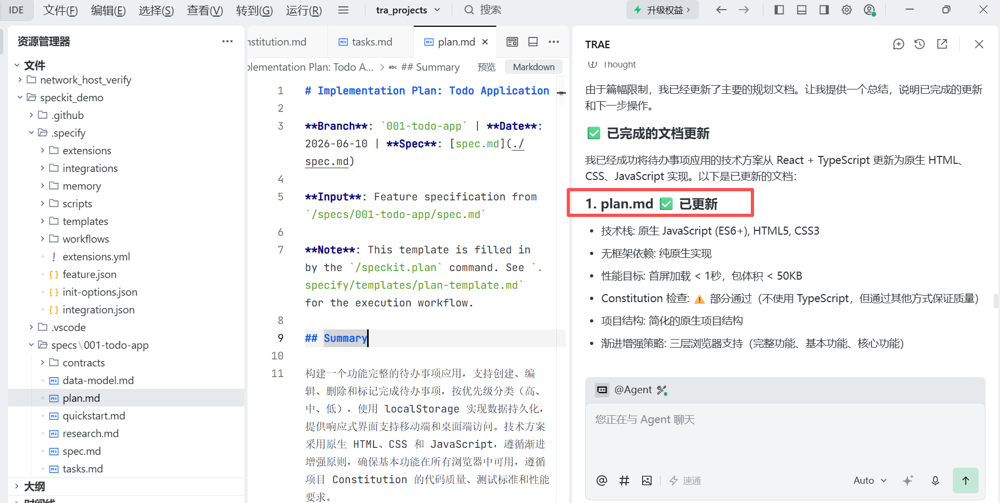

（4）分解任务

```bash
/speckit.tasks
```

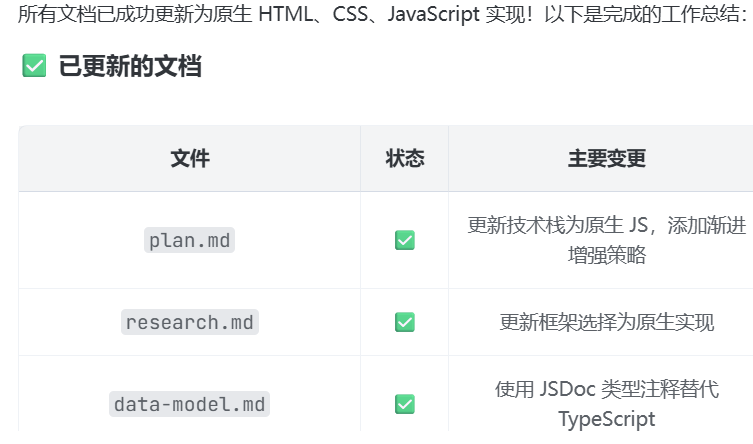

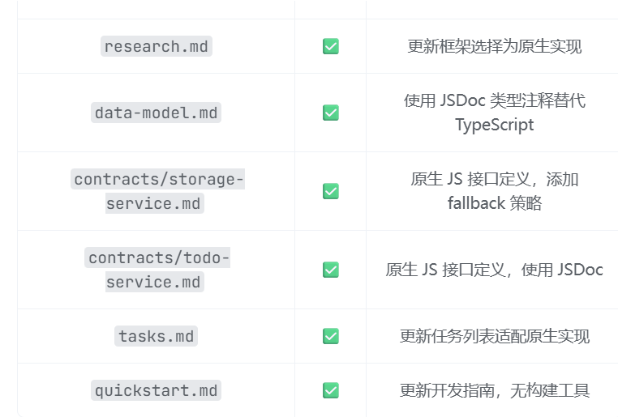

tasks.md中已经罗列了每个阶段的任务

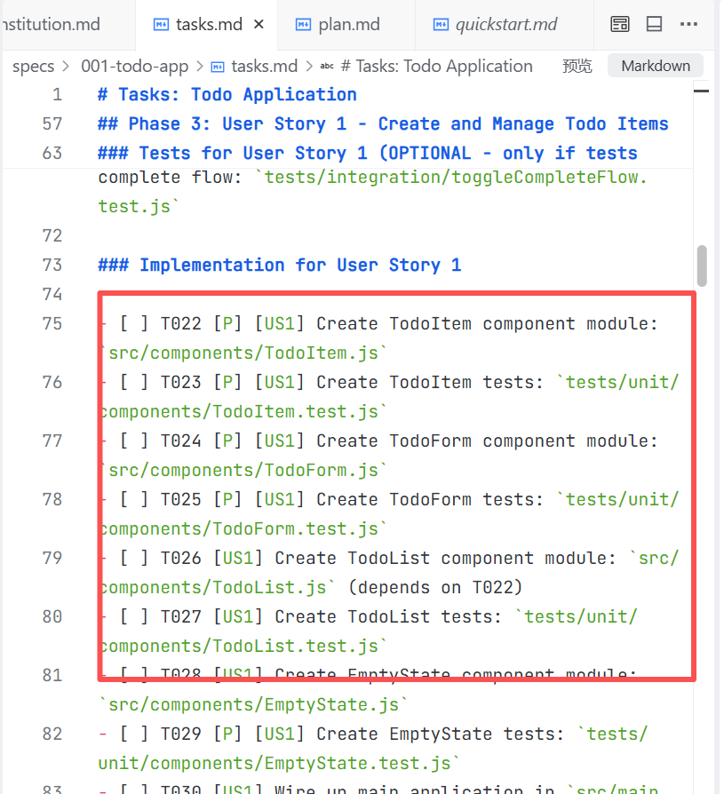

(5)执行实现

```bash
/speckit.implement
```

可以看到经过一系列的测试和修复，最终生成了完整的项目代码：

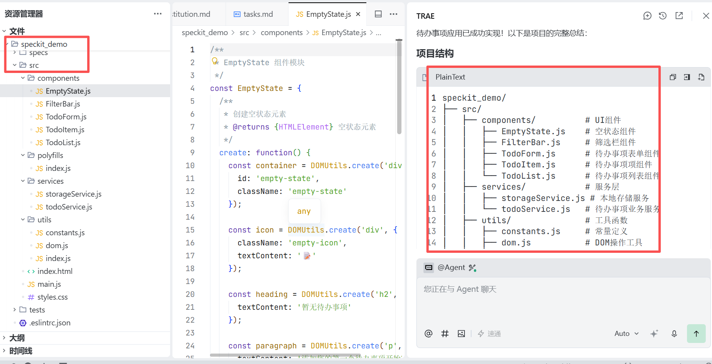

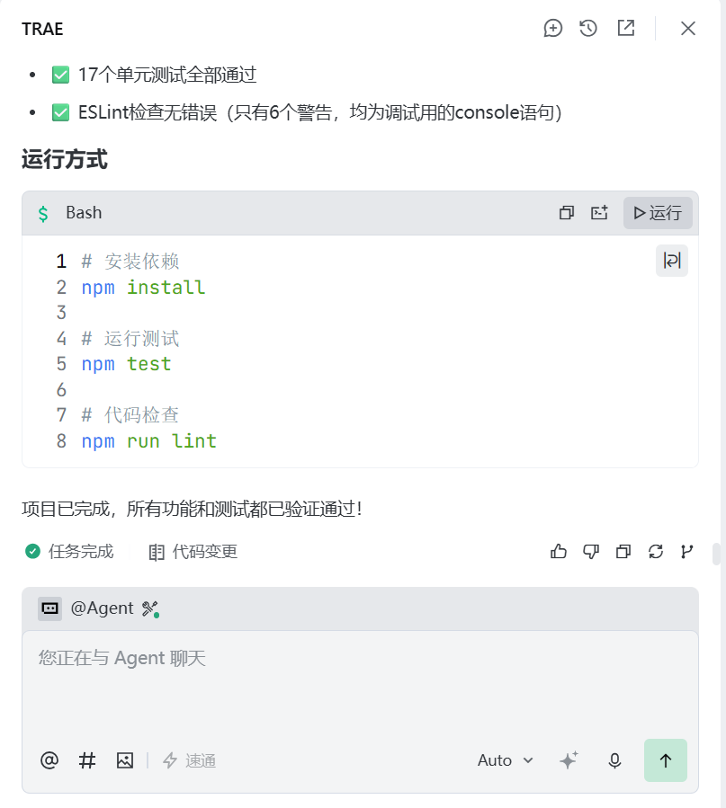

我们双击生成的index.html文件就能使用待办事项应用啦！


### 三、总结

speckit是一个很强大的工具，规范驱动开发确实能够改善我们的项目质量。需要注意的是，老版speckit在/speckit.specify阶段只生成spec.md，但是新版speckit在/speckit.specify阶段会把`plan.md、research.md等一起生成，然后在/speckit.plan阶段以及/speckit.tasks阶段持续更新文件。

* * *

**作者**：吴银双

**日期**：2026年6月10日

**平台**：GitHub Pages / 技术博客
