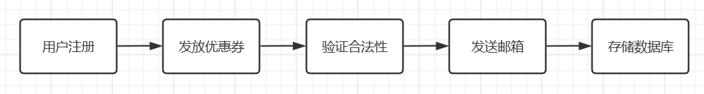
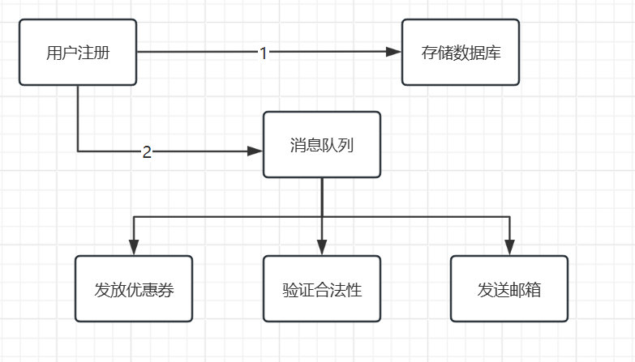
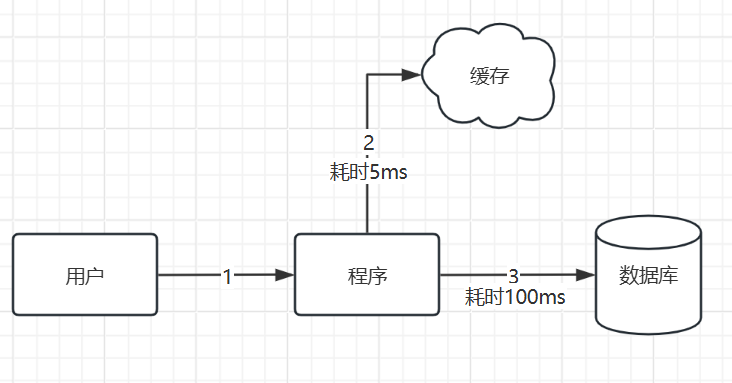

### 一、引言

处理高并发场景有两个核心技术，即队列与缓存，今天就来仔细夯实一下基础。

### 二、具体内容

### （一）队列

#### 1.什么是队列？

队列全程为消息队列（MQ，Message Queue），也叫消息中间件。为什么叫消息中间件呢？首先，队列是核心数据结构。它的底层就是先进先出（FIFO）队列，所以消息也是按照顺序发布和消费。其次，它部署在多个应用之间，不负责业务逻辑，只负责中转、收发消息，所以叫他消息中间件。

#### 2.队列的作用：

解耦：订单系统-》物流系统

异步：⽤户注册-》发送邮件，初始化信息

并行：秒杀、⽇志处理

以用户注册为例：

-- 未使用消息队列：

-- 使用消息队列后：

## （二）缓存

### 1.什么是缓存？

缓存就是把经常要用到的数据，存到读取更快的地方，不用每次都去数据库或其他持久化设备中取，提速减负。

### 2.缓存的分类：

#### 本地缓存：

程序自身内存里，比如Java Caffeine，Mybatis的一级或二级缓存，只能单机用。

Caffeine是目前Spring Boot官方默认推荐的本地缓存框架。底层基于`ConcurrentHashMap`，但封装了完善的淘汰策略（LRU、LFU等）和过期管理。

#### 分布式缓存：

与应⽤分离的缓存组件或服务，与本地应⽤隔离，⼀个独⽴的服务，多个应⽤可直接访问的共享缓存。

#### 硬件缓存：

CPU缓存、浏览器缓存等等。

### 三、总结

本地缓存和分布式缓存是我们经常用到的，尤其是redis，不过本地缓存Caffeine我还没用过，ConcurrentHashMap倒是接触过，后面可以思考研究下需不需要换成Caffeine。

* * *

**作者**：吴银双

**日期**：2026年6月12日

**平台**：GitHub Pages / 技术博客

