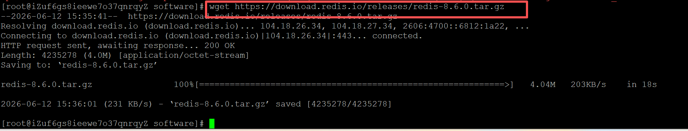
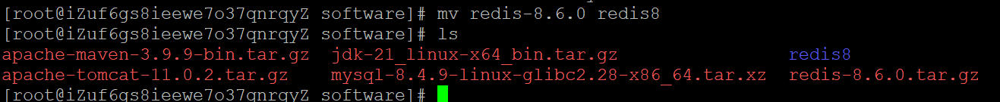
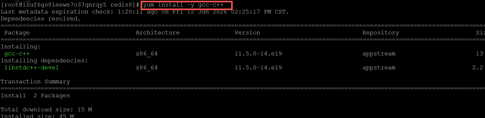
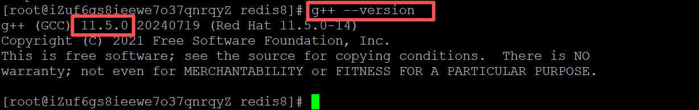
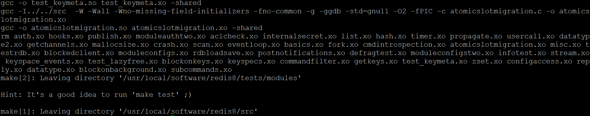
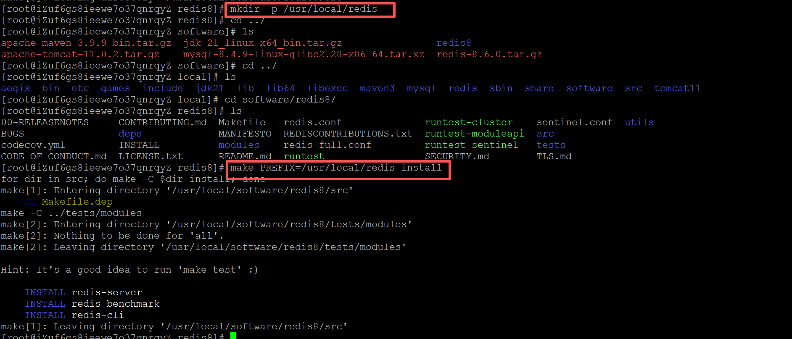
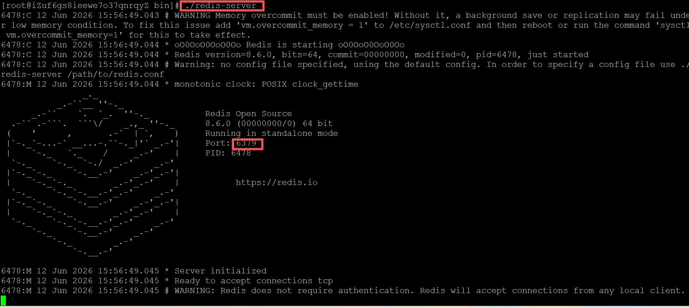
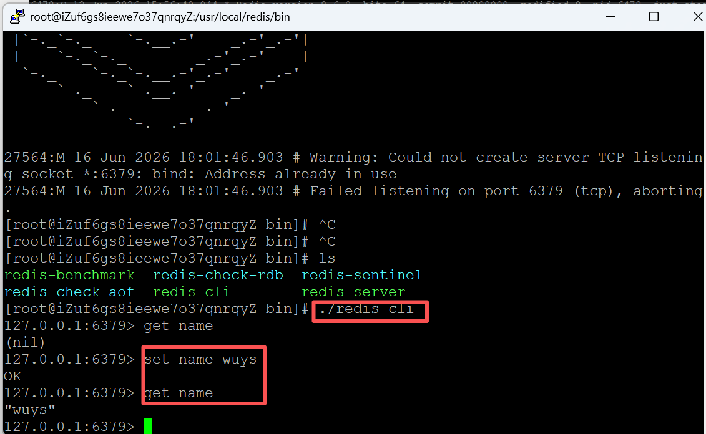

### 一、引言

之前已经在我的linux服务器上安装了jdk、maven、tomcat、mysql等，今天来装一下redis。

### 二、具体内容

#### （一）源码安装

##### 1.下载redis源码包，我下载到/usr/local/software路径下：

```bash
# 下载 Redis 6.2.22 源码包
wget https://download.redis.io/releases/redis-8.6.0.tar.gz
# 解压
tar -zxvf redis-8.6.0.tar.gz
# 重命名
mv redis-8.6.1 redis8
```





##### 2.安装依赖：

```bash
# 安装 g++ (在 yum 系统中，这个包名叫 gcc-c++)
yum install -y gcc-c
+# 验证安装是否成功
g++ --version
```





##### 3.编译redis

```bash
# 重新配置并编译，指定使用 libc 作为内存分配器，防止jemalloc报错
make MALLOC=libc
```



编译完成后安装到指定路径，我安装到/usr/local/redis下：

```bash
# 创建目录
mkdir -p /usr/local/redis
#安装到指定⽬录
make PREFIX=/usr/local/redis install
```



##### 4.启动redis服务：

```bash
# 启动redis服务端
./redis-server
# 启动redis服务端时指定配置文件
./redis-server /usr/local/software/redis8/redis.conf
```



redis服务也是有客户端与服务端的，我们刚刚启动了服务端，现在在启动一下客户端，同样进入bin目录下：

```bash
./redis-cli
```



可以看到我们现在已经能够存值取值了。

#### （二）docker安装

先在服务器上安装docker，不回安装的可以看这篇：[容器化Docker安装及命令 | ~吴 银 双~](https://www.wuyinshuang.com/posts/linux-learn-partE/)。安装好docker之后直接用docker安装Redis即可：

```bash
# 启动使⽤Docker
systemctl start docker
# docker启动redis（自行下载安装redis）
docker run -itd --name my-redis -p 6379:6379 redis --requirepass 123456
-i 以交互模式运⾏容器，通常与
-t 同时使⽤;
-d 后台运⾏容器，并返回容器ID;
--requirepass 登陆密码
```

此时redis服务端已经起好了，也就是docker run运行的容器，我们现在进入容器再执行redis-cli命令，继续存值取值：

```bash
# -it 表示交互式终端，--link 或直接进入容器
docker exec -it my-redis redis-cli -a 123456
# 存值
set mykey "hello world"
# 取值
get mykey
# 退出
exit
```

如果不想每次都进入容器执行客户端命令，也可以在宿主机上安装客户端：

```bash
yum install -y redis
# 注意这里要用 -h 指定本机IP，因为客户端在宿主机，服务端在容器里
redis-cli -h 127.0.0.1 -p 6379 -a 123456
```

### 三、总结

一般来说，docker安装更简单方便一些，比较推荐。

* * *

**作者**：吴银双

**日期**：2026年6月12日

**平台**：GitHub Pages / 技术博客
