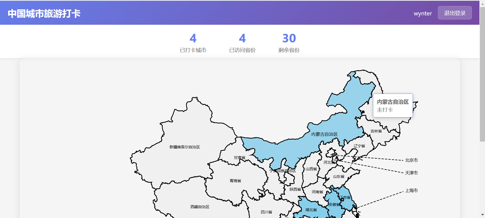
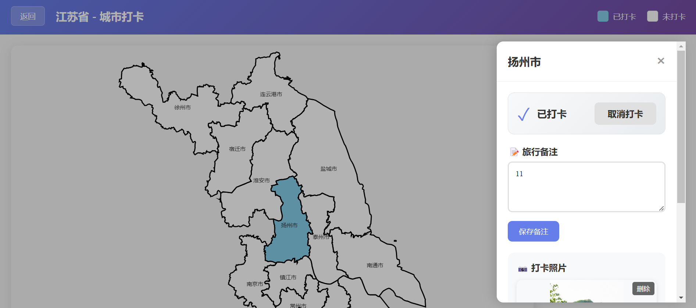

### 一、引言

最近很想用ai做一个自己一直想要的城市旅游打卡网站，因为之前也在网上找过类似的软件，但是一直没有找到很好用的，所以就自己动手啦。

### 二、具体内容

#### 1.使用speckit构建项目雏形

```bash
/speckit.constitution 这是一个能够部署在linux服务器上的项目，是前端+后端完整项目。注重代码质量、测试标准、用户体验一致性和性能要求。
/speckit.specify 构建一个中国地图城市旅游打卡应用，用户可以先在全国地图上选择省，再在放大版省的地图上选择城市，每个城市有清晰的界限，且是闭合完整的区域。用户点击城市后可以打卡，打卡前为白色，打卡后为浅蓝色。用户也可以选择城市后添加备注，备注中可以编辑文字，也可以上传图片。用户编辑的内容存储到mysql数据库中持久化，震哥哥项目可以在linux服务器上用tomcat部署，部署成功后通过http地址访问，且该应用支持多个用户使用，各个用户数据隔离。
/speckit.plan 应用前端使用vue框架，后端使用spring boot框架。使用 mysql进行数据持久化。采用响应式设计，支持移动端和桌面端。遵循渐进增强原则，确保基本功能在所有浏览器中可用。
/speckit.tasks
/speckit.implemt
```

#### 2.在数据库中执行初始化脚本

```sql
-- MySQL Database Initialization Script for Travel City Check-in Application

-- Create database if not exists
CREATE DATABASE IF NOT EXISTS travel_city CHARACTER SET utf8mb4 COLLATE utf8mb4_unicode_ci;

USE travel_city;

-- Drop existing tables (for fresh setup)
DROP TABLE IF EXISTS images;
DROP TABLE IF EXISTS notes;
DROP TABLE IF EXISTS checkins;
DROP TABLE IF EXISTS cities;
DROP TABLE IF EXISTS provinces;
DROP TABLE IF EXISTS users;

-- Users table
CREATE TABLE users (
    id BIGINT PRIMARY KEY AUTO_INCREMENT,
    username VARCHAR(50) NOT NULL UNIQUE,
    password VARCHAR(255) NOT NULL,
    created_at DATETIME NOT NULL DEFAULT CURRENT_TIMESTAMP,
    last_login DATETIME,
    INDEX idx_username (username)
) ENGINE=InnoDB DEFAULT CHARSET=utf8mb4 COLLATE=utf8mb4_unicode_ci;

-- Provinces table
CREATE TABLE provinces (
    id BIGINT PRIMARY KEY AUTO_INCREMENT,
    name VARCHAR(50) NOT NULL,
    code VARCHAR(10) NOT NULL UNIQUE,
    geojson TEXT NOT NULL,
    INDEX idx_code (code)
) ENGINE=InnoDB DEFAULT CHARSET=utf8mb4 COLLATE=utf8mb4_unicode_ci;

-- Cities table
CREATE TABLE cities (
    id BIGINT PRIMARY KEY AUTO_INCREMENT,
    name VARCHAR(50) NOT NULL,
    province_id BIGINT NOT NULL,
    code VARCHAR(10) NOT NULL UNIQUE,
    geojson TEXT NOT NULL,
    INDEX idx_province (province_id),
    INDEX idx_code (code),
    FOREIGN KEY (province_id) REFERENCES provinces(id)
) ENGINE=InnoDB DEFAULT CHARSET=utf8mb4 COLLATE=utf8mb4_unicode_ci;

-- Checkins table
CREATE TABLE checkins (
    id BIGINT PRIMARY KEY AUTO_INCREMENT,
    user_id BIGINT NOT NULL,
    city_id BIGINT NOT NULL,
    created_at DATETIME NOT NULL DEFAULT CURRENT_TIMESTAMP,
    UNIQUE INDEX idx_user_city (user_id, city_id),
    INDEX idx_user (user_id),
    INDEX idx_city (city_id),
    FOREIGN KEY (user_id) REFERENCES users(id) ON DELETE CASCADE,
    FOREIGN KEY (city_id) REFERENCES cities(id)
) ENGINE=InnoDB DEFAULT CHARSET=utf8mb4 COLLATE=utf8mb4_unicode_ci;

-- Notes table
CREATE TABLE notes (
    id BIGINT PRIMARY KEY AUTO_INCREMENT,
    user_id BIGINT NOT NULL,
    city_id BIGINT NOT NULL,
    content TEXT,
    created_at DATETIME NOT NULL DEFAULT CURRENT_TIMESTAMP,
    updated_at DATETIME ON UPDATE CURRENT_TIMESTAMP,
    UNIQUE INDEX idx_user_city (user_id, city_id),
    INDEX idx_user (user_id),
    INDEX idx_city (city_id),
    FOREIGN KEY (user_id) REFERENCES users(id) ON DELETE CASCADE,
    FOREIGN KEY (city_id) REFERENCES cities(id)
) ENGINE=InnoDB DEFAULT CHARSET=utf8mb4 COLLATE=utf8mb4_unicode_ci;

-- Images table
CREATE TABLE images (
    id BIGINT PRIMARY KEY AUTO_INCREMENT,
    note_id BIGINT NOT NULL,
    file_path VARCHAR(500) NOT NULL,
    file_name VARCHAR(255) NOT NULL,
    file_size BIGINT NOT NULL,
    created_at DATETIME NOT NULL DEFAULT CURRENT_TIMESTAMP,
    INDEX idx_note (note_id),
    FOREIGN KEY (note_id) REFERENCES notes(id) ON DELETE CASCADE
) ENGINE=InnoDB DEFAULT CHARSET=utf8mb4 COLLATE=utf8mb4_unicode_ci;


-- 省和市的初始化脚本太多，不展示了
```

#### 3.测试网站功能并不断修复优化

在实际过程中会发现，ai做出来的作品离我们理想状态还是差很多，我们要一点一点梳理并让他改善。比如：

```bash
请你修复以下问题：
1.中国地图整体轮廓改成黑色 
2.地图上每个省份轮廓也改成黑色，且省份区域上显示黑色的省份名称 
3.中国地图下方的空白区域留的太多，应该把空白缩短，把点击省份进入查看详情这行字往上放一些 
4.点击省份进入详情后，每个城市的轮廓也用黑色展示出来 
5.点击城市弹框后，“未打卡”和“已打卡”应放在打卡按钮或者取消打卡按钮的后面，在一行展示 
6.选择图片上传应支持上传多个图片，上传之后有一个总的确定按钮 
7.请支持多次输入备注信息，且新的备注信息能够覆盖老的信息内容。
```

但是有些问题也不是能完全解决的，比如性能问题。因为我上传的图片本身比较大，所以图片加载时比较慢。另外我的服务器是2G的，配置比较低，所以初始化进来的页面加载也有点慢。不过性能问题是生产投入阶段需要考虑的问题了，本次也只是用于个人学习与尝试。

#### 4.使用最终网站






### 三、总结

使用ai制作一些小工具时还是比较简单的，但是像这种稍微有点架构，涉及前端、后端、数据库的问题就比较多了。一开始四五个小时做出来的东西还是不能看，而且会在某一步卡住一直改不好，这个时候就需要有耐心，也要换一换不同的模型使用看看比较效果。这个小网站功能其实比较简单，但是难点在于中国地图展示是个不规则图形，需要使用地标不断调整，前后一共花了一周左右的时间，相比于传统的人力还算是节省成本了。

* * *

**作者**：吴银双

**日期**：2026年6月22日

**平台**：GitHub Pages / 技术博客
