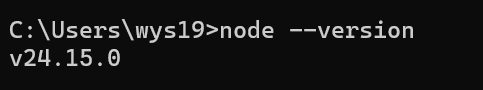
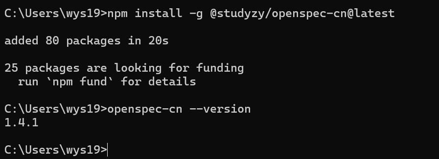
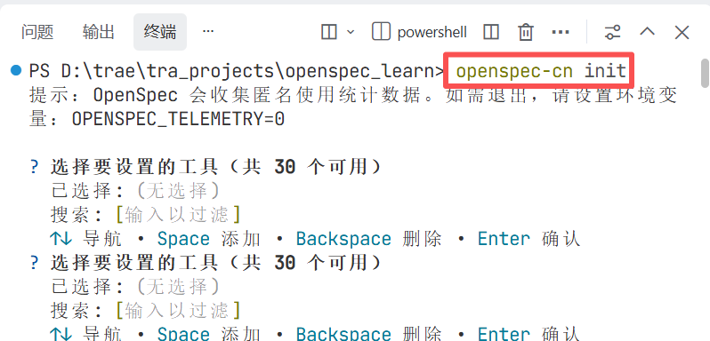
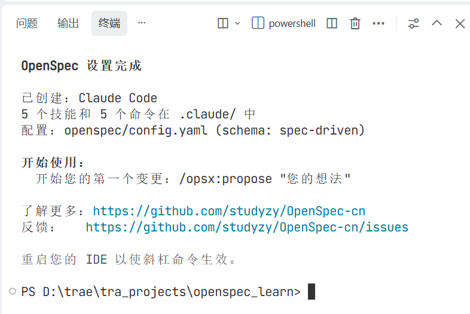
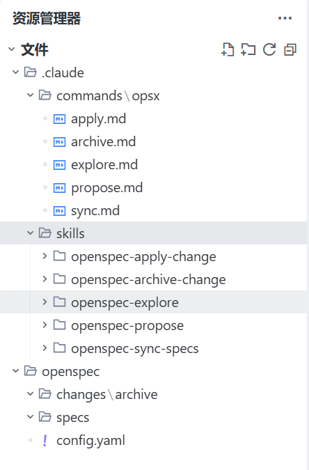
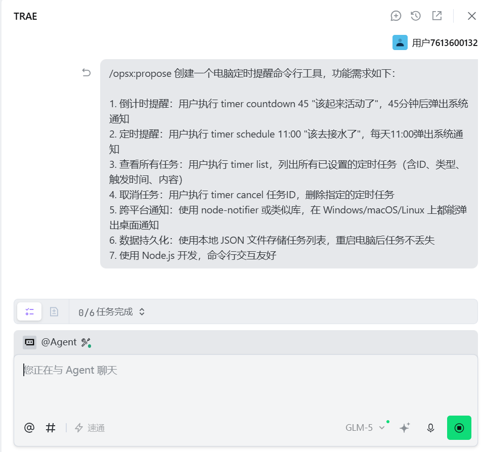

### 一、引言

之前已经学习并使用了speckit，今天来学习一下openspec，然后比较下二者的区别看看哪个更适合自己。

### 二、具体内容

#### 1.安装openspec

首先确保你的 Node.js 版本在 20.19.0 或以上，我本地是v24.15.0，满足条件。



然后安装openspec中文版：

```bash
# 安装openspec中文版
npm install -g @studyzy/openspec-cn@latest
# 验证安装是否成功
openspec-cn --version
```



#### 2.初始化项目

```bash
cd your-project
# 初始化项目
openspec-cn init
```



ai工具我选择的是已经安装的claudecode：



初始化后项目中已经出现了结构化的目录：



#### 3.使用opnespec常用命令进行实战

##### （1）在trae对话框中输入/opsx:propose命令创建变更提案：

```bash
/opsx:propose 创建一个电脑定时提醒命令行工具，功能需求如下：

1. 倒计时提醒：用户执行 timer countdown 45 "该起来活动了"，45分钟后弹出系统通知
2. 定时提醒：用户执行 timer schedule 11:00 "该去接水了"，每天11:00弹出系统通知
3. 查看所有任务：用户执行 timer list，列出所有已设置的定时任务（含ID、类型、触发时间、内容）
4. 取消任务：用户执行 timer cancel 任务ID，删除指定的定时任务
5. 跨平台通知：使用 node-notifier 或类似库，在 Windows/macOS/Linux 上都能弹出桌面通知
6. 数据持久化：使用本地 JSON 文件存储任务列表，重启电脑后任务不丢失
7. 使用 Node.js 开发，命令行交互友好
```



AI 会生成四份核心文档：

- proposal.md - 提案文档
  
  描述了为什么需要这个工具（帮助工作者管理休息时间）
  
  列出了5个新增功能：倒计时提醒、定时提醒、任务管理、跨平台通知、任务持久化

- design.md - 技术设计文档
  
  技术栈选择：Node.js + TypeScript + Commander.js + node-notifier
  
  数据持久化方案：JSON 文件存储
  
  任务调度方案：node-cron + setTimeout
  
  命令行设计：子命令模式
  
  风险分析和权衡决策

- specs/ - 功能规范文档（5个规范文件）
  
  countdown-timer/spec.md - 倒计时提醒规范
  
  scheduled-timer/spec.md - 定时提醒规范
  
  task-management/spec.md - 任务管理规范
  
  cross-platform-notification/spec.md - 跨平台通知规范
  
  task-persistence/spec.md - 任务持久化规范

- tasks.md - 实施任务清单
  
  10个任务组，共45个具体任务
  
  涵盖项目初始化、核心模块、功能实现、测试和发布
  
  

审阅过文件之后，我突然觉得命令行并不方便，还是想做成页面的形式，并且我希望定时提醒能选择每周几，这样非工作日就不会提醒了。所以我继续在trae的对话框中输入以下指令：

```bash
1.我希望定时提醒支持选择每周几提醒，从周一到周日我可以打勾，这样有些只需要工作日提醒。
2.我希望这个工具做成页面可视化的.exe工具，用命令行有点麻烦。
```

##### （2）继续输入/opsx:apply实时方案

```bash
# 实施方案
/opsx:apply
```

##### （3）归档

```bash
# 归档
/opsx:archive
```

##### （4）后期如果要添加新的功能，再走一遍**提案 → 实施 → 归档** 的循环即可。

| 命令                     | 作用        | 何时输入     |
| ---------------------- | --------- | -------- |
| `openspec-cn init`     | 初始化项目     | 新项目开始时   |
| `/opsx:propose "需求描述"` | 创建变更提案    | 想加新功能时   |
| `/opsx:apply`          | 按任务清单写代码  | 提案审阅通过后  |
| `/opsx:archive`        | 归档变更      | 代码测试通过后  |
| `/opsx:explore "模糊想法"` | 探索模式，理清需求 | 还不确定怎么做时 |

### 三、总结

openspec比speckit要更简单一点，二者都是规范驱动开发的工具，个人而言openSpec更好用一点。

* * *

**作者**：吴银双

**日期**：2026年6月23日

**平台**：GitHub Pages / 技术博客
