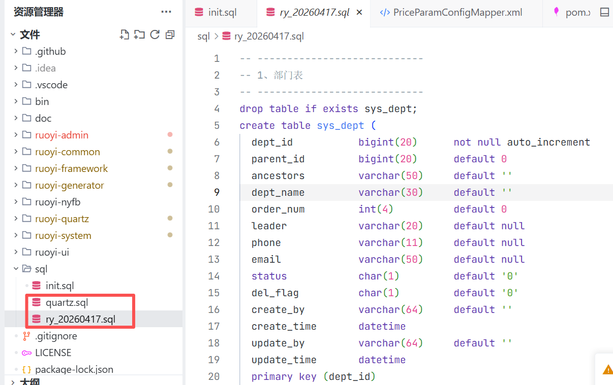
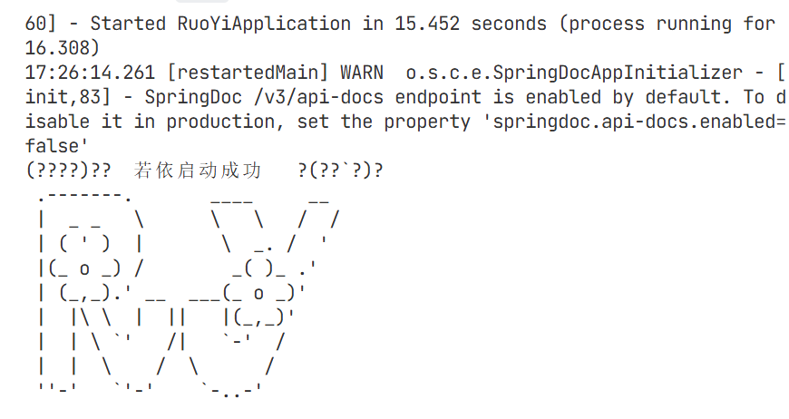
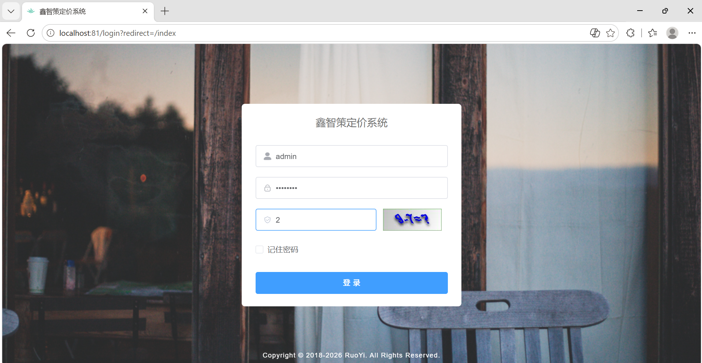

### 一、引言

最近参加了总行举办的AI大赛，我需要做前端应用，听说若依系统是一个成熟完备的系统，包括前端页面以及基本的用户管理、系统管理等底座功能，所以这次就选用若依系统来作为开发底座。

### 二、具体内容

#### 1.环境准备：

| 软件          | 推荐版本              | 核心作用                      |
| ----------- | ----------------- | ------------------------- |
| **JDK**     | 1.8 及以上           | 后端运行环境。是很多兼容问题的源头，版本别用错了。 |
| **MySQL**   | 5.7 或 8.0         | 关系型数据库，存储业务数据。            |
| **Redis**   | 5.0+              | 缓存中间件，后端启动前必须开启。          |
| **Maven**   | 3.6.0+            | Java项目的依赖管理和构建工具。         |
| **Node.js** | 14.x / 16.x (LTS) | 前端项目的运行环境，用于安装依赖和启动项目。    |
| **IDE**     | IntelliJ IDEA     | 推荐使用，用于打开和运行后端Java代码。     |

我的本地环境：jdk21 + mysql8.4.9 + redis8 + maven3.9.9 + node 22.23.1

#### 2.获取源码 & 初始化数据库

（1）**拉取代码**：从官方仓库克隆项目到本地。

* 后端：https://gitee.com/y_project/RuoYi-Vue

* 前端：https://gitcode.com/yangzongzhuan/RuoYi-Vue3。

（2）**创建数据库**：在MySQL中新建一个数据库。

（3）**导入SQL脚本**：

* 在项目根目录的 `sql` 文件夹里，你会看到两个SQL文件（如 `ry_xxxxx.sql` 和 `quartz.sql`）。

* 将它们依次导入到你刚刚创建的数据库中。
  

#### 3.启动后端

（1）**用IDEA或TRAE打开项目**：用IntelliJ IDEA打开后端项目文件夹。

（2）**修改数据库配置**：找到 `ruoyi-admin/src/main/resources/application-druid.yml` 文件，把数据库的`url`、`username`、`password`改成你自己的。

（3）**启动Redis**：确保Redis服务已经在运行。

（4）**运行启动类**：在IDEA中，找到 `RuoYiApplication` 类（通常在 `ruoyi-admin` 模块下），右键选择 `Run 'RuoYiApplication'。

（5）**验证**：当控制台输出类似“若依启动成功”的信息，就说明后端启动成功了。

#### 4.启动前端

1. **进入前端目录**：在终端中打开根目录。

2. **安装依赖**：执行 npm install。

3. **启动项目**：依赖安装完成后，执行 npm run dev。

#### 5.最终验证

在浏览器中访问 `http://localhost:80`，使用默认账号 `admin`，密码 `admin123` 登录。如果能成功进入后台管理界面，那么恭喜你，本地启动就大功告成了

### 三、总结

若依系统本身比较成熟，当我们想要在外网新建一个常规系统时可以考虑直接使用它作为底座。

* * *

**作者**：吴银双

**日期**：2026年7月12日

**平台**：GitHub Pages / 技术博客
