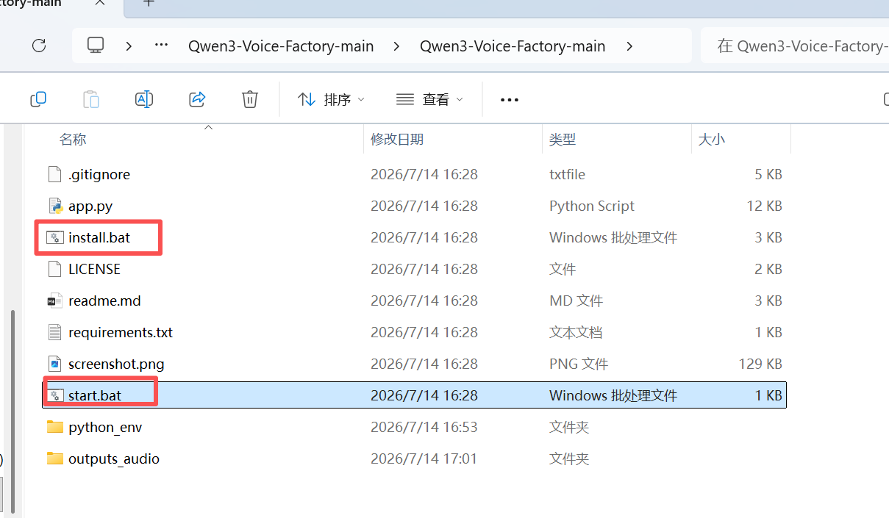
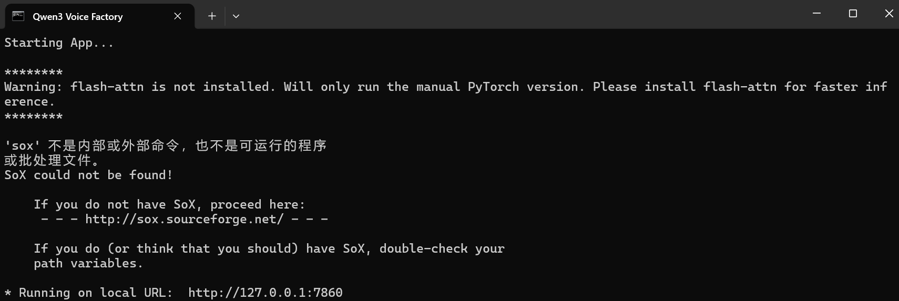
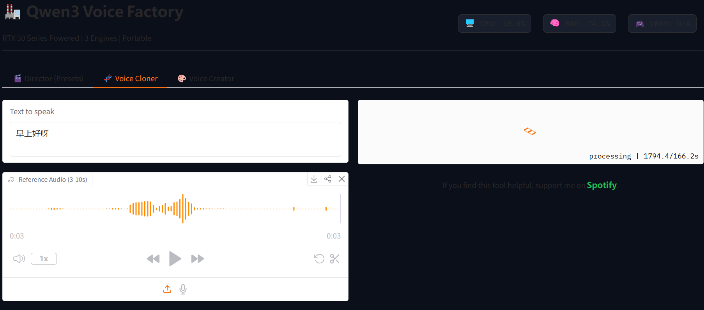
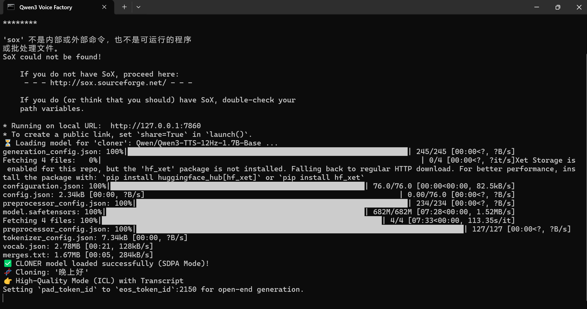
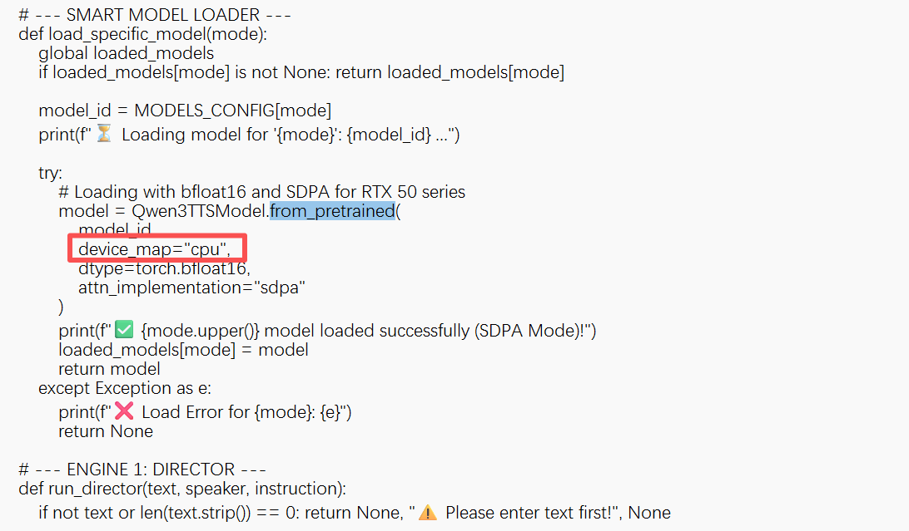
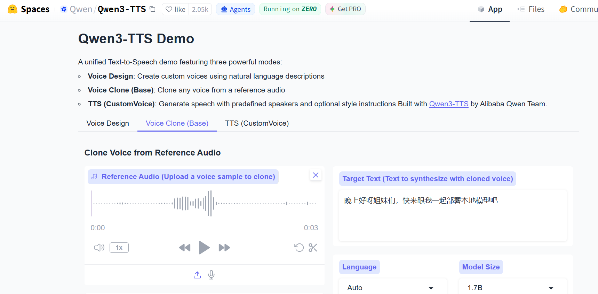

### 一、引言

之前已经在linux系统上部署过qwen3-tts模型，但是需要每次接口调用，且我自己的服务器性能不够无法部署。往上也有在线体验的网站，但是次数有限制或者需要花钱，所以想试试看能不能在自己的笔记本电脑上（windows系统）按爪个部署一个可以随时语音克隆的服务。看到大模型推荐了Qwen3-voice-factory，于是就试试。

### 二、具体内容

#### 1.下载压缩包：

官方地址：https://github.com/Detoxfox4234/Qwen3-Voice-Factory

#### 2.解压并运行

（1）解压压缩包，可以看到文件夹中有install.bat和start.bat两个脚本：

（2）执行install.bat脚本，下载过程比较久，需要等一会。

（3）执行start.bat脚本，运行完会出现本地访问路径：http://127.0.0.1:7860

#### 3.最终验证

本地浏览器打开http://127.0.0.1:7860，出现语音合成、语音克隆、语音设计三个功能的可视化界面：

#### 4.本地问题

我在第一次使用语音克隆时非常慢，看到控制台是在下载qwen3-tts-base模型，于是就静静等他下载完。

另外，我的笔记本电脑没有单独显卡，用的是集成显卡，所以他会报错找不到CUDA，只要修改一下app.py文件，把device_map从cuda修改成cpu就可以了。

但是！cpu实在跑得太慢了，最终我还是选择在线网站使用：https://huggingface.co/spaces/Qwen/Qwen3-TTS

速度快多啦！

### 三、总结

个人笔记本电脑显存很小，很难带动大模型的推理，自己买的linux服务器也是2G的，相信这是很多个人工作者的痛点，硬件配置不够。

* * *

**作者**：吴银双

**日期**：2026年7月14日

**平台**：GitHub Pages / 技术博客
