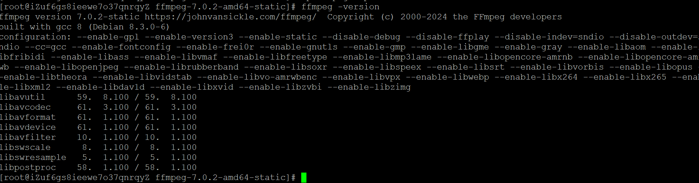

### 一、引言

之前已经在自己的笔记本电脑上装过ffmpeg命令，但是是直接下载windows适配压缩包然后添加环境变量（见[如何使用ffmpeg转换音频格式 | ~吴 银 双~](https://www.wuyinshuang.com/posts/ffmpeg-deploy/)，这次需要在linux服务器上安装，然后用java代码实现mcp工具服务。

### 二、具体内容

#### 1.下载并安装FFmpeg 静态编译包：

```bash
# 创建编译包路径
mkdir -p /usr/local/ffmpeg-static
cd /usr/local/ffmpeg-static

# 下载 FFmpeg 静态编译包
wget https://johnvansickle.com/ffmpeg/releases/ffmpeg-release-amd64-static.tar.xz

# 解压
tar -xf ffmpeg-release-amd64-static.tar.xz

# 进入解压后文件夹
cd ffmpeg-*-amd64-static

# 复制ffmpeg ffprobe到/usr/local/bin/目录下
cp ffmpeg ffprobe /usr/local/bin/

# 验证ffmpeg是否安装成功
ffmpeg -version
```

 

#### 2.验证FFmpeg功能：

```bash
# 音频格式转换
# mp3 → wav
ffmpeg -i input.mp3 output.wav

# wma → wav
ffmpeg -i input.wma output.wav

# m4a → mp3
ffmpeg -i input.m4a -b:a 192k output.mp3

# wav → m4a
ffmpeg -i input.wav -c:a aac -b:a 128k output.m4a
```

#### 3.开发MCP工具：

```java
package com.demo.service.audio;
import con.demo.tool.McpTool
import io.micrometer.common.util.StringUtils;
import lombok.extern.slf4j.Slf4j;
import org.apache.commons.lang3.ArrayUtils;
import org.springframework.beans.factory.annotation.Value;
import org.springframework.stereotype.Service;

import java.io.BufferedReader;
import java.io.File;
import java.io.IOException;
import java.io.InputStreamReader;
import java.file.Files;
import java.nio.file.Path;
import java.util.Base64;
import java.util.Arrays;
import java.util.List;
import java.util.UUID;
import java.util.concurrent.TimeUnit;
/**
音频格式转换服务
分类:audio
</p>
@author wuyinshuang@version 1.0.0since 2026/07/15
*/
@S1f4j@service
public class AudioService {}
//支持的音频格式
private Static final List<String> SUPPORIED_FORMATS = Arrays.asList ("m4a", "mp3", "wma", "wav");
//ffmpeg执行超时时间(秒)，默认5分钟
private static final long TIMEOUT_SECONDS=300;
//输入音频最大字节数，默认50oMB，超过则拒绝转换以防止内存溢出
private static final int MAX INPUT_SIZE = 500 * 1024 * 1024:
//ffmpeg可执行文件路径，可通过配置文件(ffmpeg.path)覆盖
@value("$ffmpeg.path")
private String ffmpegPath;

/**音频格式转换(Base64模式)
@param requestId ID,用于链路追踪Base64编码
@param sourceFormat 源文件格式
@param targetFormat 目标文件格式
@param audioBase64音频格式转换(Base64模式)
**/
@McpTool(
name = "audioConvert",
description = "将音频文件从一种格式转换为另一神格式，调用方直接传入音频的base64编码。支持的格式:wav,mp3,wma,m4a",
category = "audio",
inputSchema = """
{
    "type":"object",
    "properties":{
        "requestId":{
        "type":"string",
        "description":"请求 ID"
        },
        "audioBase64":{
        "type":"string",
        "description":"待转换格式的音频，输入格式:Base64编码"
        },
        "sourceFormat":{
        "type":"string",
        "description":"源文件格式，可选值:m4a，mp3，wma，wav"
        },
        "targetFormat":{
        "type":"string",
        "description":"目标文件格式，可选值:m4a，mp3，wma，wav"
        }
    },
    "required":["requestId","audioBase64","targetFormat"]
}""",
outputSchema = """
    "type": "object",
    "description":"音频格式转换结果",
    "properties": {
    "newBase64": {
        "type": "string",
        "description":"转换后的音频Base64编码"
        }
    }
}"""
)
public String audioConvert (String requestId, String audioBase64, String sourceFormat,String targetFormat){
    //1.参数校验
    if(audioBase64 == null || audioBase64.trim().isEmpty()) {
        throw new TllegalArgumentException("audioBase6s 不能为空");
    }
    if (StringUtils.isEmpty(requestId)) {
        throw new IllegalArgumentException("requestId 不能为空");
    }
    if(StringUtils.isEmpty(targetFormat)){
        throw new IllegalArgumentException("targetFormat 不能为y空");
    }
    if(StringUtils.isEmpty(sourceFormat)) {
        //源格式未传时自动解析源文件
        sourceFormat = parseFormatByBase64 (audioBase64);
    }
    sourceFormat = sourceFormat.toLowerCase ().trim () ;
    targetFormat = targetFormat.toLowerCase ().trim();
    if (!SUPPORTED_FORMATS.contains (sourceFormat)) {
        throw new IllegalArgumentExcption("不支持的源格式:" + sourceFormat +", 仅支持以下格式："+ String.join(",", SUPPORTED_FORMATS));
    }
    if (!SUPPORTED_FORMATS.contains (targetFormat)) {
        throw new IllegalArgumentExcption("不支持的目标格式:" + targetFormat+", 仅支持以下格式："+ String.join(",", SUPPORTED_FORMATS));
    }
    if(sourceFormat.equals (targetFormat)) {
    //格式相同，直接返回原数据(无需转换)
    return audioBase64;
    }

    //2.Base64解码
    byte[] inputData;
    try{
    String pureBase64 ;
    if (audioBase64.contains(",")) {
        pureBase64 = audioBase64.split(", ")[1];
    }else{
        pureBase64 = audioBase64;
    }
    inputData = Base64.getDecoder().decode(pureBase64);
    }catch (IllegalArgumentException e){
        throw new IllegalArgumentException("无效的Base64数据:"+e.getMessage());
    }

    //3.大小检查(防止内存溢出)
    if (inputData.length > MAX_INPUT_SIZE) {
        throw new IllegalArgumentException("输入文件过大:"+String.format("%.2f MB",inputData.length / (1024.0 *1024)) +",最大支持:" + (MAX_INPUT_SIZ /(1024.0 *1024) +"MB");
    }

    //4.执行FEmpeg转换
    byte[] outputData;
    try{
        outputData = convertAudio(inputData, sourceFormat, targetFormat);
    }catch (Exception e) {
    throw new RuntimeException("音频转换失败:"+e.getMeasage(),e);
    }
    if(outputData == null || outputData.length == 0){
    throw new RuntimeException("音频转换失败，转换后输出为空");  
    }

    //5.返回Base64编码
    String newBase64 = Base64.getEncoder().encodeToString (outputData);
    return newBase64;
}

public String parseFormatByBase64 (String fullBase64){
    if(fullBase64 == null || fullBase64.isBlank()){
    return "unkown";
    }
    //1.去掉前缀
    String pureBase64;
    if (fullBase64.contains(",")) {
        pureBase64 = fullBase64.split(", ")[1];
    }else{
        pureBase64 = fullBase64;
    }
    int needByteCount = 20;
    int needBase64Char = (int) Math.ceil(needByteCount * 4.0 / 3) ;
    //2.截取头部base64字符，多余的直接丢弃不解码
    String headBase64 = pureBase64.substring(0, Math.min(needBase64Char,pureBase64.length()));
    //3.仅解码头部一小段，极小内存占用
    byte[] headBytes = Base64.getDecoder().decode (headBase64);
    if (headBytes.length < 4) {
        return "unknown";
    }
    //4.根据魔数判断格式
    //WAV RIFF 52 49 46
    if (headBytes[0] == Ox52 && beadBytes[l] == Ox49 && headBytes[2] == Ox46 && headBytes[3] == Ox46){
        return "wav";
    }
    //MP3 ID3头部 
    if (headBytes[0] == Ox49 && beadBytes[l] == Ox44 && headBytes[2] == Ox33){
        return "mp3";
    }
    //M4a
    if ( headBytes.length >= 8 && headBytes[4] == Ox66 && headBytes[5] == Ox74 && headBytes[6] == Ox79 && headBytes[7] == Ox70){
        return "m4a";
    }
//WMA 头: 30 26 B2 75 BE 66 CF 11 A6 D9 00 AA 00 62 CE 6C
byte[] wmaHeader = new byte[]{
    (byte)Ox30,(byte)0x26,(byte)OxB2,(byte)0x75,
    (byte)Ox8E,(byte)0x66,(byte)OxCF,(byte)0x11,
    (byte)OxA6,(byte)0xD9,(byte)Ox00,(byte)0xAA,
    (byte)Ox00,(byte)0x62,(byte)OxCE,(byte)0x6C
}
byte[] headSlice = ArrayUtils.subarray (headBytes,0,16)
if (Arrays.equals (headSlice,wmaHeader)){
    return "wma";
}
return "unknown";
}

//执行ffmpeg音频格式转换
原音频字节数据源音频格式(如m4a、mp3)目标音频格式(如wav、mp节数据
private byte[] convertAudio (byte[] inputData, String sourceFormat,String targetFormat)
throws IOException, InterruptedException{
    Path tempDir = null;
    File inputFile = null;
    File outputFile = null;
    try{
        //1.创建临时目录，避免文件名冲突
        tempDir = Files.createTempDirectory("audio_convert_");
        String uuid = UUID.randomUUID().toString().replace("-","");
        //2.写入源临时文件(带扩展名，便于ffmpeg识别格式)
        inputFile = new File(tempDir.toFile(), uuid + "." +sourceFormat);
        Files.write(inputFile.toPath(), inputData);
        //3.构建输出文件路径
        outputFile = new File(tempDir.toFile(), uuid + " out." + targetFormat);
        //4.拼装并执行ffmpeg命令
        long startTime = System.currentTimeMillis() ;
        int exitCode = runFfmpeg (inputFile, outputFile) ;
        long duration = (System.currentTimeMillis() - startTime) /1000;
        if (exitcode != 0){
            throw new IOException("ffmpeg转换失败，退出码"+ exitCode);
        }
        if (!outputFile.exists() || outputFile.length == 0){
            throw new IOException("ffmpeg转换完成但输出内容为空");    
        }
        //6.读取输出文件并返回
        return Files.readAllBytes (outputFile.toPath()) ;
    }finally{
        //7.清理临时文件
        cleanupTempFile (inputFile);
        cleanupTempFile (outputFile);
        if(tempDir !=null){
            try{
                Files.deleteIfExists (tempDir);
            }catch (IOException e) {
                log.warn("删除临时目录失败,dir={}",tempDir,e);
            }
        }
    }
}

//拼装并执行ftmpeg命令
private int runFfmpeg(File inputFile, File outputFile)throws IOException, InterruptedException {
    ProcessBuilder pb = new ProcessBuilder (
    ffmpegPath,
    "-i", inputFile.getAbsolutePath();
    "-vn"
    );  
    //覆盖已存在输出文件
    pb.command().add ("-y").
    pb.command().add (outputFile.getAbsolutePath());
    pb.redirectErrorStream(true);
    Process process = pb.start();
    //读取输出日志，防止缓冲区阻塞
    StringBuilder outputLog = new StringBuilder();
    try (BufferedReader reader = new BufferedReader(
        new InputStreamReader (process.getInputStream(), StandardCharsets.UTF_8))) {
        String line;
        while ((line = reader.readLine()) != null){
            outputLog.append(line).append("\n");
            if (line.contains("frame=") || line.contains("time=")) {
                log.info("ffmpeg进度:"+line.trim();
            }
        }
    }
    boolean completed = process.waitFor(TIMEOUT_SECONDS, TimeUnit.SECONDS);
    if (!completed) {
        process.destroyForcibly();
        throw new IOException("ffmpeg执行超时(超过"+TIMEOUT_SECONDS+"秒)"); 
    }
    int exitCode = process.exitValue();
    if (exitCode != 0) {
    String erroeMessage =  extractErrorMessage(OutputLog.toString);
    }
    return exitCode ;
}

//从ffmpeg日志中提取关键错误信息
private String extractErrorMessage (String fullLog) {
    if (fullLog == null || fullLog.isEmpty()){
        return "无详细错误信息";
    } 
    String[] lines = fullLog.split("\n");
    StringBuilder errors - new StringBuilder( 
    for (String line : lines){
        String lower = line.toLowerCase() ;
        if (lower.contains("error") || lower.contains("invalid")){
            errors.append(line).append("\n");
        }
    }
    if (errors.length() > 0) {
        return errors.toString();   
    }
    //没有明显错误行时，返回最后 10行
    int start = Math.max(0, lines.length - 10);
    StringBuilder tail = new StringBuilder();
    for (int i= start;i< lines.length;i++) {
        tail.append(lines[i]).append("\n");
    }
    return tail.toString();
}

//清理临时文件，失败时仅打印警告日志
private void cleanupTempFile(Filefile){
    if (file == null){
       return; 
    }
    try{
        Files.deleteIfExists(file.toPath());
    }catch (IoException e) {
        log.info("删除临时文件失败,file={}",file.getAbsolutePath(),e);
    }
  }

}


```


### 三、总结

FFmpeg是权威的音频处理工具，但是要注意本地运行windows环境和linux服务器运行要安装的步骤不一样，路径也要再配置文件中变更。

* * *

**作者**：吴银双

**日期**：2026年7月24日

**平台**：GitHub Pages / 技术博客


